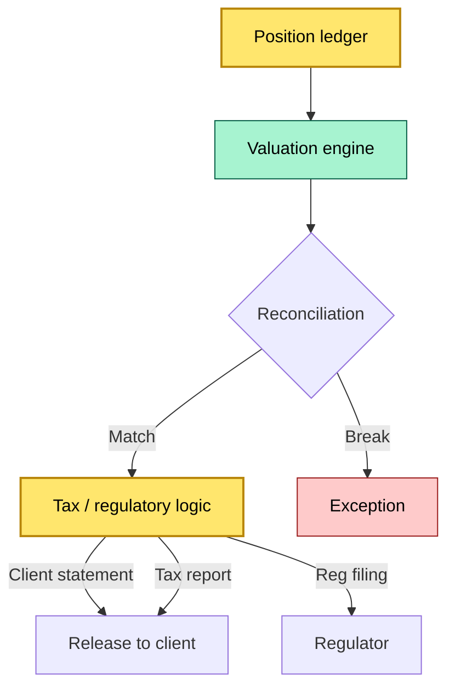
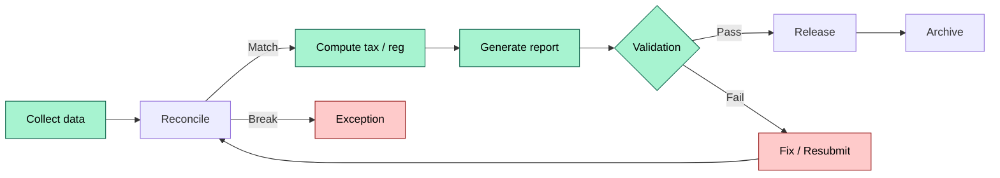
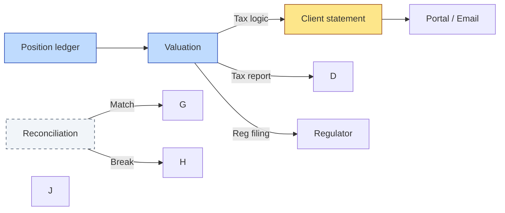

# C2-12 — Reporting and statements: daily, monthly, tax, regulatory — DETAIL
> **Category:** C2 — Core Business Flows · **Difficulty:** ◑ · **Banking-relevant:** 💳
>
> > **Companion brief:** `briefs/C2-12-reporting-statements.md`
> >
> > > **Target reader:** enterprise architect who must *explain, justify, and defend* the topic — not just recite it.

---

## 1. Precise definition
Reporting and statements are the periodic or ad-hoc outputs of the custody engine, generated from the position ledger, valuation, corporate actions, and cash-management data, that deliver client statements, tax reports, and regulator filings.

## 2. Why it exists (the problem it solves)
Without reliable reports, there is no accountability. Key failure modes:
- **Wrong positions:** The client is told they own shares that do not exist.
- **Missing income:** Dividends or interest are not credited to the client.
- **Reputational damage:** A client discovers a mistake only after an audit.
- **Regulatory fine:** The regulator imposes a fine for late, inaccurate, or missing filings (e.g., MiFID II transaction report).

The reporting engine exists to produce a single source of truth that:
- **Reconciles** with the CSD / CDS.
- **Audits** with internal controls.
- **Delegates** to clients with confidence.

## 3. Core concepts & vocabulary
| Term | Precise meaning |
|------|-----------------|
| Client statement | Periodic report of holdings, cash, income, and valuation. |
| Tax report | Report of income and gains for tax purposes (e.g., IRS 1099B, OECD criteria). |
| Regulatory report | Filing under MiFID II, EMIR, CSCR, etc. |
| Reconciliation | Matching the custody ledger to the CSD statement and the trade data. |
| Cut-off | The point in time at which the report is frozen. |
| Settlement date | The last date on which a report can include settled data. |
| Position | The client's assets and liabilities at a point in time. |
| Return (Net) | The cumulative net return of the portfolio. |
| Integrated / Consolidated | The level (e.g., client, fund, pooled) at which the report is compiled. |
| Filing / action | The filing or action steps in the reporting life cycle. |
| Timing / schedule | The schedule and conditions for a specific report. |
| Definitive / quick / incomplete | The report publication status. |
| Classification | The report form or classification. |
| Cumulative | A cumulative report, not a snapshot. |
| 2 | The proportion of the total. |
| Fin | The financial / final report. |
| Keep | The name of the individual for the archive. |
| Explanation / explanation | The explanation of a report or action. |
| 1 / 4 / 16 | The different levels of reporting accuracy. |
| 2 / 5 | The number of data points required. |

## 4. How it works (architecture / mechanism)
### Step 1: Position data collection
- The custody system collects from:
  - **Position ledger:** o, t, d, h, i (ISIN, quantity, market value, etc.)
  - **CSD / CDS statement:** the latest statement from the Depository.
  - **Trade management system (TMS):** executed trades.
  - **Corporate actions:** updates from the corporate action engine.
  - **Cash management:** balances, sweeps, income.
  - **Valuation engine:** current fair values.
  - **Collateral / SBL:** pledged assets and their values.

### Step 2: Reconciliation
- The system matches the position ledger to the CSD statement:
  - **ISIN / CUSIP match:** the position records must match the CSD account detail.
  - **Quantity & date:** the quantities and settlement dates must align.
  - **Unsafe assets:** any asset not reconciled on the CSD statement is flagged.
  - **Break resolution:** unmatched positions are traced to breaks, pending settlements, or manual corrections.

### Step 3: Valuation and projection
- The valuation engine computes per-asset values:
  - **Market price** (from Bloomberg, Refinitiv, etc.)
  - **Accruals** (interest for bonds, dividends for equities)
  - **Rebase** (if a revaluation event occurred)
- Cash is valued at current balances.
- Total portfolio value = Σ(assets + cash).

### Step 4: Tax logic
- The system classifies each income or movement:
  - **Dividend:** ordinary dividend, qualified dividend, capital dividend.
  - **Interest:** taxable / tax-exempt.
  - **Capital gain / loss:** realized / unrealized.
  - **Currency gain / loss:** realized / unrealized.
- The logic is determined by:
  - **Jurisdiction:** US, UK, EU, etc.
  - **Tax regime:** VAT, withholding, gross-up.
  - **Client type:** retail / institutional / fund.

### Step 5: Regulatory logic
- The system classifies each movement for regulatory reporting:
  - **MiFID II transaction report:** executed trades, commissions, counterparties.
  - **EMIR:** OTC derivatives trades, collateral, margin.
  - **CSCR:** investment disclosures and client management.
  - **Form PF / AIFMD:** fund manager disclosures.
- The logic is determined by:
  - **Asset class:** equities, bonds, derivatives, etc.
  - **Counterparty:** self-clearing vs clearing through a CCP.
  - **Client type:** UCITS, AIFMD, pension, etc.

### Step 6: Statement generation
- The engine generates:
  - **Client statement:** a report of holdings and cash, optionally including income, fees, and P&L.
  - **Tax report:** a report of income, gains, losses, and tax treatment.
  - **Regulatory report:** a raw data file (XML, SWIFT, CSV) for the regulator.
- The output format is determined by:
  - **Client demand:** PDF, HTML, XML, SWIFT.
  - **Regulator requirement:** specific format (e.g., MiFID II commit ISO 20022).

### Step 7: Validation and release
- The system runs a compliance validation:
  - **Risk classification:** the report's risk rating.
  - **Audit trail:** each line is traced to a source (trade, CSD statement, corporate action).
  - **Signature:** the report is digitally signed or certified.
- The report is released to:
  - **Client portal**
  - **Client email**
  - **Regulator filing system**
  - **Internal archive**

### Step 8: Archival
- The system archives:
  - The final statement file.
  - The raw data source files.
  - The reconciliation details (match, breakdown, break).
- The archive must be:
  - **Immutable** (append-only, hash-verified).
  - **Searchable** (by client, date, report type).
  - **Retrievable** (for audit and for legal discovery).

## 4.1 Diagrams

**Diagram A — Core structure** (highlight reconciliation = critical, release = gold):



**Diagram B — Lifecycle / flow** (highlight validation = green, exception = red):



## 5. Variants, options & trade-offs
| Variant | When to pick | When to avoid | Key trade-off axis |
|---------|--------------|---------------|--------------------|
| PDF statement | Standard for clients; rich formatting | Not machine-readable; harder to archive | Human vs machine |
| XML / SWIFT | Machine-readable; regulatory filing | More complex; requires mapping | Efficiency vs standardization |
| Real-time (down) | High-frequency clients; required = 0 | Higher latency; complex | Latency vs complexity |
| Batch (end-of-day) | Standard institutional clients | Not available intra-day | Turnaround vs immediacy |
| Consolidated / pooled | Pooled accounts; multi-layer reporting | Higher reconciliation cost | Coverage vs cost |
| Ad-hoc (survey / comment) | Specific client requests | One-off; rich documentation | Custom vs standard |

## 6. Relationships to sibling topics
- **C2-01 Onboarding:** The reporting frequency and format are set during onboarding.
- **C2-05 Settlement:** Only settled positions appear in the report.
- **C2-07 NAV:** Valuation and income are based on NAV.
- **C2-08 Corporate actions:** Corporate actions are reflected in the report's position and income.
- **C2-11 Borrowing & lending:** Borrowed securities may be reported separately or hidden depending on the rule.
- **C3-03 MiFID II:** Transaction reporting is a regulatory output.

## 7. Banking / financial-services context 💳
A global prime broker generates a monthly statement for a UK pension fund, a quarterly tax report per UK HMRC, and a monthly MiFID II transaction report per ESMA.

The statement:
- Reconciles against the CSD statement.
- Calculates net returns inclusive of rebase.
- Reports tax-exempt interest from gilts.
- Classifies reg 12 trades by asset class and counterparty.

Failure mode: A broker generated a tax report with incorrect withholding tax classification, resulting in a £2m fine from HMRC.

## 8. Reference architecture / worked example
### Scenario
A global broker needs to consolidate reporting for a multi-jurisdiction fund manager.

### Decision
- One reporting engine.
- One reconciliation layer.
- Different tax and reg rules per jurisdiction.
- Daily, monthly, quarterly outputs.

### Diagram


ADR-12: Reporting and statements for multi-jurisdiction fund managers.

## 9. Maturity & adoption signals
- **Adopt when:** the institution must reconcile, produce regular reports, and archive them.
- **Anti-signals (don't adopt yet):** no regulator; clients accept partial reports.
- **Common failure modes:**
  1. Reconciliation error due to stale CSD data.
  2. Tax logic not updated for a new jurisdiction.
  3. Regulatory report submitted late.

## 10. Common confusions — the “don't mix” list
| Often confused | Real distinction |
|----------------|----------------|
| Statement vs advisory statement | Statement shows holdings; advisory includes strategy. |
| Tax report vs tax transcript | Report is current; transcript is a historical record. |
| Regulatory report vs internal report | Regulatory = external; internal = operational. |

## 11. Tools & standards to know
- **Standards/IR:** MiFID II; EMIR; CSCR; ISO 20022; SWIFT MT 275, 277, 279; FINS; GST.
- **Common tooling:** Reconciliation engine, valuation engine, reporting engine, client portal, regulator gateway.
- **Mandatory reading:** MiFID II; EMIR; CSCR; Fex; Google; SWIFT.

## 12. ADR template (ready to fill in)
```markdown
# ADR-12: Reporting and statements for multi-jurisdiction fund managers
## Status
Accepted

## Context
Global broker needs to consolidate reporting across multiple regulatory regimes.

## Decision
- One reporting engine with jurisdiction-specific tax / reg rules.
- Daily, monthly, quarterly outputs.
- Reconciliation against CSD/footnotes.

## Consequences
- Positive: standardization, compliance; Negative: complexity.

## Alternatives considered
1. Separate engines per jurisdiction — high cost.
2. No reporting — non-compliant.
```

## 13. Practice — apply it
1. **Recall:** define the reporting engine in 2 min without notes.
2. **Model:** trace data from ledger to client statement to archive.
3. **ADR:** write a decision on adding a real-time tax report for a new jurisdiction.
4. **Defend:** roleplay explaining a reporting error to a non-technical CRO.

## Summary
Reporting and statements are the safety valve of custody.

---
**Status:** ☐ Not started · ☐ In progress · ✅ Covered
*Last updated: 2026-09-14*

---
**One diagram required. Both brief + detail must exist with ≥1 mermaid each before ✓.**
