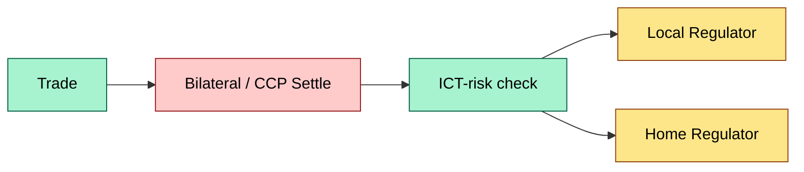
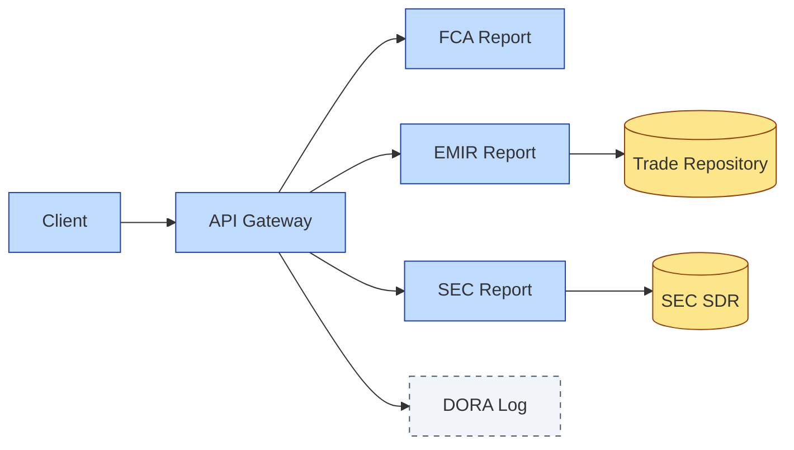

# [C3] Global regulation landscape (US SEC, EU CSDR / EMIR, UK, Asia) — DETAIL

> **Category:** C3 Regulatory, Risk & Compliance · **Difficulty:** ◑ · **Banking-relevant:** yes / 💳
> **Companion brief:** `briefs/C3-01-global-regulation.md`
>
> > **Target reader:** enterprise architect who must *explain, justify, and defend* the topic — not just recite it.

---

## 1. Precise definition
Global custody regulation is the overlay of sovereign securities-laws frameworks that govern who may hold, process, and transfer client assets across jurisdictions. It is not a single treaty; it is a patchwork of SEC rules (US), EMCA/CSDR/ESMA directives (EU), FCA conduct (UK), and local issuer-specific rules (Asia-Pacific MTF/OTF regimes). The architect must treat jurisdiction as the primary dimension of the custody reference architecture.

## 2. Why it exists
Pre-2010, custody operated in a "buyer-beware" legal environment: client assets could be commingled, trust-structures were opaque, and cross-border reconciliation took weeks. The 2008 Lehman collapse exposed $600+ billion in unregistered claims and $100+ billion in exposures tied to weak segregation and unclear legal ownership. Regulators responded with:

- **EU CSDR** (central securities depositories): legal ownership must be explicit in depository records.
- **EU EMIR**: trade reporting and collateral eligibility standards for OTC derivatives.
- **SEC Rule 15c3-3**: reserve formula requiring 140% of debits offset by collateral.
- **UK FCA SYSC**: similar client-asset segregation, enforced by the Senior Managers & Certification Regime (SMCR).

Without this patchwork, the bank faces:
- **Legal uncertainty**: client assets may be reachable by local bankruptcy trustees.
- **Operational fragmentation**: each jurisdiction requires a separate ledger, account structure, and legal entity.
- **Regulatory duplication**: same data collected thrice (local, LOU, home regulator).

## 3. Core concepts & vocabulary
| Term | Precise meaning |
|------|-----------------|
| **CSDR** | EU regulation on central securities depositories: mandates legal ownership clarity, settlement discipline (T+1), and issuer obligations. |
| **EMIR** | EU regulation on OTC derivatives and repo: reporting to trade repositories, clearing mandates, and margin requirements. |
| **MiFID II** | EU directive on markets and financial instruments: transaction reporting, best execution, research unbundling (Article 28). |
| **SEC Rule 15c3-3** | US broker-dealer reserve formula: credits (e.g., collateral held) must exceed debits (customer debits, failed settlement, uncollected income) on a daily basis. |
| **FATF-9** | FATF Recommendation 9: wire transfer / VAS provider obligations, now applied to crypto and custody. |
| **DORA** | EU regulation on digital operational resilience: ICT risk management, testing, incident reporting for all credit institutions and investment firms. |
| **G-SIB** | Global Systemically Important Bank: subject to higher loss-absorbency and operational-resilience standards (EU). |
| **LOU** | Letter of Understanding: bilateral agreement between custodian and CSD, defining account structure, rights, and obligations. |

## 4. How it works
### 4.1 Regulatory surface area
Each asset class and operational function sits at the intersection of 2–4 regimes:

| Function | Primary regulator | Secondary |
|----------|-------------------|-----------|
| Client asset segregation | SEC (US), FCA (UK), BaFin (DE) | CSDR, EMIR |
| Trade settlement | CCP (ESMA) | CSD, MiFID II |
| Reporting | TR (EMIR / MAR) | SEC, local |
| ICT resilience | DORA | LOU terms, SIPC |
| Sanctions / AML | OFAC, FCA | FATF, US Treasury |

### 4.2 Legal ownership vs beneficial ownership
- **Legal ownership**: the name on the CSD account; the entity that can direct the CSD (CSDR legal-ownership rule).
- **Beneficial ownership**: the client whose funds/assets generated the claim; enforced by segregation agreements and fiduciary duties.

### 4.3 The jurisdictional layer
```mermaid
graph TD
    classDef critical fill:#ffe66d,stroke:#b8860b,stroke-width:2px,color:#000
    classDef core fill:#a7f3d0,stroke:#065f46,stroke-width:1px,color:#000
    classDef context fill:#dfe6e9,stroke:#636e72,color:#000
    C1[Client]:::core --> C2[Bank (Custodian)]:::critical
    C2 --> C3[CSD (Legal title)]:::critical
    C2 --> C4[CCP (Margin)]:::core
    C2 --> C5[Local CSD (Cross-border)]:::context
    C5 -.-> C3
```

### 4.4 Reporting pipelines


## 5. Variants, options & trade-offs
| Variant | When to pick | When to avoid | Key trade-off axis |
|---------|--------------|---------------|--------------------|
| **Direct CSD account** | Large, sophisticated clients; cross-border; DVP needed | Small clients; cost‐constrained | Legal clarity vs cost |
| **Omnibus / nominee** | Retail aggregation; multi-currency | Regulatory scrutiny; segregation risk | Scale vs legal ownership transparency |
| **UK-centric stack (BaFin, DE-CSD, Clearstream)** | Euro‐denominated activity | Complex non-Euro, US pivot | Efficiency vs multi-currency agility |
| **US-centric stack (DTCC, Fedwire, FINRA Rule 15c3-3)** | US equities, institutional | EU / global expansion | Regulatory familiarity vs global compliance burden |

## 6. Relationships to sibling topics
- **C3-02 Client asset rules:** CSDR's legal-ownership and settlement-discipline rules are the *operational enforcement* of this landscape.
- **C7-02 Strong control:** separation of duties and reconciliation are the *internal control layer* that maps onto regulatory requirements.
- **C4-06 Reconciliation:** jurisdiction-specific record formats (CREST, Clearstream, Euroclear) feed reconciliation engines.
- **C8-01 Reference architecture:** the layered diagram above is the reference architecture for custody across jurisdictions.

## 7. Banking / financial-services context 💳
A European custody bank like **BNP Paribas Securities Services** must maintain:
- **5 legal entities** across EU (DE, FR, NL acc. to CSDR).
- **3 trade repositories** (EMIR, MAR, US SDR) for cross-border reporting.
- **DORA compliance** for a 24/7 settlement platform covering 30+ CSDs.

**Real-world failure:** The 2014 Lloyd's of London cyber-attack delayed Lloyd's of France settlement for 48 hours, triggering a €23M fine from ESMA for failing DORA incident-reporting deadlines. A custody bank with a similar contraction in its CSD-link would face:
1. **Regulatory fine** (DORA, Article 15).
2. **Liquidity seize** (T+1 obligation vs delayed delivery).
3. **Reputational hit** (failed settlement = lost client trust).

## 8. Reference architecture / worked example


**ADR-01: Jurisdictional Reporting Proxy Pattern**
- **Status:** Proposed
- **Context:** We operate in US, EU, UK, and Asia. Each regulator demands a 24-hour data cutoff, yet the internal UTC pipeline is T+0.
- **Decision:** Centralize a *jurisdictional reporting proxy* that maps internal event taxonomy to regulator-specific schemas.
- **Consequence (positive):** One pipeline, 4 feeds; DRY, auditable.
- **Consequence (negative):** Single point of schema failure; requires a 3-region active/active fallback.

## 9. Maturity & adoption signals
- **Adopt when:** Go-live >2 CSDs, $>5bn AUM, and any resp. entity in MiFID II scope.
- **Anti-signals:** Still using paper LOU; no consolidated regulatory-reporting view; SOC2 only, not DORA.
- **Common failure modes:**
  1. **Schema drift**: internal taxonomy diverges from regulator schema after a rule change.
  2. **Cut-off mismatch**: internal UTC times ≠ local regulator cut-offs (e.g., London FX close vs Tokyo reporting deadline).
  3. **Data lineage gaps**: no audit trail from CSD record to trade input.

## 10. Common confusions
| Often confused | Real distinction |
|----------------|------------------|
| EMIR vs CSDR | EMIR covers OTC derivatives and reporting; CSDR covers CSD legal-ownership, settlement discipline, and issuer obligations. |
| MiFID II vs MiFIR | MiFID II is a Directive (legal framework); MiFIR is a Regulation (transaction reporting details). |
| DORA vs NIS2 | DORA is financial-sector-specific ICT resilience; NIS2 is broader EU critical-infrastructure. FIs must comply with both where in scope. |

## 11. Tools & standards
- **Frameworks:** DORA Article 12 (ICT risk management), ESMA Guidelines on LOU terms, SEC Rule 15c3-3 reserve formula.
- **Common tooling:** SWIFT gpi, T+1 bridge, TR nonce management, DORA incident-reporting templates, Archi for jurisdiction mapping.
- **Mandatory reading:** "EU Regulation 909/2014 (CSDR)", "EMIR 600/2014", "SEC Concept Release on Regulation S-T".

## 12. ADR template
```markdown
# ADR-01: Jurisdictional Reporting Proxy Pattern
## Status
Proposed
## Context
We operate in US, EU, UK, and Asia. Each regulator demands a 24-hour data cutoff, yet the internal UTC pipeline is T+0.
## Decision
Centralize a jurisdictional reporting proxy mapping internal event taxonomy to regulator-specific schemas.
## Consequences
- Positive: One pipeline, 4 feeds; DRY, auditable.
- Negative: Single point of schema failure; 3-region active/active fallback required.
## Alternatives considered
1. Separate pipelines per regulator (anti-pattern: 4x ops, drift).
2. Outsource to third-party reporting hub (cost vs control).
```

## 13. Practice — apply it
1. **Recall:** definitions of CSDR, EMIR, DORA in under 2 minutes.
2. **Model:** draw the jurisdiction-layer diagram from scratch, labeling all 4 major regulators and 3 CSDs.
3. **ADR:** write ADR-01 for the proxy pattern.
4. **Defend:** explain to a CRO why "we just have one compliance team" fails under DORA.

## Summary
Custody regulation is a **jurisdiction-first, function-second** problem. The architecture must treat every CSD account, every trade repository feed, and every conflict-of-law scenario as a first-class design concern. A bank that treats compliance as an afterthought will find itself in the next named fine cycle.

---
*Last updated: 2026-09-16*
*One diagram required. Both brief + detail must exist with ≥1 mermaid each before ✓.*
