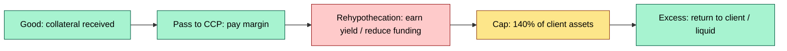
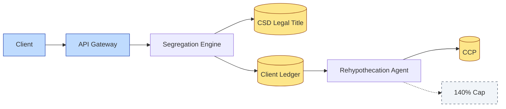

# [C3] Client asset rules: segregation, ownership, rehypothecation limits — DETAIL

> **Category:** C3 Regulatory, Risk & Compliance · **Difficulty:** ◑ · **Banking-relevant:** yes / 💳
> **Companion brief:** `briefs/C3-02-client-asset-rules.md`

> > **Target reader:** enterprise architect who must *explain, justify, and defend* the topic — not just recite it.

---

## 1. Precise definition
Client asset rules are the regulatory and contractual obligations that mandate segregation of client assets from the custodian's own assets, clarify legal and beneficial ownership, and cap rehypothecation to protect the client's priority in bankruptcy. These rules are the operational backbone of the custody value chain: without them, the bank's entire business is a floating claim in its own creditors' pool.

## 2. Why it exists
Post-Lehman, regulators discovered that:
- **$100+ billion** in client assets had been pledged to the custodian's own creditors.
- **Book-and-claim** (omnibus) structures obscured which client owned what.
- **Without segregation**, a custodian's bankruptcy could freeze the entire client base for weeks or months.

The EU responded with **CSDR** (legal ownership in CSD records) and **EMIR** (collateral eligibility). The US responded with **SEC Rule 15c3-3** (reserve formula) and **SEC Rule 17a-4** (record retention). The UK with **FCA SYSC** (Client Assets sourcebook).

## 3. Core concepts & vocabulary
| Term | Precise meaning |
|------|-----------------|
| **Segregation** | Separate ledger/legal identity for client assets; not commingled with house assets. |
| **Legal ownership** | The name on the CSD account; the right to direct the CSD (CSDR requirement). |
| **Beneficial ownership** | The client whose funds/assets created the claim; protected by fiduciary duty. |
| **Rehypothecation** | The custodian pledges client collateral to a CCP or for regulatory/funding purposes; capped by jurisdiction (e.g., 140% in EU under CSDR Art. 110). |
| **Reserve formula** | SEC Rule 15c3-3: Credits ≥ 140% of debits (customer debits, failed settlement, uncollected income). |
| **Prime collateral** | High-quality assets eligible for rehypothecation to a CCP (sovereign bonds, blue-chip equities). |
| **Book-and-claim** | Omnibus structure where the custodian holds legal title but clients claim beneficial interest. |

## 4. How it works
### 4.1 The segregation stack
```mermaid
graph TD
    classDef critical fill:#ffe66d,stroke:#b8860b,stroke-width:2px,color:#000
    classDef core fill:#a7f3d0,stroke:#065f46,stroke-width:1px,color:#000
    classDef context fill:#dfe6e9,stroke:#636e72,color:#000
    A[Client assets]:::critical --> B[House assets (closed)]:::core
    A --> C[Client sub-accounts]:::critical
    C --> D[Legal title: CSD]:::critical
    C --> E[Beneficial title: client]:::core
    F[Rehypothecation cap]:::context --> G[CCP / Bank funding]
```

### 4.2 Legal vs beneficial ownership
- **Legal**: on the CSD account in the custodian's name (CSDR).
- **Beneficial**: recorded in internal ledger; client can demand transfer or liquidation.
- The **LOU** (Letter of Understanding) is the contract bridging the two.

### 4.3 Rehypothecation lifecycle


## 5. Variants, options & trade-offs
| Variant | When to pick | When to avoid | Key trade-off axis |
|---------|--------------|---------------|--------------------|
| **Mandated segregation (1:1)** | US, UK FI; high-value / fiduciary clients | Cost; eleemosynary efficiency | Legal safety vs cost |
| **Book-and-claim (omnibus)** | Retail, multi-currency; EU established with LOU | Regulatory scrutiny; slower in liquidation | Scale vs liquidation traceability |
| **Segregated omnibus** | Hybrid: legal isolation, operational pooling | Complex; requires segregated CSD accounts or internal ledger algorithm | Efficiency vs audit transparency |
| **Hypothecation with cap** | CCP-facing; margin-efficient | Client consent complexity; shadow-rehypothecation risk | Yield / funding vs client exposure |

## 6. Relationships to sibling topics
- **C3-01 Global regulation:** CSDR Art. 110 caps rehypothecation at 140%; SEC Rule 15c3-3 defines the reserve formula.
- **C7-02 Strong control:** segregation is the *policy*; separation of duties is the *control* that enforces it.
- **C4-03 Data model:** legal ownership is a second-class attribute in most legacy data models; a modernization project must add it.
- **C8-02 Account hierarchy:** the physical account structure (direct, nominee, omnibus) is the *realization* of segregation.

## 7. Banking / financial-services context 💳
**Standard Chartered**'s Japanese custody operations must comply with **JASIS (Japanese Securities Investment Services)** rules requiring mandated segregation for certain client types and explicit disclosure when rehypothecation occurs.

**Real-world failure:** **Barings Bank** (1995) rehypothecated client stock portfolios to fund proprietary positions; when the strategy failed, the rehypothecated assets were already gone. Modern rehypothecation caps and segregation rules are direct descendants of that lesson.

## 8. Reference architecture / worked example


**ADR-02: Client-Asset Ledger Split**
- **Status:** Accepted
- **Context:** Legacy system stores client + house in one table; SEC Rule 15c3-3 now requires daily separation.
- **Decision:** Replace with a unified but *mode-aware* ledger where row-level `asset_owner_type` (CLIENT vs HOUSE) drives segregation logic, with a nightly reconciliation job producing the 140% reserve report.
- **Consequence:** Downtime for migration; new upstream dependencies; operational risk reduced.

## 9. Maturity & adoption signals
- **Adopt when:** First MiFID II or SEC audit; any CSD migration; or acquisition of a multi-jurisdiction custodian.
- **Anti-signals:** No daily segregation report; rehypothecation disclosed only in prospectus; no LOU audit trail.
- **Common failure modes:**
  1. **Shadow rehypothecation**: using client collateral for internal repo without consent or cap.
  2. **Ledger drift**: internal book ≠ CSD record on settlement date; UNRAIDable.
  3. **Cap bypass**: netting margining effectively exceeds the statutory cap.

## 10. Common confusions
| Often confused | Real distinction |
|----------------|------------------|
| Book-and-claim vs mandated segregation | Book-and-claim = legal title to custodian, beneficial title to client; mandated segregation = legal title per client identity. |
| Legal vs beneficial ownership | Legal = CSD record; beneficial = client claim against custodian. |
| Rehypothecation vs pledge | Rehypothecation = custodian uses collateral to meet own obligations; pledge = direct transfer to another party for security. |

## 11. Tools & standards
- **Frameworks:** SEC Rule 15c3-3, CSDR Art. 110, FCA SYSC 3.2.6R, MiFID II transaction reporting.
- **Common tooling:** BHC / DTCC repo feeds, CSD account statements, segregation reconciliation engines, DORA ICT-risk logs.
- **Mandatory reading:** "SEC Reserve Formula: Calculation Guide", "ESMA Guidelines on CSDR Art. 110".

## 12. ADR template
```markdown
# ADR-02: Client-Asset Ledger Split
## Status
Accepted
## Context
Legacy system stores client + house in one table; SEC Rule 15c3-3 now requires daily separation.
## Decision
Unified ledger with row-level `asset_owner_type` (CLIENT vs HOUSE); nightly 140% reserve report.
## Consequences
- Positive: One system, clean audit trail, reduced operational risk.
- Negative: Data migration risk; requires 24-hour untouchable window.
## Alternatives considered
1. Separate systems: high duplication, high drift risk.
```

## 13. Practice
1. **Recall:** define segregation, legal ownership, rehypothecation cap in under 2 minutes.
2. **Model:** draw the segregation stack diagram from memory, labeling legal, beneficial, and rehypothecation paths.
3. **ADR:** write ADR-02 for the ledger split.
4. **Defend:** explain to a non-technical CRO why "we can keep one ledger" fails under SEC audit.

## Summary
Client asset rules are the *non-negotiable* layer of custody architecture. Every system, every LOU, and every reconciliation job either enforces or violates them. Design for segregation first; optimize for efficiency second.

---
*Last updated: 2026-09-16*
*One diagram required. Both brief + detail must exist with ≥1 mermaid each before ✓.*
