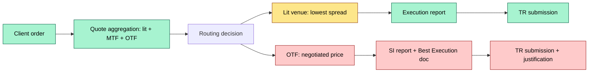
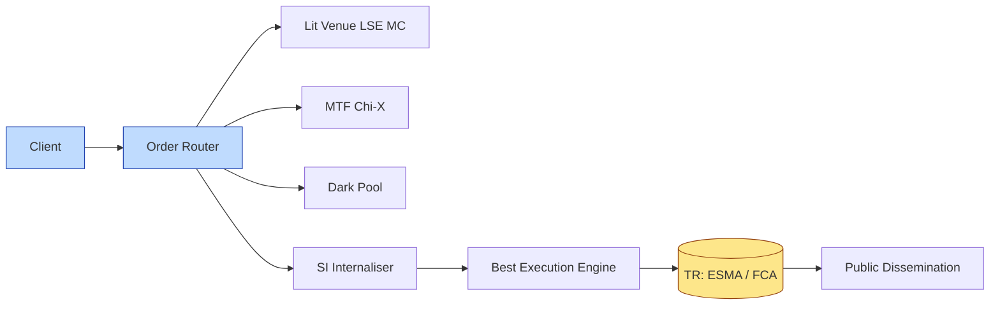

# [C3] MiFID II / MiFIR: transaction reporting, best execution — DETAIL

> **Category:** C3 Regulatory, Risk & Compliance · **Difficulty:** ◑ · **Banking-relevant:** yes / 💳
> **Companion brief:** `briefs/C3-03-mifid-transaction-reporting.md`

> > **Target reader:** enterprise architect who must *explain, justify, and defend* the topic — not just recite it.

---

## 1. Precise definition
MiFID II (Directive 2014/65/EU) is the EU regulatory framework for investment services and activities. MiFIR (Regulation (EU) No 600/2014) is the attached transaction-reporting regulation that mandates near-real-time dissemination of transaction data to trade repositories (TRs). Together they enforce Best Execution, transparency, and pre-trade / post-trade disclosure for all investment firms conducting systematic internalisers or MTF/OTF trading.

## 2. Why it exists
Pre-MiFID II (2007–2018), Europe was a fragmented landscape of 27 national regimes, minimal transparency, and variable Best Execution enforcement. The LIBOR-6 scandal (2012–2016) and Flash Crash (2010) exposed that:
- **Principal-execution routes** (internalisation, systematic internalisers) were opaque.
- **Transaction data** was unavailable to regulators for months, not seconds.
- **Best Execution** was a principle, not a measurable outcome.

MiFID II replaced 27 home-regulated markets with a single ESMA-supervised regime:
- **Best Execution** (Art. 24): must take all sufficient steps to obtain best result for client.
- **Transaction Reporting** (Art. 25–27 / MiFIR): all trades reported to TR within 15 minutes (now 10 minutes for FX) of execution.
- **Real-time Transparency** (Art. 27a–27b): pre-trade quotes (stock exchanges) and post-trade dissemination (published trades).
- **Systematic Internaliser** (SI): non-exchange venues must provide Best Execution documentation and report to TR.

## 3. Core concepts & vocabulary
| Term | Precise meaning |
|------|-----------------|
| **MiFID II** | Directive 2014/65/EU: framework for investment services, conduct, organizational requirements. |
| **MiFIR** | Regulation 600/2014: transaction reporting, transparency, market structure. |
| **Systematic Internaliser (SI)** | Non-exchange venue that repeatedly trades with clients on own account; must comply with SI regime. |
| **Best Execution** | Art. 24: must obtain best possible result taking into account price, costs, speed, likelihood of execution. |
| **Transaction Repository (TR)** | FCA-supervised (UK), ESMA (EU), SEC (US SDR): central reporting target for all MiFID II-reportable trades. |
| **UTP (Unique Transaction Identifier)** | ESMA-assigned number: must be unique, static, and appended to every reporting event. |
| **Pre-trade Transparency** | Display of best quotes / bids / offers on exchange; SI must consider prices on lit venues. |
| **Post-trade Transparency** | Published trade details (price, volume, time) within 15 minutes for equities, FX, bonds. |
| **RIF (Regulated Investment Firm)** | MiFID II entity: must comply with CRR capital, conduct, and ICT requirements.

## 4. How it works
### 4.1 The reporting pipeline
```mermaid
graph TD
    classDef critical fill:#ffe66d,stroke:#b8860b,stroke-width:2px,color:#000
    classDef core fill:#a7f3d0,stroke:#065f46,stroke-width:1px,color:#000
    classDef context fill:#dfe6e9,stroke:#636e72,color:#000
    A[Trade]:::critical --> B[Pre-trade check]:::core
    B --> C[Best Execution Engine]:::critical
    C --> D[Execution: lit / SI]:::core
    C --> E[Gas: internalisation]:::critical
    E --> F[SI Reconciliation]:::critical
    F --> G[TR Report (10-15 min)]:::core
    G --> H[(Trade Repository)]:::data
    H --> I[Public Dissemination]:::ok
```

### 4.2 Best Execution documentation


### 4.3 Post-trade publication
```mermaid
graph LR
    classDef service fill:#bfdbfe,stroke:#1e40af
    classDef data fill:#fde68a,stroke:#92400e
    classDef boundary fill:#f1f5f9,stroke:#475569,stroke-dasharray: 5
    A[TR Receive]:::service --> B[ESMA / FCA / MiFID clearance]:::service
    B --> C[Reference data validation]:::data
    C --> D[Published trade]:::data
    C -.-> E[Correction (7 days)]:::boundary
```

## 5. Variants, options & trade-offs
| Variant | When to pick | When to avoid | Key trade-off axis |
|---------|--------------|---------------|--------------------|
| **Lit execution (exchange)** | Large caps, liquid, retail | Slippage; venue fees | Price transparency vs execution cost |
| **SI execution (internalisation)** | Block, negotiated, illiquid | Best Execution burden; transparency risk | Custom pricing vs compliance |
| **Dark pools** | Institutional; anonymity | Pre-trade transparency limited | Anonymity vs price discovery |
| **MTF/OTF** | Standardized; better than SI | Spread wider than lit | Cost vs immediacy |

## 6. Relationships to sibling topics
- **C3-01 Global regulation:** MiFID II is the *specific* regulation within the global landscape; EMIR is the *derivative* overlay.
- **C4-07 STP:** Straight-through-processing must feed MiFID II TR events without manual re-keying (Art. 27).
- **C7-07 Business continuity:** TR reporting is a *critical,* non-diverting activity; if the TR feed breaks, the bank is fined.
- **C8-05 Sub-custodial network:** Cross-border SIs must marshal subsidiary execution + home regulator reporting.

## 7. Banking / financial-services context 💳
**JPMorgan Asset Management** (London) routes UK equity orders through LSE MC, Chi-X, and dark pools; documents Best Execution per client mandate (retail vs institutional). When a client accepts a negotiated block on SI, the bank produces a written Best Execution analysis per Art. 24.

**Real-world failure:** **Barclays** (2016–2017): ESMA fined €4.2M for failing to provide adequate pre-trade transparency on MTF, and failing to maintain SI compliance (no Best Execution documentation for 31,000 trades).

## 8. Reference architecture / worked example


**ADR-03: Best Execution Engine**
- **Status:** Accepted
- **Context:** Retail orders historically routed to a single execution venue; MiFID II requires 6 quote points, route-to-best, and per-order documentation.
- **Decision:** Deploy a Best Execution Engine that aggregates 6 quote points, weights by client mandate, and produces the required Art. 24 report per trade.
- **Consequence:** Reduced litigation exposure; new real-time dependency; latency added to order entry.

## 9. Maturity & adoption signals
- **Adopt when:** Any MiFID II-reportable trading; EU AUM > €100M; or SI activity.
- **Anti-signals:** Manual TR submission; no Best Execution record per trade; no pre-trade Q/O aggregation.
- **Common failure modes:**
  1. **UTP collision**: duplicate UTP or incorrect attribute → rejected TR report, fines.
  2. **Latency breach**: 15-minute reporting window missed → regulator fine + reputation risk.
  3. **Best Execution gap**: no route-to-best analysis for retail; highest execution price without justification.

## 10. Common confusions
| Often confused | Real distinction |
|----------------|------------------|
| MiFID II vs MiFIR | MiFID II = framework Directive; MiFIR = transaction reporting Regulation. |
| MTF vs OTF | MTF = exchange-like; OTF = pure over-the-counter (no exchange pre-trade transparency). |
| Best Execution vs lowest price | Best Execution = best result on price, speed, costs, likelihood — not just lowest price.

## 11. Tools & standards
- **Frameworks:** MiFID II Art. 24-27, MiFIR Art. 25-27a, ESMA RTS 697-706.
- **Common tooling:** FIX / ESMA FIX engine, Best Execution engines (Thomson Reuters, Bloomberg, internal), TR checkers (FCA TR, ESMA EUR, SEC SDR).
- **Mandatory reading:** "MiFID II Regulatory Technical Standards (RTS) 606-706", "ESMA Guidelines on Best Execution post-MiFID II".

## 12. ADR template
```markdown
# ADR-03: Best Execution Engine
## Status
Accepted
## Context
Retail orders historically to one venue; MiFID II requires 6 quotes, route-to-best, Art. 24 docs.
## Decision
Deploy Best Execution Engine: aggregate 6 quotes, weight by mandate, produce Art. 24 report per trade.
## Consequences
- Positive: Reduced litigation; auditable records.
- Negative: New real-time dependency; latency added.
## Alternatives considered
1. Manual broker routing: non-compliant post-2018.
```

## 13. Practice
1. **Recall:** MiFID II Art. 24 (Best Execution) and Art. 25 (reporting) definitions.
2. **Model:** draw the reporting pipeline from memory, labeling lit, dark, SI, TR.
3. **ADR:** write ADR-03 for the Best Execution Engine.
4. **Defend:** explain to a non-technical CCO why "lit is always best" is false under Art. 24.

## Summary
MiFID II/MiFIR is not a reporting rule; it is a *conduct and transparency* regime that turns every trade into a regulator-visible event. The architect must treat TR reporting as a non-diverting, low-latency, fault-tolerant pipeline — not an afterthought.

---
*Last updated: 2026-09-16*
*One diagram required. Both brief + detail must exist with ≥1 mermaid each before ✓.*
