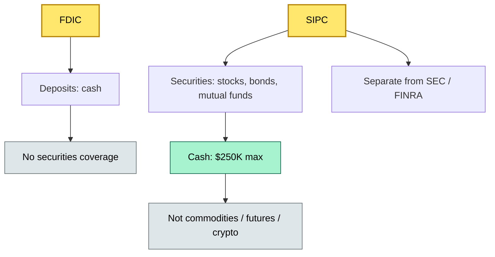
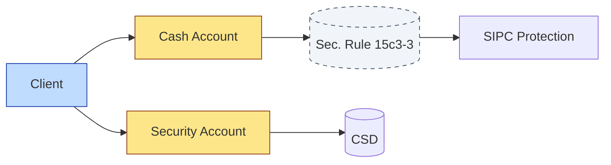
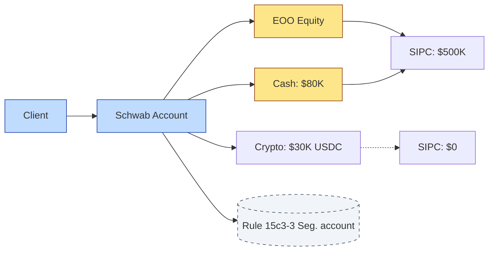

# [C3] SIPC / deposit-type protection and insurance backstop — DETAIL

> **Category:** C3 Regulatory, Risk & Compliance · **Difficulty:** ◑ · **Banking-relevant:** yes / 💳
> **Companion brief:** `briefs/C3-04-sipc-protection.md`

> > **Target reader:** enterprise architect who must *explain, justify, and defend* the topic — not just recite it.

---

## 1. Precise definition
SIPC (Securities Investor Protection Corporation) is a US not-for-profit corporation created by Congress in 1970 to provide a **limited insurance backstop** for broker-dealer clients in the event of the broker's failure. SIPC covers **securities** (stocks, bonds, mutual funds) and certain **refunds** (cash and cash equivalents) up to **$500,000 per client** (of which **$250,000 maximum in cash**). SIPC does **not** cover: commodities, futures, fixed annuities, or crypto.

## 2. Why it exists
The 1929 crash and derivative panics (1987 Black Monday) revealed that broker bankruptcy left retail clients with:
- **No insurance** for missing securities (only "proof of ownership" via C-K certificates or memoranda).
- **No regulatory backstop** for cash missing from segregated accounts (though Rule 15c3-3 reserve formula exists).
- **A legal quagmire**: clients had to petition bankruptcy court, with priority claims deferred behind secured creditors.

SIPC was created as a **patient-in-pessimism** alternative: instead of depositors racing to the bank (bank run), clients would have a no-deductible, first-loss insurer that acts as a "patient in pessimism."

## 3. Core concepts & vocabulary
| Term | Precise meaning |
|------|-----------------|
| **SIPC** | Securities Investor Protection Corporation; US insurer, not a regulator. |
| **Coverage limit** | $500,000 per client; $250,000 maximum for cash / cash equivalents. |
| **Segregated account** | Client cash held in trust, separate from broker's house assets (SEC Rule 15c3-3). |
| **Clean claim** | No unfair preferential transfers (no "satisfaction of debt"). |
| **Pro-rata distribution** | When claims exceed SIPC assets, remaining assets split proportionally (usually 90-day limit). |
| **SIPC liquidation** | Court-appointed trustee investigates; SIPC intervenes if qualifies; SIPC petition filed. |
| **Broker-dealer failure** | Event triggers SIPC: write-off of assets, excess liabilities, and losses up to SIPC limits. |
| **SIPC not a guarantee** | SIPC is an *insurer*, not a regulator: bail-in, not backstop. |

## 4. How it works
### 4.1 The SIPC claim lifecycle
```mermaid
flowchart LR
    classDef ok fill:#a7f3d0,stroke:#065f46,color:#000
    classDef risk fill:#fecaca,stroke:#991b1b,color:#000
    classDef money fill:#fde68a,stroke:#92400e,stroke-width:1px,color:#000
    A[Broker default / liquidation]:::risk --> B[SIPC petition filed]:::ok
    B --> C[Trustee investigation]:::risk
    C --> D[Clean claim? (no preference)]:::ok
    D --> E[SIPC coverage: $500K / $250K cash]:::money
    E --> F[Pro-rata if insufficient]:::ok
    F --> G[Clients reimbursed]:::money
    D --> H[Preference claim: recovery toward SIPC]:::risk
```

### 4.2 SIPC vs FDIC


### 4.3 Segregated account enforcement


## 5. Variants, options & trade-offs
| Variant | When to pick | When to avoid | Key trade-off axis |
|---------|--------------|---------------|--------------------|
| **SIPC-eligible broker** | US brokerage; no crypto; no futures | Crypto, commodities, futures | Coverage breadth vs exclusivity |
| **Statutory fronting** | Non-US asset manager using US broker | SIPC covers only client assets, not issuer risk | Regulatory simplicity vs direct ownership |
| **Local European equivalent** | London / Geneva custody | No direct SIPC; rely on FCA / LOU | Familiarity vs jurisdictional insurance |

## 6. Relationships to sibling topics
- **C3-02 Client asset rules:** SIPC's segregated accounts (Rule 15c3-3) are the *legal foundation* for SIPC coverage.
- **C7-06 Liquidity and funding:** In a broker bankruptcy, liquidity dries up fast; SIPC is the last 90-day backstop.
- **C7-07 Business continuity:** SIPC must be notified within 5 days of notice to cease business (SEC rule).
- **C8-06 Data architecture:** Client position data must survive broker bankruptcy to prove SIPC claims.

## 7. Banking / financial-services context 💳
**Charles Schwab** (US retail broker) maintains SIPC membership. In a hypothetical liquidation, a client with 100 shares of VOO and $80,000 cash would be:
- **Securities:** VOO (covered by SIPC up to $500K).
- **Cash:** $80K (covered by SIPC up to $250K cash max; fully covered here).
- **Total:** $500,000 SIPC coverage — maximum.

If the client also held $30,000 in USDC (crypto): **$0** SIPC coverage; must rely on IP protections or civil recovery.

**Real-world failure:** **Coinbase** is not SIPC-eligible for crypto; **FTX** (Bahamas) had no SIPC or escrow coverage for US users. The lesson: SIPC is narrow.

## 8. Reference architecture / worked example


**ADR-04: Crypto Withdrawal and SIPC**
- **Status:** Proposed
- **Context:** Client requests to withdraw USDC to self-custody wallet during margin stress.
- **Decision:** Flag all non-SIPC-eligible assets before any liquidity event; auto-notify clients of withdrawal holes.
- **Consequence:** Exposes non-insured exposure; improves transparency; may trigger run.

## 9. Maturity & adoption signals
- **Adopt when:** Any US broker/dealer relationship; custody of US equities / mutual funds.
- **Anti-signals:** Custody of crypto, futures, or commodities without separate insurance; no segregated account policy; no SIPC disclosure in prospectus.
- **Common failure modes:**
  1. **Double-dipping:** client counts both SIPC and Rule 15c3-3 as "insurance" — they are not exchangeable.
  2. **Preference claims:** client who withdrew cash 90 days before default may be forced to repay.
  3. **Crypto gap:** SIPC explicitly excludes crypto; firms mischaracterize it as "covered."

## 10. Common confusions
| Often confused | Real distinction |
|----------------|------------------|
| FDIC vs SIPC | FDIC = deposit insurance; SIPC = securities insurance. |
| SIPC vs SEC enforcement | SIPC = insurance; SEC = regulator. |
| SIPC vs mailbox pass-through (German Privatbrief) | SIPC = US; Privatbrief = German bank bankruptcy protection (under 3% of deposits, €100k max). |
| SIPC vs customer guarantees (Japan, UK banks) | UK: FSCS covers deposits; securities need no extra insurance. |

## 11. Tools & standards
- **Frameworks:** SIPC Act (1970), SEC Rule 15c3-3, FINRA Rule 4313 (SIPC disclosure).
- **Common tooling:** SIPC online search, client asset monitoring dashboards, crypto withdrawal endpoint tagging.
- **Mandatory reading:** "SIPC: A Brief History and Coverage Guide", "SEC Rule 15c3-3 Reserve Formula".

## 12. ADR template
```markdown
# ADR-04: Crypto Withdrawal and SIPC
## Status
Proposed
## Context
Client requests USDC withdrawal during margin stress; SIPC excludes crypto.
## Decision
Flag non-SIPC assets before liquidity events; auto-notify clients.
## Consequences
- Positive: Transparency; client clarity.
- Negative: May trigger run; no insurance backstop exists.
## Alternatives considered
1. No flagging: violate client disclosure; regulator fine.
```

## 13. Practice
1. **Recall:** SIPC coverage limits ($500K / $250K cash max) in under 30 seconds.
2. **Model:** draw the SIPC vs FDIC map from memory.
3. **ADR:** write ADR-04 for crypto withdrawal.
4. **Defend:** explain to a client why their crypto is not SIPC-covered.

## Summary
SIPC is a **$2.5B** insurance fund, not a regulator. It covers 2 million+ claimants since 1970. It is narrow, not universal. Every custodian holding US securities must disclose SIPC membership — and must not let the client believe it covers everything.

---
*Last updated: 2026-09-16*
*One diagram required. Both brief + detail must exist with ≥1 mermaid each before ✓.*
