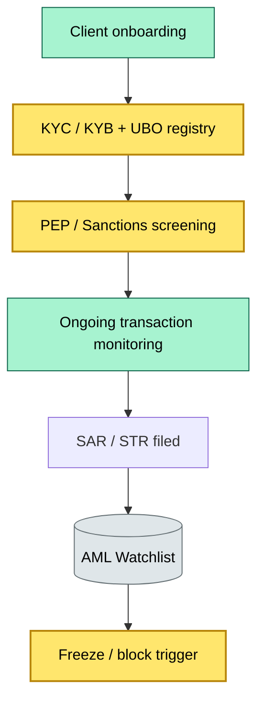
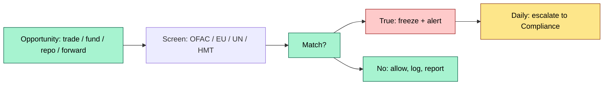
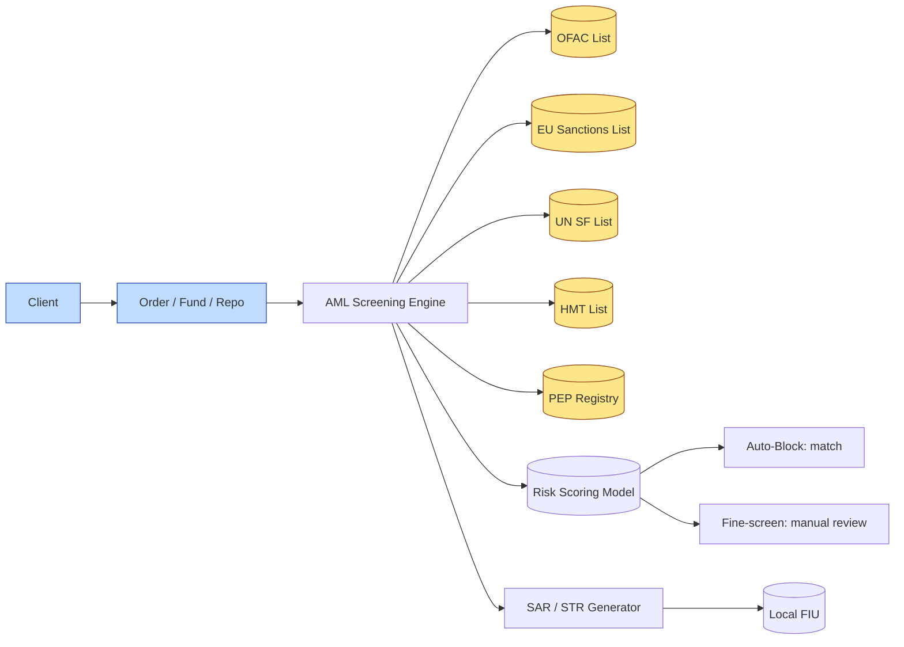

# [C3] FATF / AML / KYC / sanctions — obligation on the custodian — DETAIL

> **Category:** C3 Regulatory, Risk & Compliance · **Difficulty:** ◑ · **Banking-relevant:** yes / 💳
> **Companion brief:** `briefs/C3-05-fatf-aml-kyc.md`

> > **Target reader:** enterprise architect who must *explain, justify, and defend* the topic — not just recite it.

---

## 1. Precise definition
FATF (Financial Action Task Force) is an intergovernmental body that sets **global standards** on AML, counter-terrorist financing (CTF), and sanctions. The custodian's obligation is to:
1. **Know your customer (KYC):** identify and verify the ultimate beneficial owner (UBO).
2. **Monitor transactions:** detect suspicious patterns (structuring, layering, trade-based money laundering).
3. **Report:** file SARs / STRs with local FIU and screen against sanctions lists (OFAC, EU, UN).
4. **Freeze / block:** immediate suspension of funds/assets upon sanctioned entity match.

## 2. Why it exists
The 9/11 attacks and the 2008 crisis exposed that:
- **$2 trillion+** flows through financial services annually; <3% is traced.
- **Securities-based money laundering** (SBL) — using stocks, bonds, repo to move value — was invisible to banks until FATF added it to its standards (2012, revised 2019).
- **Sanctions evasion** via securities: OFAC's 2022 sanctions on Russian equities ($60B+ in frozen Russian stocks) proved that custodians are the *last line of defense* for frozen assets.

FATF Recommendations 9–10 cover wire transfers and VAS providers; all custodians with a securities licence fall under its scope.

## 3. Core concepts & vocabulary
| Term | Precise meaning |
|------|-----------------|
| **FATF** | Intergovernmental body; sets global AML/CTF/sanctions standards (40 Recommendations). |
| **KYC** | Know Your Customer: verify identity, UBO, source of wealth. |
| **KYB** | Know Your Business: due diligence on legal entity, beneficial owners, parent company. |
| **KYC / KYB triggers** | Money laundering, counter-terrorism, corruption, sanctions. |
| **UBO** | Ultimate Beneficial Owner: natural person(s) controlling / 25%+ of entity. |
| **SBL** | Securities-based money laundering (GATT / FATF 2019 addition). |
| **Structuring / layering** | Breaking large sums into smaller transactions to evade thresholds. |
| **SAR / STR** | Suspicious Activity Report / Suspicious Transaction Report: filed with local FIU. |
| **Sanctions screening** | Real-time / end-of-day matching against OFAC, EU, UN, HMT lists. |
| **PEP** | Politically Exposed Person: enhanced due diligence (EDD) required. |

## 4. How it works
### 4.1 The AML / CFT control stack


### 4.2 Sanctions screening pipeline


### 4.3 Securities-based money laundering
```mermaid
graph LR
    classDef service fill:#bfdbfe,stroke:#1e40af
    classDef data fill:#fde68a,stroke:#92400e
    classDef boundary fill:#f1f5f9,stroke:#475569,stroke-dasharray: 5
    A[Caster]:::service --> B[PI (Principal Intermediary)]:::service
    B --> C[Custody Bank]:::critical
    C --> D[Trade execution]:::data
    D --> E[Trade reporting]:::data
    E -.-> F[FATF A I2 / A I11]:::boundary
```

## 5. Variants, options & trade-offs
| Variant | When to pick | When to avoid | Key trade-off axis |
|---------|--------------|---------------|--------------------|
| **On-platform screening** | High-volume trades, real-time execution | False positive rate; latency | Speed vs accuracy |
| **Pre-trade screening** | US equities, large-value repo | Latency: 100ms tick | Compliance vs execution speed |
| **Post-trade screening + deferred fine** | International equities, FX | Delayed block; reputational risk | Scale vs immediacy |
| **Batch-mode (end-of-day) + morning freeze** | Retail-axle, low-value | Day-session trades may sit unblocked | Coverage vs operational simplicity |
| **Enhanced due diligence (EDD)** | PEPs, high-risk jurisdictions (FATF GRE) | Cost; friction; client churn | Risk reduction vs client experience |

## 6. Relationships to sibling topics
- **C3-01 Global regulation:** FATF travels with jurisdiction; the same entity receives US, EU, and APAC regulatory expectations.
- **C3-04 SIPC / insurance:** AML screening is a *pre-requisite* for SIPC / FFS; if the account is sanctioned, allocation is frozen.
- **C3-07 Financial crime:** AML is the *front door*; financial crime (fraud, cyber, sanctions) is the *back door* — they require different detection logic.
- **C3-08 Tax (CTF):** CRS and FATCA are data-matching obligations that feed AML identity resolution.
- **C3-10 ESG / TCFD:** ESG goals=monitoring = source-of-wealth checks on funds that claim sustainable assets.

## 7. Banking / financial-services context 💳
**HSBC** (Dubai) flagged £52M in suspicious transactions from 2011–2018, but failed to file SARs promptly. The US fined $1.9B (2010); the UK fined £665M (2020). The root cause was not a technical failure but an *organizational* one: AML screening tools existed, but the organization structure (every bank independent, refusal to share data across borders) prevented detection.

**Real-world failure:** **Deutsche Bank** paid $725M (2019) for processing $557B in Russian and Iranian transactions from 2012–2017 despite sanctions. The screening system existed; the *alert-to-action* pipeline was broken (false positive suppression, no escalation).

**Modern: 2024–2026 sanctions era:** $60B+ in Russian equities frozen; ICS / ICS = International Consortium on Assets. Custodians now face:
1. **Guns-for-hire:** frozen-asset auctions via auction platforms (Axon, Everix).
2. **DUSFT asters** = derivative-based sanctions evasion (e.g., using Mispriced Russian stocks as collateral).
3. **Deepfake / synthetic ID** fraud: new AML challenge.

## 8. Reference architecture / worked example


**ADR-05: Real-Time OFAC Streaming**
- **Status:** Proposed
- **Context:** End-of-day sanctions screening misses trades executed between market open and list update.
- **Decision:** Adopt streaming Fed / HHS / OFAC lists via API; 5-second look-up latency; circuit-breaker to auto-block.
- **Consequence:** Eliminates the "gap" window; triggers 10x+ alert volume; requires auto-triage.

## 9. Maturity & adoption signals
- **Adopt when:** Any US, EU, or UK securities custody; automated screens required by regulators (MiFID II Art. 16, SEC, FCA SYSC).
- **Anti-signals:** Manual controls for high-value clients; no real-time sanctions; sanctions screen bypass for "VIP"; no SAR queue with SLA.
- **Common failure modes:**
  1. **Supression of alerts:** analysts set high thresholds to reduce false positives; true positives missed.
  2. **Alert fatigue:** too many alerts, no triage → manual review queue grows → S/L > 30 days.
  3. **Globality bias:** screening only at onboarding; UBOs change, entity structures shift, sanctions lists update.

## 10. Common confusions
| Often confused | Real distinction |
|----------------|------------------|
| KYC vs KYB vs UBO | KYC = customer; KYB = legal entity; UBO = ultimate beneficial owner. |
| SAR vs STR | SAR = US (FinCEN); STR = UK / EU / others (FIU). |
| Sanctions vs AML | Sanctions = political restriction; AML = general money-laundering risk. |
| FATF vs OFAC | FATF = standards body; OFAC = US sanctions administrator. |
| PEP vs HNW | High-net-worth individual; PEP = political exposure = EDD (enhanced), not just HNW (standard). |

## 11. Tools & standards
- **Frameworks:** FATF Recommendations 1–40, 9–10; 2022 guidance on SBL; OFAC SDN, EU, UN SF, HMT lists.
- **Common tooling:** Refinitiv World-Check, Dow Jones Risk & Compliance, Persona (AI ID verification), regtech (ComplyAdvantage, Certn), sanctions screening engines (ArcGuard, NICE Actimize, Relativity).
- **Mandatory reading:** "GATT 2024: Securities-based Money Laundering", "OFAC "Know Your Customer" Guidance", "FATF Travel Rule 16".

## 12. ADR template
```markdown
# ADR-05: Real-Time OFAC Streaming
## Status
Proposed
## Context
End-of-day screening misses trades between market open and list update.
## Decision
Stream OFAC / HHS / EU / UN lists via API; 5-second look-up; auto-block on match.
## Consequences
- Positive: Zero-gap window; eliminates $60B+ Russian equity problem.
- Negative: 10x+ alert volume; need auto-triage pipeline.
## Alternatives considered
1. Batch only: fails in real-time.
```

## 13. Practice
1. **Recall:** FATF Recommendations 9 and 10 (KYC, CDD, high-risk businesses) in under 2 minutes.
2. **Model:** draw the control stack from csm, labeling KYC, screening, SAR, and freeze.
3. **ADR:** write ADR-05 for real-time OFAC streaming.
4. **Defend:** explain to a non-technical CRO why "our compliance team is human" fails in the financial crime automation era.

## Summary
FATF is the *global minimum standard*; local regulators (OFAC, FCA, BaFin) are the *enforcement*. The curator's obligation is a **continuous** one — not a one-time onboarding event. Every new product, every UBO change, and every sanctions-list update re-opens the clock.

---
*Last updated: 2026-09-16*
*One diagram required. Both brief + detail must exist with ≥1 mermaid each before ✓.*
