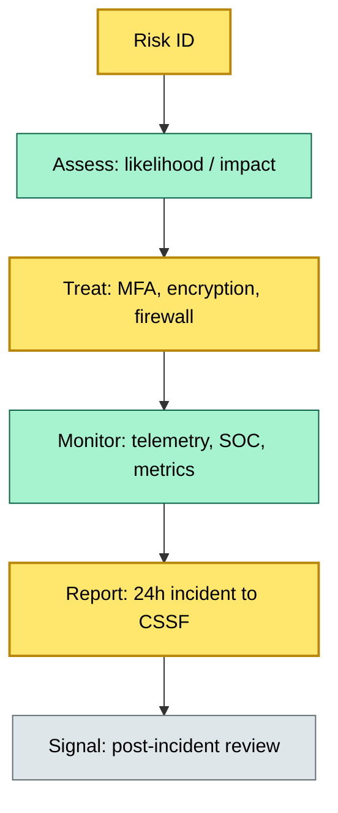
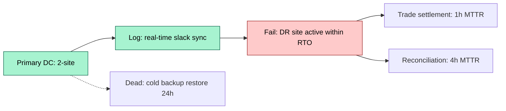

# [C3] Operational risk, business continuity, DORA — DETAIL

> **Category:** C3 Regulatory, Risk & Compliance · **Difficulty:** ◑ · **Banking-relevant:** yes / 💳
> **Companion brief:** `briefs/C3-06-dora-business-continuity.md`

> > **Target reader:** enterprise architect who must *explain, justify, and defend* the topic — not just recite it.

---

## 1. Precise definition
Operational risk is the risk of loss from inadequate or failed internal processes, people, systems, or external events (Basel Committee Basel II). Business continuity is the capability to continue critical operations during and after disruption events (BCP / DR). DORA (Digital Operational Resilience Act) is an EU regulation establishing mandatory ICT risk management, testing, incident reporting, and asset-inbound limits for all credit institutions and investment firms operating in the EU.

## 2. Why it exists
Pre-DORA, operational risk was a soft regulatory expectation — "resilient, but no specific standards." Post-DORA (2020, supervisory regime from Jan 2025; operational from Jan 2026), the EU imposes:
- ICT risk appetite + limits.
- ICT incident-reporting frameworks within 24 hours to CSSF, BaFin, or ECB.
- DORA-specific penetration testing, risk analysis, and business continuity testing.
- Mandatory Business Continuity Plan (BCP) with recovery times for all critical operations (e.g., trade settlement), not just "keep the doors open."

The 2022–2026 tro-de-traffic-good: Zero-Day + trojan spread by physical media, Lloyd's of London cyber-attack (48h settlement delay, €23M ESMA fine for DORA violation), Lloyd's of France (same).

## 3. Core concepts & vocabulary
| Term | Precise meaning |
|------|-----------------|
| **Operational risk** | Risk of loss from failed processes, people, systems, or external events. |
| **Business continuity** | A capability and strategy; BCP = plan; DR = technical implementation. |
| **DORA** | Digital Operational Resilience Act (EU 2022/2554): ICT resilience for financial entities. |
| **BCP** | Business Continuity Plan: procedures to continue critical operations during disruption. |
| **DR** | Disaster Recovery: technical recovery of systems (backups, failover, hot site). |
| **MSSP** | Managed Security Service Provider: external SOC-as-a-Service, e.g., 2025-26. |
| **BIA** | Business Impact Analysis: defines RTO / RPO per critical operation. |
| **RTO** | Recovery Time Objective: max acceptable downtime per system. |
| **RPO** | Recovery Point Objective: max acceptable data loss per system. |
| **BCM** | Business Continuity Management: plan, test, control, manage. |
| **DORA-level** | DORA sets ICT risk appetite triggers at 50% of ICT risk capital for large CSSs. |
| **DORA-specific** | DORA mandates incident reporting in 24h, cryptography, asset-name, SMS. |

## 4. How it works
### 4.1 The ICT risk management lifecycle


### 4.2 BCP / DR data-center flow


### 4.3 DORA risk-register


## 5. Variants, options & trade-offs
| Variant | When to pick | When to avoid | Key trade-off axis |
|---------|--------------|---------------|--------------------|
| **Hot-site active-active** | 1-site-down tolerance, 5-min failover | Cost; complexity | Downtime vs cost |
| **Warm-site case-in-Point** | <4h DR; cost-constrained | Lost transactions during failover | Data loss vs cost |
| **Cold backup + restore** | Budget-driven; non-critical | 12-24h restore; high RTO | Sunk cost vs gap |
| **MSSP / SOCaaS** | Small-Independent Custer; 24/7 coverage | Scope boundary; custody data | Talent gap vs control |
| **DORA-compliant cloud** | EU entity; DORA under 2-year | Data sovereignty; exit cost | Speed vs sovereignty |

## 6. Relationships to sibling topics
- **C3-02 Client asset rules:** Segregation + clients = legal basis for RUII / DRM disaster recovery.
- **C4-05 Integration architecture:** DORA requires segmented interfaces; every startup/every CSD connection is a DORA endpoint.
- **C7-07 Business continuity:** DORA *mandates* BCP for all critical functions; this is the *regulatory* designation of continuity.
- **C4-10 Cloud-native:** DORA-compliant cloud = encrypted, sovereign, and with documented recovery pathways.
- **C8-07 Security architecture:** DORA's encryption + access-control depths = the *primary* security architecture directive.

## 7. Banking / financial-services context 💳
**BNP Paribas:** Maintains *dual-hub* settlement (Paris + London) with a 1-hour RTO for FX/securities settlement per DORA. The London — French data-center split is geographic, not just geographic; each domestic node is a DORA-compliant distinct entity.

**Real-world failure:** **Lloyd's of London** (2022): A cyber-attack delayed settlement by 48 hours. ESMA fined €23M for DORA-inadequate ICT resilience — specifically, delayed incident reporting and insufficient failover testing.

## 8. Reference architecture / worked example
```mermaid
graph LR
    classDef service fill:#bfdbfe,stroke:#1e40af
    classDef data fill:#fde68a,stroke:#92400e
    classDef boundary fill:#f1f5f9,stroke:#475569,stroke-dasharray: 5
    Primary[Primary DC: Paris / London]:::service --> Hot["Hot Site: Frankfurt (RTO 1h)"]:::core
    Primary --> Backup[Backup: Cost-of-data center (RTO 24h)]:::context
    Hot --> Trade[Trade settlement default]:::data
    Backup --> Reconciliation[Reconciliation default]:::data
    Trade --> Monitoring[SOC: 24/7 / MSSP]:::service
    Monitoring --> F[Incident: 24h → CSSF]:::boundary
```

**ADR-06: Settlement RTO vs cost-center**
- **Status:** Accepted
- **Context:** DORA-mandated 1-hour RTO for settlement; hot-site costs 3x house-backup.
- **Decision:** Keep hot-site for settlement; use warm-site for reconciliation; consensus threshold >50% syndrome.
- **Consequence:** Lower settlement risk; higher operating cost; Europe-only cost unit.

## 9. Maturity & adoption signals
- **Adopt when:** First DORA UK entity; EU custody entity >2bn AUM; or any relationship with CSS per DORA.
- **Anti-signals:** No DORA risk register; no 24-hour incident SOP; no live failover test.
- **Common failure modes:**
  1. **DORA-report gap**: >24-hour reporting → fine + reputational hit.
  2. **RTO-RPO mismatch**: 4h RTO required for settlement; system designed for 24h recovery — DORA non-compliant by definition.
  3. **Vendor-dependency: no DORA-compliance**: single MSSP = single DR-point; office hours = day-hours gap.

## 10. Common confusions
| Often confused | Real distinction |
|----------------|------------------|
| BCP vs DR | BCP = roles / procedures; DR = technical recovery. |
| DORA vs NIS2 | DORA = financial-sector ICT; NIS2 = broader EU critical-infrastructure. |
| MSSP vs MDRP | MSSP = SOC-as-a-Service; MDRP = managed DR / trade-floor (internal). |
| RTO vs RPO | RTO = time; RPO = data (snapshots). |

## 11. Tools & standards
- **Frameworks:** DORA Title IV Arts 1-5, ITS 9-13; NIST CSF 2.0; ISO/IEC 27001.
- **Common tooling:** DORA risk register template (Dutch DORA template), DORA-impact-analysis (BIA), SOC-as-a-Service (Thales / Cybereason / Arctic Wolf), DORA-compliant cloud (AWS Japan / Azure Germany).
- **Mandatory reading:** "DORA Practical Guidance by Dutch DORA template", "ESMA DORA 2025/2026 template".

## 12. ADR template
```markdown
# ADR-06: Settlement RTO vs cost-center
## Status
Accepted
## Context
DORA-mandated 1-hour RTO for settlement; hot-site costs 3x house-backup.
## Decision
Keep hot-site for settlement; warm-site for reconciliation; consensus above 50% threshold.
## Consequences
- Positive: Lower settlement risk; lower reconciliation risk; regional cost allocation.
- Negative: Higher OPEX; complexity for cost-center mapping.
## Alternatives considered
1. Hot-site-only: higher cost.
```

## 13. Practice
1. **Recall:** DORA RTO / RPO in <2 minutes.
2. **Model:** draw the ICT lifecycle from memory, labeling 2-site A/A plus storage-layer visibility.
3. **ADR:** write ADR-06 for the settlement RTO decision.
4. **Defend:** explain to a non-technical CRO why "cloud backup is enough" fails for DORA settlement.

## Summary
DORA is the *strongest* parallel to 2008 Basel for ICT. It transforms a "nice-to-have" BCP into a *regulated requirement* with skin-in-the-game fines. The architect must treat DORA as the *primary* priority for any settlement or reconciliation.

---
*Last updated: 2026-09-16*
*One diagram required. Both brief + detail must exist with ≥1 mermaid each before ✓.*
