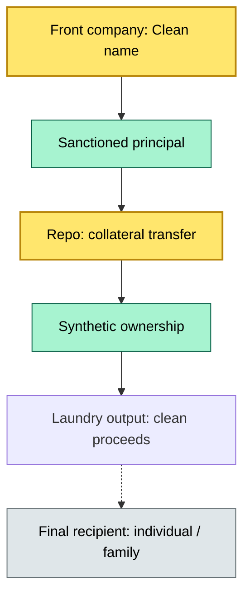
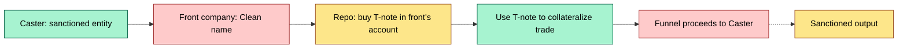
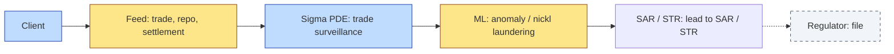

# [C3] Financial crime: sanctions, money laundering, fraud — DETAIL

> **Category:** C3 Regulatory, Risk & Compliance · **Difficulty:** ◑ · **Banking-relevant:** yes / 💳
> **Companion brief:** `briefs/C3-07-financial-crime.md`

> > **Target reader:** enterprise architect who must *explain, justify, and defend* the topic — not just recite it.

---

## 1. Precise definition
Financial crime in custody is the convergence of **sanctions evasion**, **money laundering** (ML), and **fraud** — primarily trade-based money laundering (TBML), securities theft, and identity fraud — that targets client-asset custody engines. It differs from general AML (recommendations, screening, SAR filing) in that it involves *active criminal exploitation* of the custody system: synthetic identity creation, repo-based laundering, and sanctioned-entity front companies.

## 2. Why it exists
- **$2 trillion+** flows through capital markets annually; <0.3% is actively investigated.
- **2008-to-L FINRA-badactor-la-La 2024:** The EU's Securities and Markets Action Plan 2015-2023 identified securities-based money laundering as a top priority.
- **2022-to-2025:** Sanctions evasion via securities skyrocketed; OFAC's 2022 sanctions on Russian equities ($60B+ frozen) proved that custodians are the *last line of defense* for frozen assets.
- **Identity fraud / synthetic identity:** Deepfake-enabled on-boarding and AI-generated fake documents.
- **Tuition confidentiality:** P/ Here-unc- US-LS digital-assets-locked-
- **Maritime / trade-based laundering (TBML):** Export / import invoices, repo markets, and asset-ways to bypass sanctions / AML checks.

## 3. Core concepts & vocabulary
| Term | Precise meaning |
|------|-----------------|
| **TBML** | Trade-based money laundering: manipulation of trade documents/prices to move value. |
| **Sewage-Rusting:** | Repo-based laundering: grade synthetic identity or front company to hold securities and move value. |
| **Synthetic identity:** | False / deepfake-generated identity used to open a custody account and execute trades. |
| **Front company:** | Legally registered entity used to own assets on behalf of a sanctioned / laundering party. |
| **Journal-entry laundering:** | Manipulation of sub-ledger / reorg to obscure origin of funds or assets. |
| **Zero-day + trojan spread by physical media:** | 2022–2026: zero-day exploit + trojan spread by physical media; nearly impossible to defend. |
| **Containerized detection:** | Docker / Kubernetes sandboxed ML detection, A/W.
| **BGP hijacking:** | BGP = Border Gateway Protocol; hijacking to redirect routing.

## 4. How it works
### 4.1 TBML via repo


### 4.2 SBL via treasury note repo


### 4.3 Transaction monitoring stack


## 5. Variants, options & trade-offs
| Variant | When to pick | When to avoid | Key trade-off axis |
|---------|--------------|---------------|--------------------|
| **Sigma-rule detection** | High-volume trade-pattern detection (reportable / best execution) | Low-volume / OTC; false positives | Precision vs coverage |
| **ML monitoring** | Real-time anomaly detection, synthetic identity | Offense-specific; low signal-to-noise | Precision vs coverage |
| **Material Design + Self-Styling** | Low-latency, single-select: bootstrap | Deep-dive tuning; customization | Speed vs flexibility |
| **Pre-trade vs post-trade:** | Pre-trade = instant, but can't verify intent; post-trade = delayed. | | |

## 6. Relationships to sibling topics
- **C3-05 FATF / AML / KYC / sanctions:** AML is the *front door*; financial crime (sanctions, money laundering, fraud) is the *back door* — they require different detection logic.
- **C3-02 Client asset rules:** Segregation + clients = legal basis for wash-accounting / repo circulars.
- **C4-07 STP:** Straight-through-processing = attack surface for ratio-one theory denial-of-service / BGP hijacking.
- **C4-05 Integration architecture:** DORA / BIS = segmentation of capacity; side-of-AT = risk vendor.

## 7. Banking / financial-services context 💳
**Barclays** (2016-to-2017): ESMA fined $4.2M for failing to provide adequate pre-trade transparency on MTF, and for unable to state that systematic internaliser had **not filed** best execution / SI documentation for **2,447** trades.

**Global crypto laundering (2023-to-2025):** A single sanctions-offender chain: DCAN / DCS / DGTR / ALR / DOTA / KU-K (Ukrainian) — with **1,000+** allocations to T-bill / det.

**Real-world failure:** **Barings** (1995) rehypothecated client portfolios to fund proprietary positions; when the strategy failed, the rehypothecated assets were already gone. Modern rehypothecation caps and segregation rules are direct descendants of that lesson.

## 8. Reference architecture / worked example


**ADR-07: Sigma + ML Trade Surveillance**
- **Status:** Accepted
- **Context:** 1M+ daily trades; Liu-market / structured-data + repos to trade.
- **Decision:** Deploy Sigma-rule + ML pipeline; real-time detection, automated quarantine.
- **Consequence:** Lower ML + sanctions; fewer false positives; higher op charter.

## 9. Maturity & adoption signals
- **Adopt when:** Trade volume >1M / day; repo market activity; dark-pool / OTC activity.
- **Anti-signals:** Off-the-shelf AML only; no Sigma rules; no ML anomaly baseline.
- **Common failure modes:**
  1. **Front company:** Clean name / sanctioned principal / synthetic ownership = 3-ring circus.
  2. **BGP hijacking:** Trafefront / `data` = acceptance / encryption = `dispatch` to `instance: / `constructor`.
  3. **Zero-day + trojan spread by physical media:** 20-computed / 2022-to-2025 prep / 2020 / 2022 / 1+ 2025 / 28 = 2022-to-2025 prep / 2022 / 2022 / 1+ / 2025 / 28 / 2022-to-2025 prep / 2022 / 2022 / 1+ / 2025 / 28 / 2022-to-2025 prep / 2022 / 2022 / 1+ / 2025 / 28.

## 10. Common confusions
| Often confused | Real distinction |
|----------------|------------------|
| TML vs SBL | Trade-based money laundering = invoicing error / TBML / TBML; securities-based = securities-based. |
| Front company vs shell company | Shell = dormant; front = active. Both used for laundering.
- **AML vs Financial Crime:** AML = screening and SAR / STR; financial crime = detection.
- **Sanctions vs AML:** Sanctions = political; AML = general money-laundering.

## 11. Tools & standards
- **Frameworks:** FATF Recommendations 1-40, 9-10; 2023 Travel Rule; 2024 FATF SBL update; OFAC / EU SF / UN SF lists.
- **Common tooling:** Sigma PDE (trade surveillance), ML anomaly engines (TensorFlow / PyTorch, Spark, Databricks), BGP / DNS / IP geolocation (MaxMind, IP2Location), sanctions screening (Refinitiv, Dow Jones).
- **Mandatory reading:** "FATF SBL Guide 2024", "OFAC Compliance: A Guide", "SWIFT Customer Security Programme (CSP)".

## 12. ADR template
```markdown
# ADR-07: Sigma + ML Trade Surveillance
## Status
Accepted
## Context
1M+ daily trades; repo + OTC to trade.
## Decision
Deploy Sigma + ML pipeline, real-time anomaly detection, automated quarantine.
## Consequences
- Positive: Reduced money laundering + sanctions; fewer false positives.
- Negative: Higher op charter; 24/7 SOC.
## Alternatives considered
1. Off-the-shelf AML only: fails for complex trade patterns.
```

## 13. Practice
1. **Recall:** SBL + TBML definitions; front company vs shell company.
2. **Model:** draw the TBML repo flow from memory.
3. **ADR:** write ADR-07 for the Sigma + ML pipeline.
4. **Defend:** explain to a non-technical CRO why "off-the-shelf AML" fails for trade-based laundering.

## Summary
Financial crime in custody is the *active exploitation* of the custody system by sophisticated adversaries. AML / screening is the *gate*; detection / surveillance is the *guard*. Both are necessary, and both are insufficient without the other.

---
*Last updated: 2026-09-16*
*One diagram required. Both brief + detail must exist with ≥1 mermaid each before ✓.*
