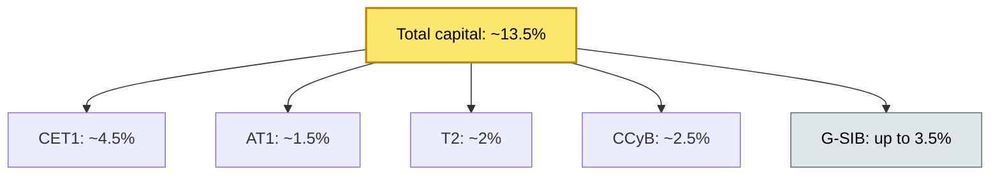
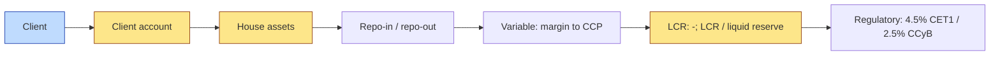

# [C3] Capital & leverage requirements (Basel, liquidity risk) — DETAIL

> **Category:** C3 Regulatory, Risk & Compliance · **Difficulty:** ◔ · **Banking-relevant:** yes / 💳
> **Companion brief:** `briefs/C3-09-capital-requirements.md`

> > **Target reader:** enterprise architect who must *explain, justify, and defend* the topic — not just recite it.

---

## 1. Precise definition
Capital requirements (Basel III) are the minimum regulatory capital (CET1, AT1, T2) a bank must hold against its risk-weighted assets (RWAs). Liquidity risk is the risk of not meeting payment obligations due to lack of cash or available funding. The custodian's impact is indirect but material: segregated client assets do NOT count as regulatory capital; margin / collateral posted by the bank to CSDs or CCPs is a Tier 2 / Tier 1 capital drain; and DORA / LCR / NSFR requirements impose additional liquidity buffers.

## 2. Why it exists
- **2008 crisis:** Banks with <3% Tier 1 capital absorbed massive losses.
- **Eurozone sovereign risk:** 2011-to-2012 showed that liquidity and capital were correlated: Greek CDS spiked, banks' capital ratios fell, and depositor runs began.
- **DORA:** Doubles down on liquidity for ICT disruption (e.g., 24h incident = no access to markets = liquidity hit).

Basel III defined:
- **CET1:** Common equity Tier 1 (core capital) — 4.5% min, 2.5% conservation + G-SIB buffer.
- **AT1:** Contingent convertible bonds / hybrid instruments — 1.5% min.
- **T2:** Tier 2 capital — 2% min; includes revaluation reserves, general provisions.
- **CCyB:** Capital Conservation Buffer — 2.5% of RWAs.
- **G-SIB:** Global Systemically Important Bank buffer — up to 3.5% on top of CET1.

Liquidity (LCR + NSFR):
- **LCR:** Liquid assets / net cash outflows over 30 days >= 100%.
- **NSFR:** Available Stable Funding / required stable funding over 1 year >= 100%.

## 3. Core concepts & vocabulary
| Term | Precise meaning |
|------|-----------------|
| **Basel III** | Post-2008 capital framework: CET1 / AT1 / T2 + buffers. |
| **CET1** | Common equity Tier 1: common shares, retained earnings, disclosed reserves. |
| **AT1** | Additional Tier 1: sub-ordinated debt, contingent convertible bonds. |
| **T2** | Tier 2: revaluation reserves, general provisions, hybrid instruments. |
| **CCyB** | Counter-cyclical capital buffer: 0-2.5% of RWAs; varies by jurisdiction. |
| **G-SIB** | Global Systemically Important Bank: 1-3.5% extra capital. |
| **LCR** | Liquidity Coverage Ratio: >= 100% liquid assets / net cash outflows (30 days). |
| **NSFR** | Net Stable Funding Ratio: >= 100% available stable funding / required stable funding (1 year). |
| **RWAs** | Risk-weighted assets: total assets * risk weight (0%-150%). |
| **Segregated assets** | Client assets in trusts / reserves; NOT counted as CET1 / AT1. |
| **Variation margin** | Daily gains/losses posted to CCP; counted as contingent outflow under LCR. |
| **Cash-like** | LCR-eligible: central bank reserves, sovereign bonds, gold. |
| **LCR-eligible** | Must be unencumbered, traded in deep market, 0% haircuts. |

## 4. How it works
### 4.1 Capital structure diagram


### 4.2 LCR calculation


### 4.3 Custody-specific liquidity drag
```mermaid
graph LR
    classDef service fill:#bfdbfe,stroke:#1e40af
    classDef data fill:#fde68a,stroke:#92400e
    classDef boundary fill:#f1f5f9,stroke:#475569,stroke-dasharray: 5
    Client:::service --> Collateral[Client collateral (house + trade)]:::data
    Collateral --> CCP[(CCP variation margin)]:::data
    Counterparty[/ derivative positions / counterparty default / risk-weighted assets / regulatory capital drain / liquidity hit / settlement stress]:::critical
    Counterparty -.-> Liquidity[Liquidity: 24h / 4h / 12h / 2 / liquidity: LCR / buffer / / leverage / capital deficiency]:::money
```

## 5. Variants, options & trade-offs
| Variant | When to pick | When to avoid | Key trade-off axis |
|---------|--------------|---------------|--------------------|
| **Segregated client assets** | Always | — | No regulatory capital benefit; high compliance cost. |
| **House assets + cash** | Conversion of repo-in / repo-out | High risk weight; leverages balance sheet. | Capital efficiency vs regulatory capital. |
| **CCP variation margin** | Margin posted daily; counts as contingent outflow. | Tends to reduce LCR. | Risk transfer vs liquidity hit. |
| **Internal models (IRB)** | Large banks with >= 1bn AUM | Model risk; regulator approval. | Model accuracy vs capital efficiency. |
| **Standardized approach** | Small banks; IRB not approved. | Higher RWAs. | Capital efficiency. |

## 6. Relationships to sibling topics
- **C7-06 Liquidity and funding:** Liquidity is the *operational* face of Basel / LCR; capital is *regulatory*.
- **C3-10 ESG / TCFD:** ESG risk is now being priced into RWAs (Basel Pillar 2 guidance).
- **C4-06 Reconciliation:** Reconciliation drift = unexpected cash loss = liquidity hit = LCR breach.
- **C8-07 Security architecture for client assets:** Segregation + encryption + insurance = lower RWA for physical assets.

## 7. Banking / financial-services context 💳
**HSBC** (London / Hong Kong) carries a G-SIB buffer of 3.5% on CET1 — the highest in the UK. Swiss and French custodians face 2.5% CCyB + G-SIB messages.

**Real-world failure:** **Barings** (1995) had a 400% loss from a single trader with no adequate capital buffer against the risk (no Basel III then, but the lesson is the same: inadequate capital + no margin calls = bankruptcy).

## 8. Reference architecture / worked example


**ADR-08: Capital-efficient repo structure**
- **Status:** Accepted
- **Context:** Repo-in (client collateral) + repo-out (house funding) = same amount / not netting in capital.
- **Decision:** Netting of identical collateral in a single repo = RWA reduction; use internal model / regulatory netting.
- **Consequence:** Lower RWAs; model risk; regulatory approval required.

## 9. Maturity & adoption signals
- **Adopt when:** Balance sheet > 50bn; any G-SIB status; or repo activity.
- **Anti-signals:** No LCR / NSFR reporting; no buffer monitoring; no gauge for segregation/reco.
- **Common failure modes:**
  1. **Segregated assets as capital:** client assets in trust = no CET1 benefit.
  2. **CCP variation margin drain:** daily gross margin = 24h / 4h / liquidity-hit.
  3. **Model risk:** internal models approved without regulator sign-off.

## 10. Common confusions
| Often confused | Real distinction |
|----------------|------------------|
| CET1 vs AT1 vs T2 | CET1 = core; AT1 = hybrid; T2 = reserves. |
| LCR vs NSFR | LCR = 30-day liquidity; NSFR = 1-year stable funding. |
| Capital vs liquidity | Capital = loss-absorbing buffer; liquidity = funding |
| G-SIB vs CCyB | G-SIB = extra buffer on top of Basel; CCyB = counter-cyclical. |
| Segregated vs non-segregated assets | Segregated = no regulatory capital benefit; non-segregated = capital benefit. |

## 11. Tools & standards
- **Frameworks:** Basel III (Credit Risk, Market Risk, Operational Risk), LCR / NSFR, DORA 2025/26-1.
- **Common tooling:** RWA calculation engines (Basel / IRB / standardized), stress-testing, LCR / NSFR reporting dashboards.
- **Mandatory reading:** "Basel III Handbook by BIS", "ESMA Guidelines on G-SIB buffer".

## 12. ADR template
```markdown
# ADR-08: Capital-efficient repo structure
## Status
Accepted
## Context
Repo-in + repo-out = same amount; not netting in capital; regulatory netting required.
## Decision
Net identical collateral in a single repo = RWA reduction; use internal model / regulatory netting.
## Consequences
- Positive: Lower RWAs; efficient capital use.
- Negative: Model risk; regulatory approval required.
## Alternatives considered
1. Gross repo: higher RWAs; simpler compliance.
```

## 13. Practice
1. **Recall:** CET1 / AT1 / T2 definitions and minimums in under 2 minutes.
2. **Model:** draw the capital structure diagram from scratch.
3. **ADR:** write ADR-08 for the capital-efficient repo structure.
4. **Defend:** explain to a non-technical CRO why "segregated assets count as our capital" is false.

## Summary
Capital and liquidity are the *backstop* of custody architecture. Segregated client assets do NOT count as capital; but repo margin, CCP variation, and liquidity buffers are. The architect must design for capital efficiency without jeopardizing the capital floor.

---
*Last updated: 2026-09-16*
*One diagram required. Both brief + detail must exist with ≥1 mermaid each before ✓.*
