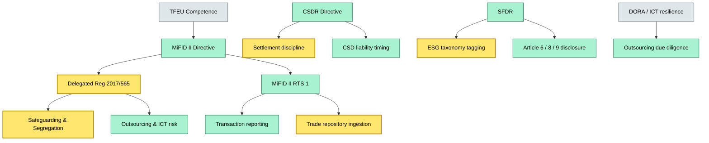
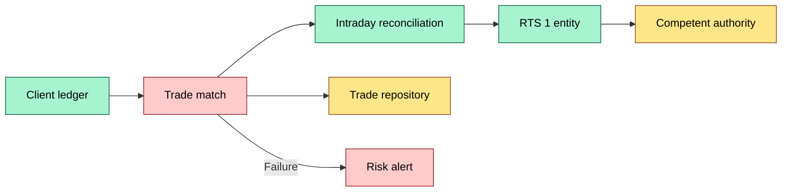
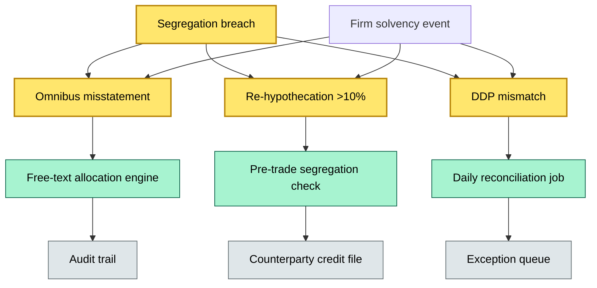

# C3 11 ESMA directives and secondary regulation on custody — DETAIL

> **Category:** C3 — Regulatory & compliance · **Difficulty:** ●/◑/○/◔ · **Banking-relevant:** yes 💳
> **Companion brief:** `briefs/C3-11-esma-directives.md`
>
> > **Target reader:** enterprise architect who must *explain, justify, and defend* the topic — not just recite it.

---

## 1. Precise definition

**ESMA directives and secondary regulation on custody** is the layered EU legislative stack that instructs securities depositories and investment firms on:
1. **Client-asset safeguarding** — segregation, identification, and ring-fencing against the custodian's own creditors.
2. **Reporting obligations** — transaction reporting, transaction-level holdings, and periodic custody lists.
3. **Operational resilience** — DORA-adjacent (and preceding CSDR/MiFID II) requirements on ICT risk, outsourcing, and change management.
4. **Sustainability disclosure** — SFDR articles 6, 8, and 9; Taxonomy Regulation climate-alignment tagging.

The **EU Treaties** (TFEU) grant ESMA competence under MiFID II Review. ESMA drafts and publishes:
- **Directives:** legally binding acts directed at Member States (e.g., MiFID II, MiFIR).
- **Delegated Regulations:** directly applicable, no transposition needed (e.g., Delegated Regulation 2017/565 on safeguarding and 2022/1235 on transaction reporting).
- **Implementing Regulations:** specify modalities for existing legislation.
- **RTS / RTS Updates:** technical standards adopted by ESMA.
- **Guidelines, Q&As, and Opinions:** interpretative, not directly binding but carrying strong supervisory weight.

**Key differentiator:** A directive requires transposition into national law with a specified deadline; delegated acts and RTS are immediately applicable across the EU once published in the OJ (Official Journal).

## 2. Why it exists (the problem it solves)

The 2008 financial crisis exposed a critical chink in EU custody architecture:
- **London Whale / MF Global (2011):** Assets held in omnibus accounts without clear legal segregation. When MF Global failed, client assets were technically "segregated" but practically indistinguishable from firm assets due to commingling at the clearing level.
- **Eurozone stress (2010–2012):** French and Italian sovereigns' balance sheets treated depositor protections differently, creating cross-border arbitrage in custody chains.
- **"UTP" (unrealised trading profits) abuse:** Custodians re-hypothecating without disclosure, creating hidden leverage in the financial system.

The **delegated regulation 2017/565** was the direct response: it mandates that client money and client assets of investment firms are held in segregated accounts, with limits on re-hypothecation (no more than 10% of client assets for any counterparty, and only at counterparties with a creditworthiness assessment). It also mandates that the depositary (if separate from the investment firm) maintains a **Fop:** "segregated accounts, safety of assets, and contingency arrangements."

**Why meta-data and routing matter:** Before MiFID II, transaction reporting was national; the same trade could be reported differently in Frankfurt, Paris, and Amsterdam. RTS 1 harmonises the schema and the reporting window, but it also mandates *interaction* between the trade repository, the trade promotion engine, and the custody ledger. The architectural pain was (and is) **three-way reconciliation without a shared data model.**

## 3. Core concepts & vocabulary

| Term | Precise meaning |
|------|-----------------|
| Segregated account | An account at a credit institution (CI) or central counterparty (CCP) that is legally separated from the institution's own assets. Client assets must be identifiable, fungible, and ring-fenced. |
| Omnibus account | A single account held by the custodian on behalf of multiple sub-clients. Permitted only when individual segregation is impossible and subject to strict risk-limiting conditions. |
| Re-hypothecation | The practice of using client assets as collateral by the custodian or a counterparty. Bounded by 10% under 2017/565. |
| DDP (Depositary Daily Report) | A daily reconciliation report the depositary sends to each client (or legal owner) listing assets held. |
| RTS 1 | Regulatory technical standard on transaction reporting; defines taxonomy, schema, and timeliness. |
| CSDR | Central Securities Depositories Regulation; governs CSD operations, settlement discipline, and liability. |
| SFDR | Sustainable Finance Disclosure Regulation; obliges financial market participants to disclose ESG integration. |
| Taxonomy Regulation | A green-washing control: classifies economic activities that qualify as environmentally sustainable. |
| UCITS / AIFMD | Alternative investment fund directives; relevant for fund-custody structures but not for general client asset safeguarding. |
| KAGB | German Investment Code; national law implementing AIFMD / UCITS in Germany. |
| NACE / CNPJ (EU equivalents) | Statistical classification of economic activities; used in taxonomy applicability tests. |
| ESMA Guidelines 2024/XX | Interpretative guidance on delegated act 2017/565; not legally binding but cited by NCAs in examination programmes. |

## 4. How it works (architecture / mechanism)

### 4.1 Diagrams

**Diagram A — Layered regulatory stack (critical => amber, core => green, context => grey)**


**Diagram B — Custody data flow for reporting (decision = green, money = gold, risk = red)**


**Diagram C — Segregation fault-tree (critical = breach surface, core = controls, context = supporting systems)**


### 4.2 Step-by-step

1. **Ingestion:** Trade and settlement messages arrive from the CSD, clearing house, and corporate-actions processor.
2. **Matching:** Cash/securities positions are matched at the security level and currency level.
3. **Segregation logic:** The custody engine checks client X against the omnibus pool. If omnibus, it validates the safety-valuation method and the re-hypothecation cap.
4. **Reconciliation:** The DDP engine aggregates positions and generates the daily depositary report.
5. **Reporting:** RTS 1 triggers intraday reporting for OTC derivatives and end-of-day for portfolio holdings.
6. **SFDR tagging:** For each holding, the engine queries the Taxonomy database and the ESG data vendor to produce Article 6/8/9 meta-data.
7. **Validation:** A supervisory layer (internal data-quality) flags anomalies: missing CSD participant ID, negative safekeeping quantities, or taxonomy-mismatched holdings.
8. **Archival:** Raw and enriched data are auto-archived per ESMA retention schedules (typically 5 years for transaction data, 3 years for category-level holdings).

## 5. Variants, options & trade-offs

| Variant | When to pick | When to avoid | Key trade-off axis |
|---------|--------------|---------------|--------------------|
| Home-country custody ( German Depositar ) | Long-term retail clients, localised regulatory comfort | Cross-border UCITS funds needing scale | Control vs. cost |
| Agent-bank (Global custodian, e.g., State Street, BGC) | UCITS, multi-jurisdictional funds | Firms with bespoke reporting needs | Scale vs. customisation |
| Vesting execution (BGC-style) | High-frequency, automated settlement | Firms without strong front-to-back infrastructure | Latency vs. GI |
| In-house clearing + custody | Prop-style trading shops | Regulated investment firms (MiFID II) | Proprietary flexibility vs. safeguarding rules |
| Synthetic collateral (repo) | Short-term funding, high reuse | Settled custody accounts (HSBC 2012) | Re-hypothecation efficiency vs. CRR liquidity |

## 6. Relationships to sibling topics
- **C3 12 (Compliance reporting):** MiFID II RTS 1 is the *source feed*; the compliance reporting system is the *consumer*. The brief — detail relationship is contractual.
- **C3 10 (ESG sustainability):** SFDR and Taxonomy are direct siblings; they import custody holdings data and enrich it with ESG taxonomy tags.
- **C2 01 (Onboarding):** IB status and onboarding flows are gated by MiFID II Article 23 / CRR conduct rules; ESMA rules affect the risk-appetite assessment.
- **C1 01 (What is custody):** Custody is the physical and legal fact; ESMA directives are the *governance layer* that turns that fact into a reportable, auditable process.

## 7. Banking / financial-services context 💳

**Concrete example:** A Luxembourg SICAV domiciled in Germany, held by a Frankfurt custodian.

- The custodian maintains a **vested account** at Clearstream (German CSD).
- German law (KAGB implementer) + ESMA delegated act 2017/565 require **free-text allocation** (not omnibus) because the fund is retail.
- The custodian must generate a **DDP** every business day: "X shares of VW, Y of SAP, Z of BASF — segregated, not re-hypothecated, safekeeping balance 100%."
- Under SFDR, the fund's depositary must disclose:
  - Article 6: "How ESG risks are integrated into the investment decision-making process."
  - Article 8 (if applicable): "To what extent did ESG compliance criteria cause exclusions."
  - Article 9 (if applicable): "The extent to which the financial product invests in environmentally sustainable economic activities per the Taxonomy Regulation."
- **Failure mode:** In 2019, a London custodian mis-tagged 30% of its Article 8 fund as Article 9 (greenwashing). The FCA fined the firm £3.5M. The *architectural* root cause was a rules engine that mapped fund-name tokens ("green", "sustainable") to taxonomy levels *without* a latency-effective Taxonomy lookup. The fix: a dedicated API to the Taxonomy database, cached and versioned, integrated as a hard validation step in the custody data pipeline.

## 8. Reference architecture / worked example

**ADR-07: Custody data pipeline for MiFID II / SFDR compliance**

```markdown
# ADR-07: EF-CUSTODY-STREAM
## Status
Accepted
## Context
The firm must report MiFID II / RTS 1 and SFDR disclosures by EOD T. Current data is fragmented: trade repo on-prem, corporate actions on a SaaS vendor, ESG data from a third-party feed. Reconciliation is manual and error-prone.
## Decision
Adopt an event-sourced custody data pipeline:
1. Ingest (Kafka / event hub) from CSD, clearing house, and corporate-action vendor.
2. Enrich (ESMÀ taxonomy API, ESG vendor feed) — as a side-effect of the custody ledger update.
3. Validate (RegTech rules engine) — segment, re-hypothecation check, taxonomy mapping.
4. Materialise (TimescaleDB) — intraday RTS 1 stream, EOD SFDR snapshot.
5. Audit (WORM S3 + immutable ledger) — 5-year retention, on-demand DDO extracts.
## Consequences
- Positive: Sub-second latency for RTS 1, real-time SFDR tagging, full audit trail.
- Negative: Vendor lock-in to Kafka / Timescale, operational overhead on schema versioning.
## Alternatives considered
1. Legacy batch ETL — rejected: latency 16+ hours, cannot support intraday RTS 1.
2. CSD-provided reporting service — rejected: loses client-level granularity (requires us to send data out, not just receive).
```

## 9. Maturity & adoption signals
- **Adopt when:** The firm already runs a real-time event streaming platform and has a RegTech contract (e.g., Infosys Finacle, Murex, or a cloud-native streaming stack).
- **Anti-signals (don't adopt yet):** If the firm's SEC / FINMA / BaFin regulator still accepts EOD-settled reports and the firm has no wholesale depositary change on the horizon, over-engineering is a risk.
- **Common failure modes:**
  1. Data model drift: Taxonomy tags change, but the pipeline assumes a static mapping.
  2. Side-effect coupling: SFDR enrichment blocks RTS 1, causing a systemic deadline miss.
  3. Omnibus capex: Using omnibus for retail XiMs (exchange-traded funds) to save on accounting cost, but then failing on segregation checks.

## 10. Common confusions — the "don't mix" list

| Often confused | Real distinction |
|----------------|-----------------|
| MiFID II Regulation vs. MiFID II Directive | MiFID II Regulation (EU) no longer needs transposition; MiFID II Directive was the original Act of 2004, now largely repealed by MiFID II (2014) implemented in 2018. |
| Delegated act 2017/565 vs. MiFID II Review package | 2017/565 is the *safeguarding* regime; MiFID II Review (2018/847) updated transaction reporting and AI governance but did not change safeguarding thresholds. |
| SFDR / Taxonomy Regulation vs. CSRD | CSRD (Corporate Sustainability Reporting Directive) applies to *issuers* and *issuers' supply chain reporting*; SFDR / Taxonomy applies to *financial market participants* and *financial advisers*, including custodial data. |
| CSDR vs. MiFID II | CSDR = CSD law (settlement, liability, BIM structure); MiFID II = investment-firm law (segregation, charges, transactional reporting). A CSD can be a MiFID entity if it provides ancillary services, but it is rarely a "custodian" in the client-asset sense. |

## 11. Tools & standards to know
- **Frameworks:** MiFID II / MiFIR / RTS 1, Delegated Regulation 2017/565, CSDR, SFDR, Taxonomy Regulation, DORA, GDPR.
- **IR-2 / NINE:** Not directly relevant; focus on MiFID II and DORA Interaction‑2 audit trails.
- **Common tooling:** ArchiMate / TOGAF for governance mapping; Murex / Finacle for legacy; Kafka + TimescaleDB for streaming data; TM Forum Open APIs for data-exchange between CSDs.
- **Mandatory reading:**
  - ESMA Guidelines 2024/XX on safeguarding (latest version).
  - ESMA RTS 1 (Annex I) — Taxonomy 2.0 (the machine-readable taxonomy mapping).
  - ECB SCP Stress-test methodology guidance on data quality for large custodians.

## 12. ADR template (ready to fill in)
See §8 (ADR-07: EF-CUSTODY-STREAM) and §11 for standard language.

## 13. Practice — apply it
1. **Recall:** Define MiFID II safeguarding hierarchy in 2 min.
2. **Model:** Draw an ArchiMate diagram showing the MiFID II regulatory layer, the delegated-act execution layer, and the custody ledger.
3. **ADR:** Write a decision doc for whether to replace your current corporate-actions feed with an STAC-compliant stream.
4. **Defend:** Roleplay a CRO question: "Why should I spend €500k on a stream processing platform for MiFID II?"

## Summary

ESMA directives and secondary regulation are not a peripheral compliance overlay for custody; they are the **operating system**. MiFID II creates the legal fact; delegated acts and RTS translate it into data schemas; CSDR and SFDR add settlement and sustainability constraints. A modern custody architecture must treat regulation as a **first-class data product**: schema-driven, versioned, and validated in real time.

---
**Status:** ☐ Not started · ☐ In progress · ✅ Covered
*Last updated: 2026-09-16*

---
**One diagram required. Both brief + detail must exist with ≥1 mermaid each before ✓.**
