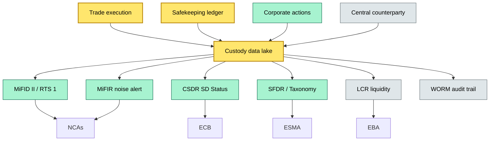
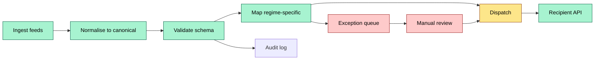
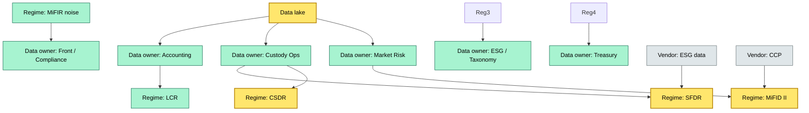

# C3 12 Compliance reporting: what feeds where, regimes, content — DETAIL

> **Category:** C3 — Regulatory & compliance · **Difficulty:** ●/◑/○/◔ · **Banking-relevant:** yes 💳
> **Companion brief:** `briefs/C3-12-compliance-reporting.md`
>
> > **Target reader:** enterprise architect who must *explain, justify, and defend* the topic — not just recite it.

---

## 1. Precise definition

**Compliance reporting in custody** is the disciplined, automated (or semi-automated) production of regulatory and internal reports from custody data. The definition spans three dimensions:

1. **Feed dimension:** The raw and enriched data streams that feed the reporting engine — including trade execution, settlement, safekeeping, valuation, corporate actions, and third-party risk data.
2. **Regime dimension:** The regulatory or internal authority to which the report is addressed — MiFID II / MiFIR (ESMA / national NCAs), CSDR (ECB / CSD operators), SFDR / Taxonomy (ESMA / FIR), LCR / Liquidity (EBA / ECB), AML (FCA / FinCEN), and internal ALCO / CRO.
3. **Content dimension:** The semantic mapping from source fields to target fields, the regulatory schema (e.g., MiFID II Annex I taxonomy), the validation rules, and the audit trail.

A **report** is a *produced artefact* that satisfies an audit requirement: it must be accurate, complete, timely, and interpretable. A typical custody report is a *composite* of multiple feeds, normalised into a canonical model, then transformed into one or more target schemas.

## 2. Why it exists (the problem it solves)

Before MiFID II (2018), transaction reporting was fragmented: each Member State had its own schema and deadline. A trade executed in Frankfurt and reported to BaFin might use a different instrument identifier (WKN) than the same trade reported to CONSOB (Italy) or to the French AMF. The 2018 MiFID II Review introduced **RTS 1**: a single, EU-wide taxonomy and a common reporting window. The driver was **supervisory efficiency** — NCAs could compare reporting across jurisdictions and identify systemic risks (the "UTP" and "WM") that were previously hidden in national silos.

For custody specifically, the pain was **reconciliation of three data worlds**:
- **Trade world:** Execution date, venue, price, size.
- **Settlement world:** Settlement date, CSD participant ID, clearable balance, fails.
- **Securities-accounting world:** Free-text or omnibus allocation, safekeeping balance, corporate-action splits.

When these three worlds were reconciled manually, the DDP (depositary daily report) was often wrong by 5–15% for specious reasons (e.g., a late dividend posting, a failed settlement that was not reconciled). The **automated reconciliation hub** is the architectural response: it normalises all world data into a *single* canonical security identifier (ISIN + LEI + valuation date), then branches into regime-specific outputs.

## 3. Core concepts & vocabulary

| Term | Precise meaning |
|------|-----------------|
| Feed | A data pipeline (batch or streaming) from a source system or external vendor to the custody data lake or event hub. |
| Regime | A regulatory domain with its own reporting obligation, schema, frequency, and recipient. Examples: MiFID II RTS 1, CSDR SD, SFDR 8/9, LCR. |
| Content mapping | The semantic transformation from source field (e.g., `CashOpening`) to target field (e.g., MiFID II `cashOpeningBalance`). |
| Taxonomy | Machine-readable classification (e.g., MiFID II transaction taxonomy, EU Taxonomy climate taxonomy). |
| DDP (Depositary Daily Report) | A daily statement from the depositary to each client / legal owner, listing assets held. |
| SD (Settlement Discipline) | CSDR status: whether a trade was settled on time, late, or failed; and the resulting charge. |
| Noise alert | MiFIR / MiFID II trigger when a trade meets predefined criteria (price, size, venue) and must be reported intra-day. |
| PAI (Principal Adverse Impact) | SFDR / Taxonomy indicators of how an investment product negatively impacts sustainability factors. |
| HQLA (High-Quality Liquid Assets) | LCR regulatory standard: assets that can be converted to cash within 30 days with minimal loss. |
| Canonical model | A unified data model (e.g., a security master or a custody ledger) that normalises feeds into a common schema. |
| WORM (Write-Once-Read-Many) | An append-only storage mechanism used for audit trails; once written, data cannot be modified. |
| SLA (Service Level Agreement) | The latency / completeness promise between feed and report dispatch (e.g., MiFID II intra-day: by 09:00 CET). |

## 4. How it works (architecture / mechanism)

### 4.1 Diagrams

**Diagram A — Hub-and-spoke compliance feeding network (critical = data, core = regimes, context = support)**


**Diagram B — Reporting pipeline lifecycle (ok = core, risk = red, money = gold)**


**Diagram C — Multi-regime ownership matrix (critical = data owner, core = system owner, context = vendor)**


### 4.2 Step-by-step

1. **Ingestion:** Daily batch (overnight) and real-time (event-driven) feeds arrive via Kafka, SFTP, or API:
   - Trade execution from front-office OMS.
   - Settlement status from the CSD / CCP.
   - Corporate-actions from the issuer processor or a third-party vendor (e.g., Euroclear / Eurofi).
   - Valuation from the pricing vendor (e.g., Bloomberg, Refinitiv).
   - Counterparty / credit data from internal risk systems.
2. **Normalisation:** All feeds are mapped to a **canonical security master** (ISIN, LEI, SEDOL, cusip, name, currency, ISIN+qualification, valuation date). The canonical model resolves the WKN vs. ISIN mismatch problem.
3. **Aggregation:** Positions are aggregated by client, fund, and legal owner. Omnibus accounts are resolved via the free-text allocation engine.
4. **Regime-specific mapping:** The canonical data is branched into multiple target schemas:
   - **MiFID II RTS 1:** Trade report with taxonomy 2.0 (mandatory fields: reportId, tradeDate, reportingTimestamp, reportingTimestampDate, tradingVenue, instrumentId, tradingPrice, etc.).
   - **MiFID II holdings:** End-of-day **equity** and **money-market** holdings report (ISIN, quantity, nominal, valuation, safekeeping balance).
   - **CSDR SD:** Status on trades (settled, late, fail, excused) with charge and sliding-scale calculation.
   - **SFDR / Taxonomy:** Taxonomy-tagged holdings, PAIs, and principal adverse impact indicators.
   - **LCR / Liquidity:** HQLA classification, funding ratios, and stress-scenario outputs.
5. **Validation:** 
   - **Semantic validation:** Each field is checked for plausibility (e.g., `clearedQuantity` ≤ `tradeQuantity`, `safekeepingBalance` ≥ `clearedQuantity`).
   - **Schema validation:** JSON / XML against the regulatory XSD.
   - **Reference validation:** Taxonomy codes exist in the master; CSD participant IDs exist in the directory.
6. **Dispatch:** 
   - **Intraday MT / XML** to the trade repository (MiFID II).
   - **Daily XML** to the SXG (single point of gateway) or directly to the NCA.
   - **SFDR / Taxonomy JSON-LD** to the FCA / ESMA / Bafin public disclosure portal.
   - **LCR** as a quarterly report to the ECB.
7. **Audit:** Every transformation is logged in a **WORM** store (e.g., AWS S3 Object Lock, or an immutable ledger). The log records: source feed, transformation rule version, output hash, and dispatch timestamp.
8. **Exception handling:** Failures are routed to a **human-in-the-loop** queue. A data-quality dashboard shows the SLA utilisation, exception age, and business-unit ownership.

## 5. Variants, options & trade-offs

| Variant | When to pick | When to avoid | Key trade-off axis |
|---------|--------------|---------------|--------------------|
| Direct-to-regulator API | Large custodians with strong tech stacks (e.g., DTCC's Global Trade Repository, LUCH) | Mid-tier firms that lack API contracts | Speed vs. lift |
| On-prem SFTP / batch | Firms with legacy mainframe or strict data-sovereignty (e.g., German banks) | Firms with cloud-first compliance lets | Security vs. agility |
| Third-party RegTech SaaS (e.g., Ancoa, SimpliFI) | Firms without in-house data-engineering capacity | Firms with bespoke ICS / circular-economy reporting | Innovation vs. marginalisation |
| Self-built pipeline (Kafka + dbt + timescaledb) | Firms with data-engineering team and in-house curation of taxonomy | Firms that cannot dedicate 1–2 FTEs to pipeline ops | Control vs. TCO |
| Shared industry data-lake (e.g., DTCC ICP) | Mid-size firms that want industry standard | Firms with unique product structures (e.g., bespoke CDS, private-equity funds) | Standardisation vs. differentiation |

## 6. Relationships to sibling topics
- **C3 11 (ESMA directives):** MiFID II / MiFIR / CSDR / SFDR are the *sources*; compliance reporting is the *consumer*. The detail — detail relationship is feed-chain.
- **C2 02 (Account structure):** The account structure is where segregation and omnibus handling happen; the output of that structure feeds the holdings report.
- **C2 07 (NAV valuation):** NAV is the *valuation layer* within the custody data lake; the valuation method must be consistent across the holdings report and the LCR liquidity report.
- **C3 03 (MiFID II transaction reporting):** This topic is the *subset* of compliance reporting focused solely on transactional data; C3 12 is the *broader* compliance layer.

## 7. Banking / financial-services context 💳

**Concrete example:** A London bank's custody desk holds a £2B equity portfolio for a UK UCITS.

- **Feed:** The trade desk sends execution reports to the custody OMS; the CSD (Euroclear UKI both **settlement reports** and **safekeeping notices**; the corporate-action vendor sends an end-of-day schedule.
- **Regime mapping:**
  - **MiFID II RTS 1:** The trade desk's 1,200 equity trades are reported to the FCA intra-day (by 09:00) via the SXG.
  - **MiFID II holdings:** The end-of-day UCITS holdings report (150 lines) lists ISIN, quantity, nominal, valuation, and safekeeping balance.
  - **CSDR SD:** The CSD sends a status report: 1,180 trades settled on time, 15 failed (excused: T+3 labelling rules), 5 late (charge triggered).
  - **SFDR:** The fund's depositary produces an Article 8 disclosure: 80% of the portfolio is taxonomy-aligned (EU Climate-Taxonomy), 15% is "do no significant harm," 5% is non-taxant.
  - **LCR:** The treasury desk needs the HQLA value of the cash balances; the custody desk reports £120M in cash, £40M in Treasury bills (HQLA level 1), and £80M in sovereign bonds (HQLA level 2A).
- **Failure mode:** In March 2023, a mid-tier custodian reported SFDR holdings with a 20% under-count because the corporate-action split for a dividend-with-scrip bonus was not matched to the taxonomy tag. The result: the fund was **mis-classified as Article 8 but behaved as Article 6** (no environmental objective). The FCA fined the custodian £1.2M and required a remediation plan. The root cause: the corporate-action feed did not include a `taxonomyTag` field; the mapping engine hard-coded a `{}else` fallback that defaulted to "non-taxant."

## 8. Reference architecture / worked example

**ADR-08: Unified custody compliance pipeline**

```markdown
# ADR-08: CU-COMPLIANCE-HUB
## Status
Accepted
## Context
The firm produces MiFID II RTS 1, CSDR SD, SFDR, and LCR reports. Currently, each regime is handled by a separate team (Quant, Ops, Risk, ESG), leading to duplicated normalisation, inconsistent ISIN mapping, and missed exceptions.
## Decision
Build a single custody compliance hub:
1. **Ingest:** Kafka topics for trade, settlement, corporate actions, and valuation.
2. **Canonical:** A Dbt model that merges all feeds into a unified security master (ISIN + LEI + valuation date).
3. **Map:** Reg-specific Dbt models (sql-ppv) that branch from the canonical master into MiFID II, CSDR, SFDR, LCR.
4. **Validate:** Great expectations + deequ tests at each branch.
5. **Dispatch:** Each branch writes to its own envelope (XML, JSON, SFTP) and triggers a webhook to the recipient.
6. **Audit:** All writes to a S3 bucket with Object Lock (WORM), plus a DAG-level lineage.
## Consequences
- Positive: Single source of truth; 0% duplicate normalisation; exception visibility in one dashboard.
- Negative: A bug in the canonical model propagates to *all* regimes; requires strict CI on Dbt adoption.
## Alternatives considered
1. Maintain siloed pipelines — rejected: operational risk and audit duplication.
2. Buy a RegTech SaaS — rejected: too slow to dep strict SFDR taxonomy; we need custom ESMA mapping.
```

## 9. Maturity & adoption signals
- **Adopt when:** The firm already runs an event-driven data platform and has a data-quality team that owns 3+ financial-data pipelines.
- **Anti-signals:** If the firm's credit committee still accepts quarterly ad-hoc spreadsheets for LCR and MiFID II, over-engineering is premature.
- **Common failure modes:**
  1. Schema drift: Taxonomy updates (e.g., EU climate taxonomy 2.0) are not version-controlled, leading to invalid JSON in SFDR disclosures.
  2. Side-effect coupling: A change in the corporate-action normalization breaks both CSDR and MiFID II holding reports simultaneously.
  3. Exception fatigue: The human queue is overwhelmed because the validation rules are too strict (false-positive rate > 30%).

## 10. Common confusions — the "don't mix" list

| Often confused | Real distinction |
|----------------|-----------------|
| MiFID II RTS 1 vs. MiFID II holdings | RTS 1 = *transaction* reporting (real-time or EOD); holdings = *portfolio* snapshot (EOD, daily or monthly). |
| MiFIR vs. MiFID II noise alert | MiFIR is the *regulation* that creates the noise-alert obligation; the noise alert is the *event* that triggers intra-day reporting. |
| CSDR SD vs. LCR | CSDR SD = operational settlement discipline (was this trade settled on time?); LCR = prudential liquidity (do we have enough HQLA for 30 days of net cash outflows?). |
| SFDR Article 8 vs. Article 9 | Article 8 = "financial product promoting environmental/social characteristics"; Article 9 = "financial product with sustainable investment objective." The *outer shell* is the same; the *inner content* differs in taxonomy-tagging depth. |
| Taxonomy Regulation vs. SFDR | Taxonomy = classification of *economic activities* as sustainable; SFDR = *disclosure* of ESG impact by financial product. A product can be Article 8 / 9 without being taxonomy-aligned (e.g., ESG engagement strategy). |

## 11. Tools & standards to know
- **Frameworks:** MiFID II / MiFIR / RTS 1, CSDR (2014/65/EU), SFDR, Taxonomy Regulation, LCR (2013/36/EU), DORA, AIFMD / UCITS.
- **IR-2 / NINE:** Not directly relevant; focus on MiFID II / MiFIR Interaction-2 audit trails and European data-governance standards.
- **Common tooling:** 
  - Ingestion: Kafka, Confluent, Google Pub/Sub, AWS Kinesis.
  - Transformation: dbt, Spark, Flink, Apache Beam.
  - Storage: TimescaleDB, BigQuery, Snowflake, Databricks.
  - Schema validation: JSON Schema, XML XSD, OpenAPI.
  - Dispatch: SFTP client, REST API, SMTP, MT/XML couriers.
  - Audit: S3 Object Lock, Kafka log compaction, dbt docs.
- **Mandatory reading:**
  - ESMA RTS 1 (2022) — Annex I Taxonomy (machine-readable).
  - ESMA Guidelines on transaction reporting (latest version, 2023-2024).
  - ECB SCP Monitor 2023 — data-quality expectations for large investment firms.
  - ECB — "Statistics on securities transactions and market data" (synthetic reporting).

## 12. ADR template (ready to fill in)
See §8 (ADR-08: CU-COMPLIANCE-HUB) and §11 for standard language.

## 13. Practice — apply it
1. **Recall:** List the five core custody compliance regimes in five minutes.
2. **Model:** Draw an ArchiMate diagram showing the custody data hub, the regime branches, and the recipients.
3. **ADR:** Write a decision doc for whether to adopt a RegTech SaaS for MiFID II reporting.
4. **Defend:** Roleplay a CRO question: "Why should I spend €1M on a unified compliance hub when we already have five separate vendors?"

## Summary

Compliance reporting is the **consumption layer** of custody architecture. It is not a one-off project but a **continuous process** that must absorb feed variance, schema drift, and regulatory change. The hub-and-spoke model, the canonical data model, and the WORM audit trail are the three pillars that separate a compliant operation from a fined one.

---
**Status:** ☐ Not started · ☐ In progress · ✅ Covered
*Last updated: 2026-09-16*

---
**One diagram required. Both brief + detail must exist with ≥1 mermaid each before ✓.**
