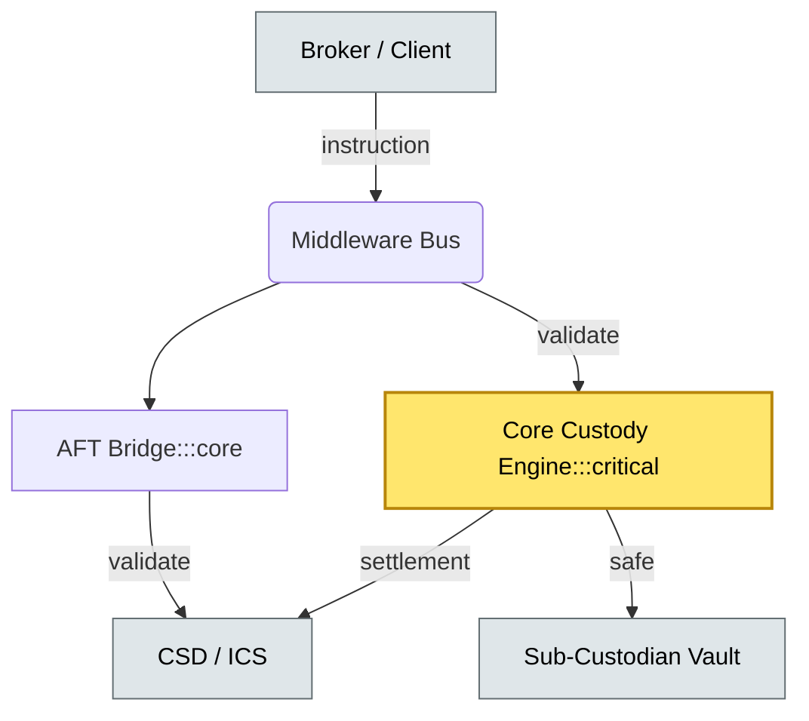
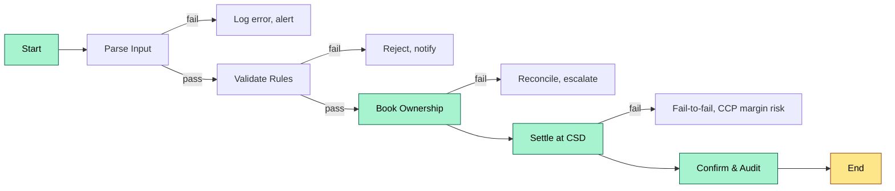
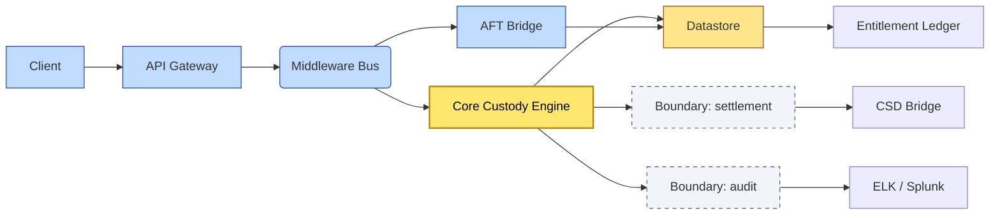

# C4-01 Custody platform landscape — DETAIL
> **Category:** Cx — Core Systems & Middleware · **Difficulty:** ●/◑/○/◔ : ◑ · **Banking-relevant:** yes / 💳
> **Companion brief:** `briefs/C4-01-platform-landscape.md`
>
> > **Target reader:** enterprise architect who must *explain, justify, and defend* the topic — not just recite it.

---

## 1. Precise definition
A custody platform is an integrated systems stack through which institutions record, safekeep, transfer, and service client-held financial assets. It has three architectural tiers:

1. **Core custody engine** — the source of truth for entitlement, safekeeping, and corporate-action processing.
2. **Event middleware / bus** — message normalization, validation, orchestration, and rule mediation.
3. **Connectivity layer** — CSD, ICS, TPA, and AFT (Automated Footer Testing) bridges.

The **CSD** (Central Securities Depository) is the entity that maintains securities accounts and effects book-entry settlement; an **ICS** (International Central Securities Depository) serves cross-border markets. A **custodian** is typically an investment bank or broker-dealer that holds assets on behalf of clients under client-asset rules, using CSD connectivity and TPA contracts to execute.

## 2. Why it exists (the problem it solves)
Without a custody stack, asset ownership is an oral or paper contract with no settlement mechanism. The modern stack exists because:

- **Settlement efficiency:** CSDs eliminate physical certificates.
- **Regulatory separation:** Client assets must be ring-fenced from the firm's own assets (Segregation / CSD Rule).
- **Operational scale:** A custodian managing $10 Tln needs a machine-readable entitlement ledger, not double-entry books.
- **Cross-border friction:** ICS connectivity (Euroclear, Clearstream) reduces DvP/fail risk, but requires a standardized middleware envelope.

Where they diverge: a CSD is a *market utility*; a custodian is a *service provider* with CSD access.

## 3. Core concepts & vocabulary
| Term | Precise meaning |
|------|-----------------|
| Core custody engine | System of record: patron master, account positions, entitlements, safekeeping consents. |
| Event middleware | Integration bus: ISO 15022 / 20022 parsers, FIX adapters, STP engine, B2B orchestration. |
| CSD | Maintains securities accounts; legal / operational settlement infrastructure. |
| ICS | International CSD; settles cross-border trade in multiple markets. |
| TPA | Third-Party Administrator contractually authorized to process fiduciary transactions. |
| AFT Bridge | Automated Footer Testing bridge to CSDs; checks message integrity before acceptance. |
| Nominee account | A brokerage account held by a custodian/broker for client positions; not legal ownership. |
| Physical safekeeping | Securities held externally (e.g., sub-custodian vault) versus book-entry at broker/bank. |

## 4. How it works (architecture / mechanism)

### 4.1 Data flow

1. Institutional investors send instructions (trade, repo, dividend preference) via FIX, SWIFT, or via a web portal.
2. Converters/gateways translate into the middleware bus format.
3. Rule engine validates: CSD eligibility, client-account consistency, collateral risk limits.
4. Core engine books ownership or entitlement.
5. CSD / ICS receives SETTM / SETTX messages.
6. Confirmation / audit trail is emitted back to originator and risk systems.

### 4.2 Governance

- The **core engine** is under strict SOX / internal-control regime because it is the system of record.
- Middleware changes are managed via CI/CD with functional / UAT / SAT gates; hot-fixes require emergency change board (CRB) approval because they mediate CSD traffic.
- Regulatory audits (PCAOB / OCC / ECB) will sample message trails and compare them against the core engine ledger.

### 4.3 Diagrams

**Diagram A — Core structure** (highlight load-bearing parts = amber, supporting = grey):


**Diagram B — Lifecycle / flow** (highlight decision points = green, failures = red, money = gold):


## 5. Variants, options & trade-offs
| Variant | When to pick | When to avoid | Key trade-off axis |
|---------|--------------|---------------|--------------------|
| On-prem core + ibroker middleware | Regulated jurisdiction with data-sovereignty mandate | Cloud-first org seeking elasticity | Control vs. agility |
| Cloud-native suite (DTCC Spark / Euroclear Aurora) | New launch, limited legacy debt | Deep customization required | Alignment vs. specialization |
| API-first middleware + best-of-breed core | High format-churn (ESG, OTC derivatives) | Low integration budget | Flexibility vs. TCO |
| TPA-only | Non-core-intensive asset class (cash) | Equity direct ownership | Cost vs. capability |

## 6. Relationships to sibling topics
- **C4-02 (Smart custody):** more middleware-centric, machine-readable entitlements, and API-first design.
- **C2-08 (Corporate actions):** middleware receives raw event feeds; core engine processes entitlement/claim.
- **C3-02 (Client asset rules):** dictates segregation mandates that shape the core engine's account schema.
- **C2-09 (Proxy voting):** leveraged via corporate-action entitlement data produced by the core engine.

## 7. Banking / financial-services context 💳
A global custodian processes a $500M emerging-market flow:
- **Risk:** APAC going ex-dividend triggers 2% corporate-action processing window; core engine entitlement latency >15 min causes missing an CFD vendor cut-off — direct P&L hit.
- **Regulation:** MiFID II / CSD Regulation mandates timely ownership affirmation; a settlement fail incurs ESMA enforcement.
- **Business reason:** reducing go-to-market latency for institutional ETFs depends on how tightly the middleware bus is coupled to the core settlement engine.
- **Failure consequence:** a 24-hour settlement fail on the CSD bridge required a $2M goodwill payment plus regulatory FCA fine.

## 8. Reference architecture / worked example


## 9. Maturity & adoption signals
- **Adopt when:** firm is evaluating a DRS (Distributed Recordkeeping) or cloud-core platform; has a >$5Tnl custody book.
- **Anti-signals:** still running silo core per asset class; no CSD automation; no real-time entitlement view.
- **Common failure modes:** middleware business-rule leakage into the core (golden-record corruption); AFT bridge overload at month-end; CSD concurrency limits not enforced in middleware.

## 10. Common confusions — the "don't mix" list
| Often confused | Real distinction |
|----------------|------------------|
| CSD vs ICS | CSD = domestic (or locale-specific); ICS = cross-border (Euroclear / Clearstream / Bank of New York Mellon). |
| Core engine vs BSS | Core engine = asset record; BSS/ERPS = client onboarding, fees, reporting. |
| Nominee vs Beneficial | Nominee = broker account; Beneficial = true client — jurisdictional & tax consequences differ. |

## 11. Tools & standards to know
- **Standards:** ISO 15022 (UAG), ISO 20022 (pain.001), FIX Protocol FIXP, OAY, Paxos (CSDS), SWIFT MT / MX.
- **Frameworks / IR-2 / NINE:** DORA (DORA v1.0), CSD Regulation (EU 2022/23693).
- **Common tooling:** Archi (for custom layers), draw.io (quick art), GitHub (CI/CD), Splunk / ELK (audit).
- **Mandatory reading:** *Custody Operations and Risk* by CFA Institute; *The Future of Custody* (External Market Structure Council).

## 12. ADR template (ready to fill in)
```markdown
# ADR-01: Cloud-native custody core vs. on-prem core
## Status
Proposed
## Context
Evaluate core custody engine migration to cloud-native microservices for $5Tnl emerging-market book.
## Decision
Keep on-prem core for client-asset ledger (regulatory / audit precedent); use cloud-native middleware for API-facing orchestration.
## Consequences
- Positive: faster FIX/ISO 20022 translation, elastic tax-year processing.
- Negative: harder to achieve EU data-sovereignty without dedicated processed-region deployment.
## Alternatives considered
1. Lift-and-shift core engine — rejected: latency risk + onerous re-certification.
2. Hybrid (as chosen).
```

## 13. Practice — apply it
1. **Recall:** define in 2 min without notes.
2. **Model:** produce an ArchiMate diagram from scratch: business process → application → system layer.
3. **ADR:** write a decision doc applying the ADR-01 template to a proposed DTCC-Spark migration.
4. **Defend:** roleplay explaining it to a non-technical Chief Risk Officer.

## Summary
The custody platform is a three-tier stack in which the core engine is the immutable source of truth, middleware is the adaptive translation and mediation layer, and CSD/ICS connectivity is the operational settlement bridge. Over-engineering middleware and under-testing it against CSD conformant paths is a top-three operational risk. The next evolution (C4-02) is tightening the bus to an API-native, event-driven core so that entitlements and collateral can be treated as real-time data products rather than batch-shipped events.

---
**Status:** ☐ Not started · ☐ In progress · ✅ Covered
*Last updated: 2026-09-16*

---
**One diagram required. Both brief + detail must exist with ≥1 mermaid each before ✓.**
