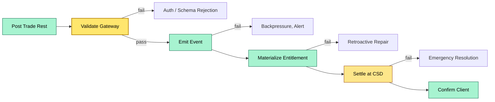
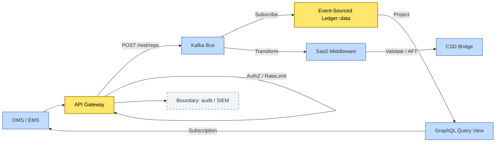

# C4-02 Smart custody platform — DETAIL
> **Category:** Cx — Modernization · **Difficulty:** ●/◑/○/◔ : ◑ · **Banking-relevant:** yes / 💳
> **Companion brief:** `briefs/C4-02-smart-custody-modernization.md`
>
> > **Target reader:** enterprise architect who must *explain, justify, and defend* the topic — not just recite it.

---

## 1. Precise definition
Smart custody is a digital-asset custody paradigm in which entitlements, movements, and corporate actions are represented as **live, queryable, machine-readable data** rather than batch-shipped, human-readable messages or nightly file extracts. Architecturally, it is characterized by:

- **API-first interfaces** (REST / GraphQL / FIX 5.0 / FIX 5.2 / OpenAPI 3.1).
- **Event-driven, event-sourced cores** (immutable event logs = source of truth).
- **SaaS middleware** (multi-tenant ISO 20022 / FIXP translation, routing, orchestration).
- **Real-time entitlement** (computed on demand via graph traversal, not snapshot + inference).
- **Semantic identifiers** (BYLD, DVC, enriched ISIN/CUSIP objects, not free text).

It is not merely "cloud-hosted legacy": it is a **data-product paradigm** where custody inbounds/outbounds behave like supply-chain events.

## 2. Why it exists (the problem it solves)
Legacy custody stacks are built on mainframe, batch processing, and file-based connectivity. They were designed when settlement T+2 was acceptable and regulatory reporting was monthly. The pain points driving smart custody include:

- **Speed-to-market:** vanilla ETFs and interim funds demand same-day or instant settlement.
- **Regulatory velocity:** DORA, MiFID III, and CSD Regulation require granular, timely audit trails.
- **Collateral optimization:** Collateral managers need real-time, multi-ISIN views of eligible and posted collateral to minimize haircuts.
- **Cross-border fragmentation:** ICS connectivity + standard APIs reduce CSD-by-CSD integration effort.
- **Data-science readiness:** machine-readable entitlement + collateral enables ML-driven liquidity forecasting.

## 3. Core concepts & vocabulary
| Term | Precise meaning |
|------|-----------------|
| API-first | Interface contract defines platform capability up-front; backend implementation secondary. |
| Event sourcing | Persistence of state as immutable, ordered events; current state materialized via projection. |
| SaaS middleware | Multi-tenant cloud service that handles translation, validation, routing, identity mapping. |
| Real-time entitlement | Entitlement calculated on query by traversing the event graph from security to client. |
| BYLD | Bloomberg Yield Language DVC; a standardized, machine-readable description of a security's cash-flow attributes. |
| DVC | Data Vendor Candidate / Digital-ID Concept; a semantic identifier beyond ISIN with lifecycle attributes. |
| ELMTime | Electronic Legal Messaging time; the latency from instruction sent to settlement instruction accepted. |
| Sub-second ELM | <1 second from instruction to CSD or ICS submission; a KPI for smart custody. |
| Tokenized events | CSD-compatible instructions encoded in tokenized payloads to reduce message size and error rate. |

## 4. How it works (architecture / mechanism)

### 4.1 Architectural stack
1. **Client layer:** OMS / EMS / Treasury portal / mobile app.
2. **API gateway:** rate-limiting, auth (OAuth 2.1 / FAPI), versioning, schema validation.
3. **Event bus:** Kafka or event-streaming fabric; topic-per-event-type.
4. **SaaS middleware:** ISO 20022 parser, FIX 5.0/5.2 normalizer, AFT bridge, CSD formatter.
5. **Core event-sourced ledger:** append-only log of all entitlement changes; materialization stores.
6. **Query / entitlement engine:** real-time graph traversal to resolve who owns what.
7. **CSD / ICS sub-bridge:** outbound SETTX / SRI formatted messages.
8. **Read-model / data lake:** downstream analytics, risk, and reporting.

### 4.2 Data flow (example: repo collateral)
1. Traded repo instruction arrives through FIX 5.0/Advisory API.
2. Gateway validates schema and tokenizes payload.
3. Event: `REPO_BORROW` is appended to the event log.
4. Materialized view increments the collateral entitlement for security Y and client X.
5. Entitlement engine confirms eligibility (haircut, ISIN master, CSD status).
6. Settlement event emitted to CSD sub-bridge; Euroclear Aurora processes sub-second ELM.
7. Confirmation and audit event returned to client layer.

### 4.3 Governance
- The API gateway is the new trust boundary: it must enforce JWT / mutual TLS, API version gates, and input sanitization to prevent event-log pollution.
- Event schemas are versioned and backwards-compatible; schema registry gates CI/CD.
- Regulatory audit trails are derived directly from the event log (WORM storage).

### 4.4 Diagrams
**Diagram A — Stack layers** (highlight critical data paths = amber, core compute = green, context glue = grey):
```mermaid
graph TD
    classDef critical fill:#ffe66d,stroke:#b8860b,stroke-width:2px,color:#000
    classDef core fill:#a7f3d0,stroke:#065f46,stroke-width:1px,color:#000
    classDef context fill:#dfe6e9,stroke:#636e72,color:#000
    Client[Client OMS / EMS]:::context --> IGW[API Gateway]:::critical
    IGW --> BUS[Event Bus / Kafka]:::core
    BUS --> MW[SaaS Middleware]:::critical
    BUS --> ES[Event-Sourced Core Ledger]:::core
    MW --> BUS
    ES --> ENT[Entitlement Graph Engine]:::core
    ENT --> RAY[Real-Time Views (GraphQL / API)]:::critical
    MW --> CSD[CSD / ICS Bridges]:::context
    style IGW fill:#ffe66d,stroke:#b8860b,stroke-width:2px,color:#000
    style ES fill:#ffe66d,stroke:#b8860b,stroke-width:2px,color:#000
```

**Diagram B — Lifecycle / flow** (highlight success path = green, API fault = red, authority = gold):


## 5. Variants, options & trade-offs
| Variant | When to pick | When to avoid | Key trade-off axis |
|---------|--------------|---------------|--------------------|
| SaaS + best-of-breed | Faster integration than building ES ledger | Regulators require crown-jewel data on-prem | Time-to-market vs. data sovereignty |
| Native SaaS suite (DTCC Spark, Euroclear Aurora) | Single-vendor stack avoids stitching risk | Vendor lock-in on pricing + release cadence | Control vs. product completeness |
| Hybrid (on-prem core ledger + SaaS bus) | Core must stay governed by local regulator | Higher TCO and dual-stack maintenance | Compliance vs. agility |
| Apache Kafka self-managed | Full control over event log | Heavy ops burden; must own schema registry | Operability vs. flexibility |
| Serverless / FaaS for event handlers | Bursty, low-throughput functions (e.g. onboarding) | Not ideal for high-volume entitlement projection | Cost vs. deterministic latency |

## 6. Relationships to sibling topics
- **C4-01 (Platform landscape):** smart custody is the modern evolution of the traditional three-tier stack; same actors, different technology.
- **C4-03 (Core data model):** event-sourced core means the data model is an append-only log of state changes; snapshots are derived, not primary.
- **C4-04 (Reference data):** semantic identifiers (BYLD, DVC) require master-data governance; smart custody cannot exist with free-text naming.
- **C2-10 (Collateral management):** real-time View = precondition for smart collateral reuse; without it, collateral is batch-reconciled and underutilized.
- **C3-06 (DORA / business continuity):** event-sourced cores are resilient (event log replay), but the API gateway is a single point of failure — resilience must be active-active.

## 7. Banking / financial-services context 💳
An institutional custody bank evaluates a €3Tnl book:

- **Crux:** real-time entitlement would reduce withheld-tax reconciliation errors for EU mutual funds from T+23 to T+0, saving ~$40M/year in tax-loss carryforward corrections.
- **Regulation:** DORA Annex IV mandates 4-hour incident reporting; an event-sourced audit log with automated anomaly detection is a strong DORA compliance lever.
- **Failure consequence:** a legacy settlement fail in T+2 caused a $15M penalty + regulatory censure because the core engine could not write an automatic reversal.
- **Trade-off:** SaaS middleware pricing is usage-based; a spike in OTC derivatives volume (10x normal) would spike egress and transformation costs >30%.

## 8. Reference architecture / worked example


## 9. Maturity & adoption signals
- **Adopt when:** firm has a >$1Tnl book, runs nightly SAS 70-type reconciliation, and wants to offer next-day settlement to asset managers.
- **Anti-signals:** no dedicated cloud-native platform engineering squad; no CSD ELM time KPI; board still treats custody as a cost center.
- **Common failure modes:**
  1. API spec drift: a new OMS version sends an unmapped FIX tag, causing silent event-log corruption.
  2. Schema evolution: a downstream CSD introduces a new mandatory tag; event-sourcing materialization fails and entitlement view goes stale.
  3. Vendor SaaS lock-in: proprietary event-log format cannot be replicated if the vendor price doubles.

## 10. Common confusions — the "don't mix" list
| Often confused | Real distinction |
|----------------|------------------|
| Event sourcing vs. event streaming | Event sourcing is persistence pattern; event streaming is connectivity transport; you can have one without the other. |
| API-first vs. API gateway | API-first is a design philosophy; gateway is the runtime enforcement layer. |
| Smart custody vs. blockchain / tokenization | Smart custody can use blockchain partners but is primarily about real-time data architecture, not distributed ledgers. |

## 11. Tools & standards to know
- **Standards:** OpenID Foundation FAPI 2.0; FIX Protocol 5.0 / 5.2; ISO 20022; BLEST; Kafka Schema Registry (Avro / JSON Schema); OAS 3.1 (OpenAPI 3.1).
- **Frameworks / regulators:** DORA v1.0; MiFID III (proposed); SEC Climate-Related Disclosure / T+1 (US).
- **Common tooling:** Apicurio (Schema Registry), Confluent Platform, HashiCorp Boundary (secrets), Kong / AWS WAF, Archi, draw.io.
- **Mandatory reading:** *DTCC Spark Technical Overview*; *Euroclear Aurora Product Brief*; *The Future of Untraded Funds* (BCG).

## 12. ADR template (ready to fill in)
```markdown
# ADR-09: API-first event-sourced core ledger with SaaS middleware
## Status
Proposed
## Context
Evaluate replacing legacy daily-batch entitlement engine with event-sourced core + Azure Event Hubs / Confluent middleware for $3Tnl global custody book.
## Decision
Adopt hybrid: keep on-prem core ledger for regulated record (evidence retention), migrate middleware and entitlement view to SaaS.
## Consequences
- Positive: sub-second ELM, real-time collateral view, DORA audit-log strength.
- Negative: dual-stack ops, vendor pricing risk, need for on-prem event-source replay capability.
## Alternatives considered
1. All-in SaaS — rejected: EU data-sovereignty guidance.
2. All-in on-prem — rejected: speed and cost disadvantage.
```

## 13. Practice — apply it
1. **Recall:** define in 2 min without notes.
2. **Model:** produce an ArchiMate / Kafka Streams topology diagram from scratch.
3. **ADR:** write a decision applying ADR-09 to a proposed Epicor / SAP Datasphere collateral-optimization project.
4. **Defend:** roleplay explaining sub-second ELM to a non-technical CRO.

## Summary
Smart custody is the logical endpoint of custody modernization: compute entitlements in real time from an immutable event log, expose them through API-first interfaces, and let SaaS middleware handle the legacy, format-churn density. The shift is architectural (event-sourced) and organizational (ownership of the API gateway as a product). The chief risk is not technical debt but vendor lock-in and the need to maintain a replayable event log that regulators can inspect.

---
**Status:** ☐ Not started · ☐ In progress · ✅ Covered
*Last updated: 2026-09-16*

---
**One diagram required. Both brief + detail must exist with ≥1 mermaid each before ✓.**
