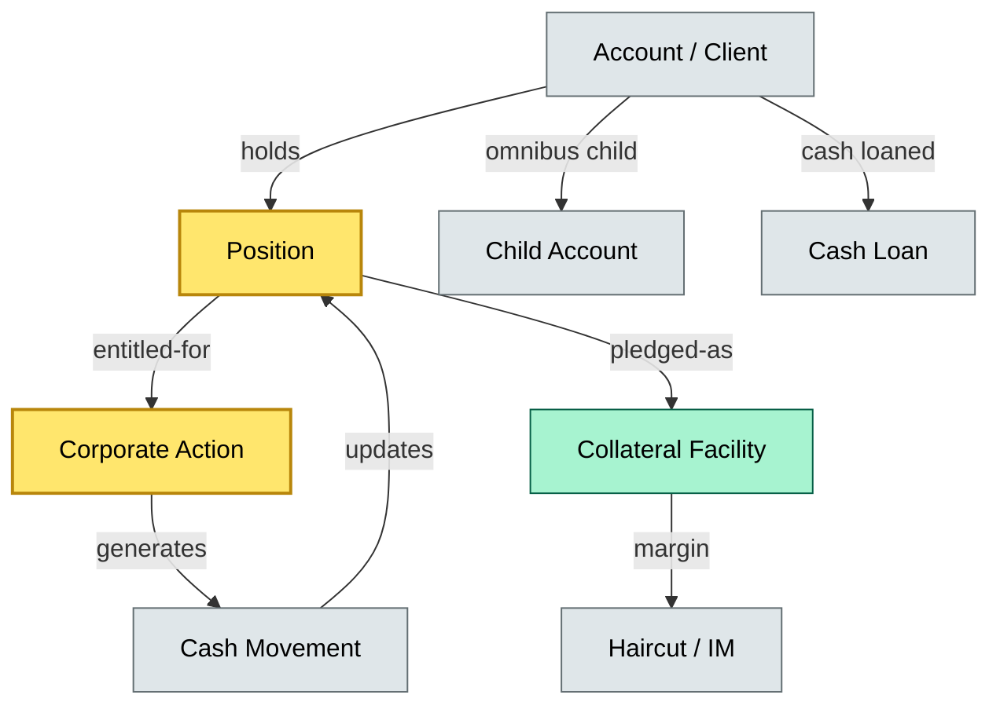
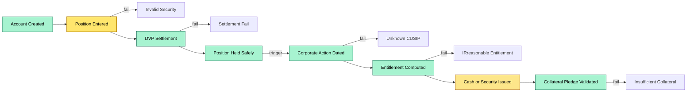
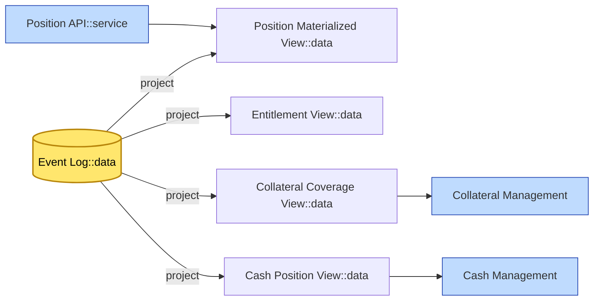

# C4-03 Core data model — DETAIL
> **Category:** Cx — Core Systems · **Difficulty:** ●/◑/○/◔ : ● · **Banking-relevant:** yes / 💳
> **Companion brief:** `briefs/C4-03-core-data-model.md`
>
> > **Target reader:** enterprise architect who must *explain, justify, and defend* the topic — not just recite it.

---

## 1. Precise definition
The core data model is the **single, canonical, graph-structured schema** that defines the atomic facts a custody system records and processes. It encompasses:

- **Account** — the client's legal and structural identity (individual, omnibus, nominee).
- **Position** — the security, quantity, currency, and safekeeping status held within an account.
- **Corporate action** — any event (dividend, coupon, split, merger, tender) that creates an entitlement or obligation.
- **Collateral facility** — a repo or securities-lending arrangement where positions or cash are posted to secure obligations.
- **Cash loan** — a term or overnight borrowing facility of client cash, with margin, interest, and return terms.

The model is **event-sourced**: each fact is an immutable, append-only record. Current state is derived by projection, not stored alone. This enforces auditability, temporal accuracy, and alignment with regulatory evidence requirements.

## 2. Why it exists (the problem it solves)
Custody is not a transaction-processing story; it is an **entitlement-tracking story**. The data model exists because:

- **Reconciliation:** nightly or sub-daily position reconciliation against the CSD ledger requires a deterministic, unified schema.
- **Regulatory readiness:** MiFID II transaction reporting, CSD / ICSR client-asset rules, and DORA require provable timestamps and lineage.
- **Incident recovery:** without a single event log, outage-time repair requires reconciling multiple silos, each with slightly different definitions of "held."
- **Cross-asset consistency:** cash, equities, fixed income, and derivatives must be modeled in a unified graph to produce consolidated reporting.
- **Collateral optimization:** a model that treats a security's existence and availability as separate, time-sliced facts is a prerequisite for automated rehypothecation.

## 3. Core concepts & vocabulary
| Term | Precise meaning |
|------|-----------------|
| Account | Legal entity or legal container; includes client need (retail, institutional, fiduciary), jurisdiction, and omnibus flag. |
| Position | A security held in an account; has identifier (ISIN / CUSIP / BBG), quantity (gross / net / available), currency, and safekeeping status. |
| Corporate action | Exogenous event creating a claim, obligation, or entitlement; governed by a rule set (EEA/SEC/CSDR). |
| Collateral facility | Contract or internal ledger representing a pledged position or cash balance; has lender, borrower, haircut, maturity, exposure limit. |
| Cash loan | Borrowing of client cash for duration; has margin, interest, and daily valuation run. |
| Event sourcing | Append-only, immutable fact log; current state = projection of events. |
| Entitlement graph | Directed graph mapping security CUSIP/ISIN -> account -> position -> corporate-action -> claim. |
| Materialized view | Pre-computed projection of the event graph for query performance. |
| Master data | Reference attributes (security issuer, coupon rate, dividend type) against which transactions validate. |

## 4. How it works (architecture / mechanism)

### 4.1 Entity-Relationship Essence
```
ACCOUNT [1..*] -- holds --> POSITION [1..*]
POSITION -- covered-by --> COLLATERAL_FACILITY [0..*]
ACCOUNT -- child-of --> ACCOUNT [omnibus hierarchy]
POSITION [1..*] -- entitled --> CORPORATE_ACTION [0..*]
CORPORATE_ACTION -- generates --> CASH_MOVEMENT [0..*]
CORPORATE_ACTION -- generates --> SETTLEMENT_INSTRUCTION [0..*]
CASH_MOVEMENT -- updates --> POSITION [cash component]
```

### 4.2 Event-sourced write path
1. **Ingest:** an instruction (trade, dividend, collateral call) arrives via the API / event bus.
2. **Validate:** schema check against master data (ISIN, CUSIP, currency).
3. **Append:** a fact record is appended to the event log: `{id, type, timestamp, payload, provenance}`.
4. **Project:** a materialization process reads new facts and updates the current view (position, entitlement, collateral).
5. **Emit:** derived states (settlement flows, collateral coverage) are published downstream.

### 4.3 Diagram A — Core structure
**Diagram A — Core structure** (highlight load-bearing parts = amber, supporting = grey):


### 4.4 Diagram B — Lifecycle / flow
**Diagram B — Lifecycle / flow** (highlight success path = green, entitlement failure = red, cash = gold):


## 5. Variants, options & trade-offs
| Variant | When to pick | When to avoid | Key trade-off axis |
|---------|--------------|---------------|--------------------|
| Graph DB (Neo4j / Arango) | High relationship cardinality (positions, entitlements, corporate actions) | Simple relational RLS models suffice | Query flexibility vs. operational simplicity |
| Relational (PostgreSQL + Citus) | Mature RI requirements, strict ACID, existing SQL skillset | Complex graph traversals | Strong consistency vs. scalability |
| Event store (EventStore / Kafka + Streams) | Event-sourcing as primary; CSR projection | Auditors expect table-view reporting | Audit strength vs. query ergonomics |
| Hybrid (Relational for master data, Graph for entitlements) | Mixed workload: master data + complex entitlement graphs | Higher ops and replication complexity | Source-of-truth clarity vs. ops burden |
| Materialized snapshots only | Read-heavy, low change-rate | Regulatory demands for event lineage | Performance vs. provenance |

## 6. Relationships to sibling topics
- **C2-08 (Corporate actions):** corporate-action events are a major input into the core model; the detail doc is the practitioner's guide to processing them.
- **C2-10 (Collateral management):** the core data model defines the "available" vs "pledged" field that collateral systems consume; without it, rehypothecation automation is impossible.
- **C3-02 (Client asset rules):** mandate account segregation, which shapes the core model's account classes (segregated, omnibus, nominee).
- **C4-01 (Platform landscape):** the core model is the canonical schema; middleware must map to it, not bypass it.
- **C4-02 (Smart custody):** event sourcing is the data-model philosophy behind smart custody; it is not merely a technology pattern.

## 7. Banking / financial-services context 💳
An institutional custodian maintains a $1.5Tnl book across 45 markets:

- **Crux:** a single erroneous "quantity updated" event caused a reconciliation gap of 12,000 securities, triggering a 3-day outage and a $3M employee remediation cost.
- **Regulation:** a regulator sample of the event log showed retroactive correction of a cash-dividend posting — a red-flag violation of data immutability; the firm was required to re-issue 18 months of statements.
- **Business reason:** the core data model's graph structure enables automated collateral optimization (reuse / rehypothecation), reducing cost-of-carry by ~$4M/year.
- **Failure consequence:** missing a corporate-action ex-dividend date due to a stale entitlement view caused a $2M tax-loss carryforward clawback on a European ETF.

## 8. Reference architecture / worked example


## 9. Maturity & adoption signals
- **Adopt when:** firm has multiple failed reconciliation cycles; regulatory audit identified data-lineage gaps; collateral reuse is manual.
- **Anti-signals:** "data model is fine in the legacy core, let's just add a view there"; no unified client identity across trade and custody.
- **Common failure modes:**
  1. **Duplicate facts:** two systems append a "position" event with different timestamps; reconciliation logic silently picks one, causing drift.
  2. **Missing identity resolution:** ISIN mismatches (WARC vs. MIC) cause the graph to treat the same security as two separate nodes.
  3. **State inconsistency:** collateral system reads a snapshot view; a concurrent corporate action updates the position between snapshot and query.

## 10. Common confusions — the "don't mix" list
| Often confused | Real distinction |
|----------------|------------------|
| Position vs. derivative obligation | A position is a physical or book entitlement; a derivative is a contractual right/obligation, often cash-settled. |
| Collateral facility vs. cash loan | Collateral is pledged *against* an obligation (security repo); a cash loan is a direct borrowing of cash. |
| Master data vs. transaction fact | Master data is static reference (security description); a transaction fact is an event (trade, dividend, pledge). |

## 11. Tools & standards to know
- **Standards:** ISO 20022 (pain.001, rtrv.003, pmnt.002), ISO 15022 (UAG), FIX Protocol 5.0, ACORD, OAY.
- **Frameworks / regulators:** MiFID II / ESZ (reporting), CSD Regulation European 2022/23693, DORA.
- **Common tooling:** Archi (for ER diagrams), Neo4j / Arango (graph), Apache Kafka (event log), Pydantic / jsonschema (structure validation), pgbouncer.
- **Mandatory reading:** *ISO 20022 Payment Messages*; *CSRC Position Definition*; *Design Data Models for Financial Services* (Data & Analytics Charter).

## 12. ADR template (ready to fill in)
```markdown
# ADR-03: Event-sourced graph core for positions and entitlements
## Status
Accepted
## Context
Legacy overnight batch core cannot support sub-second entitlement view for $1.8Tnl global equity / fixed-income book.
## Decision
Adopt event-sourced core with Neo4j for entitlement graph, PostgreSQL for master data, and Kafka for event replication.
## Consequences
- Positive: sub-second entitlement queries, audit provenance, automated collateral coverage.
- Negative: Neo4j operational burden, need for dual-skilled DBA/engineer team.
## Alternatives considered
1. Expand PostgreSQL with recursive CTEs — rejected: poor scale for >10M nodes.
2. Pure relational — rejected: graph query complexity would bloat reporting.
```

## 13. Practice — apply it
1. **Recall:** define in 2 min without notes.
2. **Model:** produce an Archi / YED diagram from scratch, showing Account -> Position -> Corporate Action -> Claim.
3. **ADR:** write a decision applying ADR-03 to a proposed collateral-reuse optimization for a $5Bnl RMBS book.
4. **Defend:** roleplay explaining event sourcing to a non-technical C-suite executive using "source of truth = immutable ledger, view = newspaper headline."

## Summary
The core data model is the anatomical skeleton of the custody platform. It is not a schema that lives only on a phones-home migration page; it is the governance contract between the platform, the regulator, and the client. Event sourcing and a graph-aware structure are no longer optional for large custodians — they are the minimal viable architecture for real-time entitlements, collateral optimization, and DORA-grade auditability.

---
**Status:** ☐ Not started · ☐ In progress · ✅ Covered
*Last updated: 2026-09-16*

---
**One diagram required. Both brief + detail must exist with ≥1 mermaid each before ✓.**
