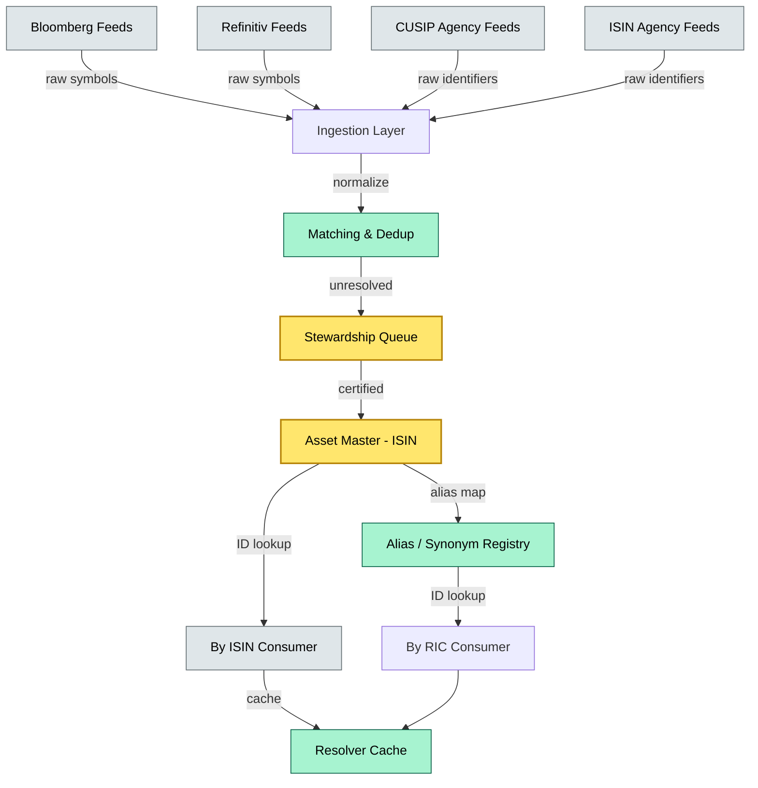
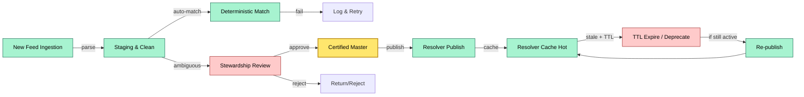
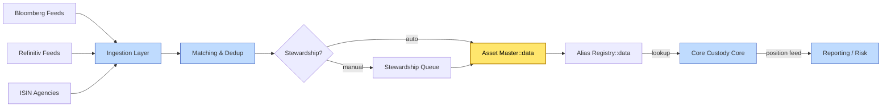

# C4-04 Reference data management — DETAIL
> **Category:** Cx — Reference Data · **Difficulty:** ●/◑/○/◔ : ◑ · **Banking-relevant:** yes / 💳
> **Companion brief:** `briefs/C4-04-reference-data-management.md`
>
> > **Target reader:** enterprise architect who must *explain, justify, and defend* the topic — not just recite it.

---

## 1. Precise definition
Reference data management (RDM) is the **governed discipline of curating authoritative master databases** for financial instruments, securities, counterparties, and identifiers, and then **propagating canonical mappings** to all dependent systems. The foundational identifiers are:

- **ISIN** (ISO 6166): 12-character structured identifier; country prefix + national identifier + check digit.
- **CUSIP** (Committee on Uniform Securities Identification Procedures): 9-digit numbering system for US and Canadian markets.
- **SEDOL** (Stock Exchange Daily Official List): 7-character alphanumeric identifier, primarily UK and Irish equities.
- **RIC** (Reuters Instrument Code): cryptic ticker + exchange code (e.g., `ES5.L`); used by Refinitiv.
- **BUID** (Bloomberg Universal Identifier): a persistent, instrument-level identifier used across Bloomberg's ecosystem (yield language, loan, FX).
- **BBG Logger / BBG RICS:** Bloomberg-specific rich instrument context system.
- **MCID / WARC:** Morningstar Corporate Actions ID and World-Check Relative ID; entity and historical-event linkage.
- **NACE / SIC / LEI / LEAC:** sector classifiers; legal entity / legal address / API identity for regulatory reporting.

The RDM operation is split into two layers: the **asset master** (the canonical, enriched security record) and the **identifier resolver** (the mapping engine that resolves all subtitle tickers to a single master record).

## 2. Why it exists (the problem it solves)
Financial markets run on messy, overlapping, multi-lingual identifiers. Without RDM, every downstream system — trade, custody, pricing, corporate actions, risk, reporting — must independently decide which code to use. The consequences are failures:

- **Reconciliation fire:** a trade captured as RIC, a position received as ISIN, and a corporate action processed as CUSIP produce three "different" securities when they are the same economic instrument.
- **Regulatory settlement failure:** a CSD may reject a SETTX message because the security identifier does not match its accepted format; the rejection often surfaces only after the settlement deadline.
- **Valuation and P&L errors:** collateral or derivative valuation feeds off the wrong ISIN / ticker, producing a stale or completely wrong market value.
- **Reporting misclassification:** MiFID II RTS 12 / MiFIR regulations require reporting against a single, unambiguous identifier; multiple codes for one instrument cause duplicate or omitted reports.
- **Client onboarding churn:** every new custodian must re-map identifiers, producing weeks of "data-match" delays.

RDM exists to make the **identifier trust boundary** auditable, automated, and cross-jurisdictional.

## 3. Core concepts & vocabulary
| Term | Precise meaning |
|------|-----------------|
| ISIN | ISO 6166 global identifier; country code, issuer code, check digit. |
| CUSIP | US/CAN numbering; maintained by S&P Global; nine digits. |
| SEDOL | UK/Irish; seven alphanumeric; maintained by LSEG. |
| RIC | Refinitiv ticker; exchange + cryptic; non-ISO; aliases local IDs. |
| BUID | Bloomberg Universal Instrument Identifier; persistent across releases. |
| BBG RICS | Bloomberg rich instruments context system; mapping + metadata. |
| MCID | Morningstar Corporate Actions ID; event-level uniqueness. |
| WARC | World-Check Relative ID; entity linkage across data providers. |
| Asset master | Canonical, enriched security record; includes ISIN, CUSIP, SEDOL, coupon, currency, maturity, issuer, MIC, and classification. |
| Identifier resolver | Runtime service: given any subscriber-format code (RIC / BBG / Reuters), returns canonical ISIN / internal ID. |
| Stewardship model | Governance process: who proposes, edits, imports, and approves a security record. |
| Equivalence | A regulatory-defined mapping that allows multiple identifiers for the same instrument (e.g., ISIN -> CUSIP for US-listed securities). |
| Status lifecycle | Not-equals -> Trading -> Flagged -> Corporate-Action-In-Progress -> Default -> Delisted -> De-ISIN (optional). |

## 4. How it works (architecture / mechanism)

### 4.1 RDM architecture
```
Source feeds (Bloomberg, Refinitiv, Markit, CUSIP Global Services, ISIN Agencies)
    |
    v
Ingestion layer: web services, SFTP, API polling
    |
    v
Staging: raw normalization (case, whitespace, encoding fixes)
    |
    v
Matching & dedup: record linkage (probabilistic / deterministic algorithms)
    |
    v
Stewardship queue: human-in-the-loop resolution for ambiguous matches
    |
    v
Certified asset master
    |
    v
Resolver: active / static cache (identifier -> master ID)
    |
    v
Downstream consumers (core custody, trade, pricing, reporting)
```

### 4.2 The "one master, many aliases" principle
- A single security (e.g., Apple Inc. common stock) has:
  - **One canonical `supplyMap` entry: `ISIN`** (or a chosen primary master key).
  - **Multiple `supplyMap` entries for the alias:** `CUSIP` (`037833100`), `ISIN` (`US0378331005`), `BBG BUID` (`US0378331005 <EQ>`), `RIC` (`AAPL <US>`), `MCID` (`002263322`), etc.
  - **Status gate:** a record cannot reach "Trading" if any critical attribute (issuer, currency, MIC) is unverified.

### 4.3 The resolver API
At runtime, a position update arrives with a `BBG-RIC`:
1. Request: `GET /rdm/resolve?key=ESMA000`
2. Resolver service:
   - Hash lookup in hot cache -> hit -> return `internalSecurityID`.
   - Miss -> fallback to Materialized / Elasticsearch index -> return `internalSecurityID`.
3. Inserts a short-lived entry in the resolver cache for locality.
4. `internalSecurityID` is written to the custody core: every transaction uses the internal key, never the raw ticker.

### 4.4 Diagrams
**Diagram A — Core structure** (highlight master = amber, aliases = green, consumers = grey):


**Diagram B — Lifecycle / flow** (highlight active = green, stale = red, authority = gold):


## 5. Variants, options & trade-offs
| Variant | When to pick | When to avoid | Key trade-off axis |
|---------|--------------|---------------|--------------------|
| Third-party RDM SaaS (Six Street / AlphaData) | Large-firm, multi-asset, multi-jurisdiction; vendor funds R&D | Need for deep customization, data sovereignty | Cost vs. product depth |
| In-house RDM (Markit / DTCC data + bespoke matching) | Proprietary asset classes (private equity, complex derivatives) | Slow to ingest new markets; ops burden | Specialization vs. timeliness |
| Open-source + internal matching (PostgreSQL + Elasticsearch + Dedup rules) | Small firm, specialized jurisdiction | Matching accuracy for derivates / MBS | Control vs. completeness |
| Federated RDM (multiple providers, no single master) | Highly multinational with no local waiver | Inconsistent identity; high reconciliation risk | Local nuance vs. analytics continuity |

## 6. Relationships to sibling topics
- **C4-03 (Core data model):** the core model's `instrument` table is a projected view of the RDM master; any drift there is a reconciliation failure.
- **C4-02 (Smart custody):** smart custody's API-first nature pushes the resolver into the critical path of every position query; it must be sub-50ms and cache-aware.
- **C2-08 (Corporate actions):** corporate actions use the MCID / WARC / BBG event feed; mapping failure here means missed entitlements.
- **C3-01 / C3-03 / C3-08 / C3-09:** MiFID II / CSD / Tax / Transaction reporting all consume canonical identifiers; a wrong ISIN triggers a reporting gap.
- **C2-03 / C2-04 (Receiving safekeeping / delivery to CSD):** safekeeping receipts must match the CSD's accepted identifier; mismatch = settlement fail.

## 7. Banking / financial-services context 💳
A $2Tnl global custodian has 47 data-provider feeds for 12,000 ISIN-equivalent identifiers:

- **Crux:** a stale Bloomberg RIC (`AAPL <US>` -> `ES5.L`) due to a subscription lapse caused a T+5 reconciliation gap every Monday morning, producing a $500K collateral mis-valuation for the week.
- **Regulation:** a MiFID II/S streamline reporting deadline (T+10) was missed on a US small-cap because the internal RDM inventory did not recognize that CUSIP `010101010` is now listed as a dual-listing (same ISIN, two CUSIPs).
- **Business reason:** 70% of provider-to-provider mapping is automated; 30% requires steward time. The firm operates a "steward-first" model for anything outside the top 500 securities.
- **Failure consequence:** a €40M sovereign bond position was accidentally associated with the wrong SEDOL (confusing two Polish issuers with identical names). The swap back took six weeks and cost the firm a basis-point recapture — plus a DORA regulatory censure.

## 8. Reference architecture / worked example


## 9. Maturity & adoption signals
- **Adopt when:** firm has >10 data-provider feeds, manual reconciliation, and wants to meet MiFID II / DORA data lineage requirements.
- **Anti-signals:** no dedicated data-stewardship team; "we just use Bloomberg wrappers"; no regulatory audit of identifier accuracy.
- **Common failure modes:**
  1. **Missing equivalence:** a CUSIP maps to two ISINs (U.S. dual-listing) and the resolver has no equivalence table, causing two positions for one economic exposure.
  2. **Stale status:** entity is delisted but remains "Trading" in the master, causing CSD settlement rejection.
  3. **Homogeneous case normalization:** ISINs are uppercase, SEDOLs are mixed-case, CUSIPs are numeric; a simple-case match misses 18% of cross-jurisdiction duplicates.

## 10. Common confusions — the "don't mix" list
| Often confused | Real distinction |
|----------------|------------------|
| ISIN vs CUSIP vs SEDOL | all identify a security, but each originates from a different standard; they are not synonyms. |
| RIC vs ISIN | RIC is a Refinitiv ticker; ISIN is ISO 6166; one can map to many. |
| Reference data vs transaction data | reference data is static (the dictionary); transaction data is the movement through that dictionary. |
| Asset master vs. security catalogue | asset master is curated and governed; catalogue is a dump of all provider feeds. |

## 11. Tools & standards to know
- **Standards:** ISO 15022 (UAG), ISO 20022 (pain.001), ISIN Agency guidelines, CUSIP Global Services rules.
- **Frameworks / regulators:** MiFID II / MiFIR, DORA, CSD Regulation (EU 2022/23693), MMF (Money Market Fund) guidelines.
- **Common tooling:** Archi / Excalidraw (for mapping diagrams), Elasticsearch (resolver index), Python-recordlinkage (dedup), Neo4j (equivalence graph), Confluent (CDC).
- **Mandatory reading:** *ITG Issue Identification Study*; *Six Street RDM White Paper*; *DTCC LYNX Reference Data Overview*.

## 12. ADR template (ready to fill in)
```markdown
# ADR-17: Bloomberg BUID canonical vs. proprietary internal ID
## Status
Proposed
## Context
Evaluate replacing BBG-based internal security IDs with a canonical BUID-derived master for $800Bnl Asian custody book.
## Decision
Adopt BUID as the canonical standard upstream (with ISIN/CUSIP synonym layer); keep internal numeric ID for legacy core to avoid a re-interfaced core migration.
## Consequences
- Positive: eliminates RIC mismatch errors; aligns with DTCC LYNX-style standard.
- Negative: 70/30 auto-match carve-out requires custom dedup rules; BUID fees may reduce vendor negotiation leverage.
## Alternatives considered
1. Pure ISIN/CUSIP master — rejected: loses Bloomberg ecosystem coverage (e.g., non-listed instruments).
2. Hybrid BUID + internal bridge (chosen).
```

## 13. Practice — apply it
1. **Recall:** define in 2 min without notes.
2. **Model:** produce an ArchiMate / relationship diagram from scratch: Data Resource (Asset Master) -> Core Service (Resolver API) -> Application (Custody Core).
3. **ADR:** write a decision applying ADR-17 to a proposed Azure Data Factory / Databricks pipeline for RDM ingestion.
4. **Defend:** roleplay explaining equivalence to a non-technical CRO.

## Summary
Reference data management is the **identity engine** of the custody platform. Without it, every downstream system is a fragmented island of conflicting identifiers. The two-layer architecture (asset master + resolver) is the bottleneck-free pattern: the master is curated centrally, the resolver is a fast cache layer. The next evolution is semantic-enriched masters (MCID-linked events, ESG taxonomy tags, climate-risk overlays) where identifier governance becomes a regulatory asset in itself.

---
**Status:** ☐ Not started · ☐ In progress · ✅ Covered
*Last updated: 2026-09-16*

---
**One diagram required. Both brief + detail must exist with ≥1 mermaid each before ✓.**
