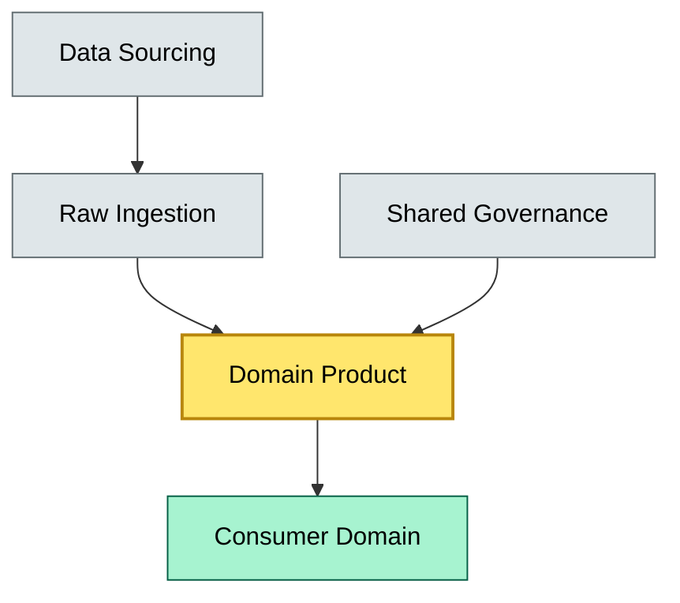
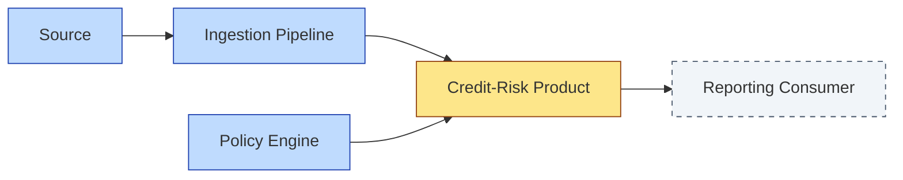

# C4-09 Data Mesh — DETAIL
> **Category:** Cx — Data Management · **Difficulty:** ◑ · **Banking-relevant:** yes / 💳
> **Companion brief:** `briefs/C4-09-data-mesh.md`
>
> > **Target reader:** enterprise architect who must *explain, justify, and defend* the topic — not just recite it.

---

## 1. Precise definition
{rigorous definition}

## 2. Why it exists (the problem it solves)
{problem + failure mode}

## 3. Core concepts & vocabulary
| Term | Precise meaning |
|------|-----------------|
| {term} | {definition} |

## 4. How it works (architecture / mechanism)

### 4.1 Diagrams
**Diagram A — Core structure** (highlight load-bearing parts = amber, supporting = grey):


**Diagram B — Lifecycle / flow** (highlight decision points = green, failures = red, money = gold):


## 5. Variants, options & trade-offs
| Variant | When to pick | When to avoid | Key trade-off axis |
|---------|--------------|---------------|--------------------|
| {A} | {case} | {case} | {axis} |

## 6. Relationships to sibling topics
- **{X}:** {relationship}

## 7. Banking / financial-services context 💳
{concrete banking example with regulations}

## 8. Reference architecture / worked example
{worked example}



## 9. Maturity & adoption signals
- **Adopt when:** {org readiness}
- **Anti-signals (don't adopt yet):** {signals}
- **Common failure modes:** {top 3}

## 10. Common confusions — the "don't mix" list
| Often confused | Real distinction |
|----------------|------------------|
| {X} vs {Y} | {precise} |

## 11. Tools & standards to know
- **Frameworks:** {cite standard}
- **Common tooling:** {tooling}
- **Mandatory reading:** {books, white papers, articles}

## 12. ADR template (ready to fill in)
```markdown
# ADR-{{NN}}: {{decision}}
## Status
Accepted | Proposed | Deprecated
## Context
{{...}}
## Decision
{{...}}
## Consequences
- Positive ...
- Negative ...
- ...
## Alternatives considered
1. ...
2. ...
```

## 13. Practice — apply it
1. **Recall:** define in 2 min without notes.
2. **Model:** produce an ArchiMate/UML diagram from scratch.
3. **ADR:** write a decision doc applying it to the banking example in §7.
4. **Defend:** roleplay explaining it to a non-technical CRO / CIO.

## Summary
{closing paragraph}

---
*Last updated: 2026-09-16*

---
**Status:** ☐ Not started · ☐ In progress · ✅ Covered
*One diagram required. Both brief + detail must exist with ≥1 mermaid each before ✓.*
