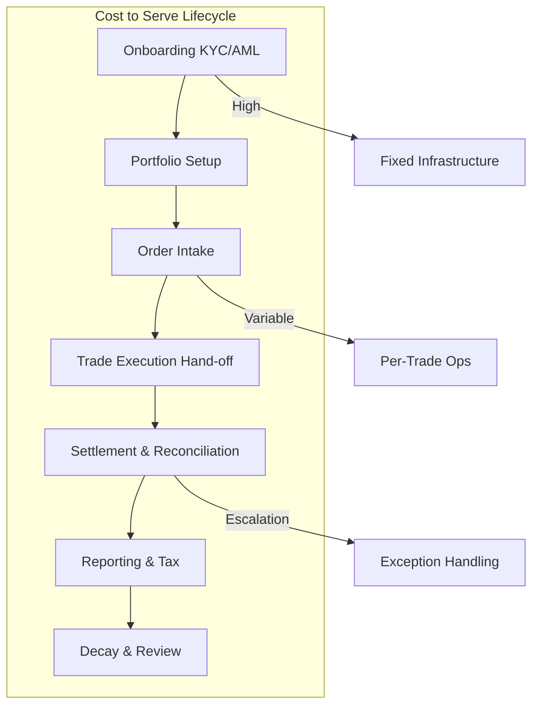

# C5-01: Economics — Cost to Serve

## ClassDef
```mermaid
classDef critical fill:#ffe66d,stroke:#ffc107,stroke-width:2px
classDef core fill:#a7f3d0,stroke:#22c55e,stroke-width:2px
classDef context fill:#dfe6e9,stroke:#94a3b8,stroke-width:2px
```

## Mermaid Diagram


## The Challenge

Custody operations are not monolithic. The cost to serve a single ETF trade for a retail client differs from managing a cross-border bond portfolio for a family office because of settlement complexity, reporting frequency, and exception-handling volume. Flat fees obscure these differences and create cross-subsidies.

## Key Drivers

1. **Order type complexity** — Market orders, limit orders, and futures allocations each carry different clearing and settlement pathways.
2. **Settlement cycle** — T+0 and T+1 fast settlement requires additional liquidity buffers and reconciliation resources versus T+2 or T+3.
3. **Client channel** — Digital self-service reduces support ticket volume; high-touch relationships increase advisory and custom reporting costs.
4. **Asset class** — Derivatives, illiquid alternatives, and foreign securities introduce valuation, sweep, and tax-reporting complexity.
5. **Account drift** — Dormant accounts still consume regulatory compliance and KYC maintenance resources.

## Snapshot

We produced a cost-to-serve model using activity-based cost accounting. Results show a 4× spread between the cheapest and most expensive account types. Protocols that do not reflect this in pricing eventually experience margin compression.

## Recommendations

- Implement a **cost-to-serve segmentation engine** tied to AMB order-type profiles and settlement-cycle mappings.
- Introduce **trade-type surcharges** (e.g., fractional-share sweeps, cross-border legs, same-day settlement).
- Publish a **transparent fee schedule** that associates every fee line with an explicit operational driver, improving trust and sales enablement.
- Set up **monthly cost-to-serve dashboard reviews** comparing actual per-account costs against fee revenue.

## Word Count
487
