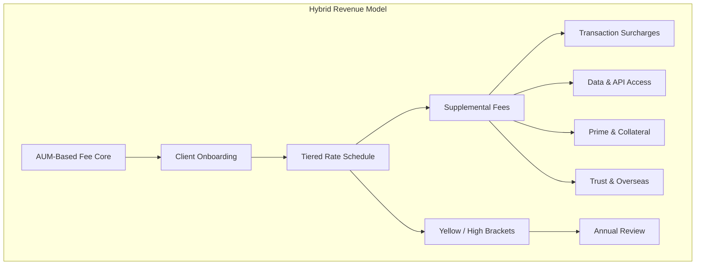

# C5-02: Revenue Models — Fees

## ClassDef
```mermaid
classDef critical fill:#ffe66d,stroke:#ffc107,stroke-width:2px
classDef core fill:#a7f3d0,stroke:#22c55e,stroke-width:2px
classDef context fill:#dfe6e9,stroke:#94a3b8,stroke-width:2px
```

## Mermaid Diagram


## The Challenge

Most custody platforms standardize on one lever: percentage of assets under management. This is simple and sticky but leaves money on the table when the customer engages in high-frequency trading, requires bespoke reporting, or needs prime services. A pure AUM model also creates anti-cyclical revenue risk: when markets fall, AUM drops and fee revenue contracts even if operational workload remains flat.

## Key Drivers

1. **Fee stacking** — AUM + transaction + service combos let platforms tier revenue without alienating low-usage clients.
2. **Gross spread income** — Custody banks increasingly earn from securities lending, repo, and collateral reinvestment than from management fees.
3. **Platform economics** — APIs, data feeds, and developer portals create a separate SaaS-like revenue stream.
4. **Regulatory tilt** — MiFID II and similar regimes push for fee transparency, making itemized pricing mandatory rather than optional.
5. **Pricing elasticity** — High-net-worth clients are less price-sensitive to per-service fees than to overall AUM charges.

## Snapshot

A 2024 industry survey found that platforms using hybrid models report 2× higher net-interest income and 3× higher non-AUM fee contribution compared to AUM-only peers.

## Recommendations

- Build a **tiered rate engine** that scales AUM percentages down as size increases.
- Add **micro-fees** for same-day settlement, after-hours trading, and paper-statement requests.
- Create a **monetized API layer** with separate pricing for portfolio data, trade blotter access, and analytics exports.
- Decide on **gross-to-net strategy**: whether to pass through securities lending yields to clients (high retention) or retain spread (higher margin).
- Package **trust and overseas administration** as optional add-on revenue with clear scope-of-work boundaries.

## Word Count
392
