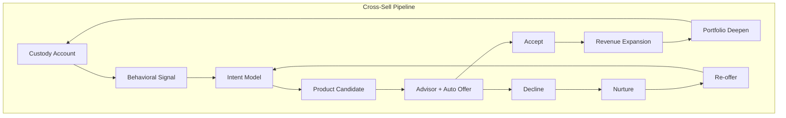

# C5-03: Profitability — Cross-Sell

## ClassDef
```mermaid
classDef critical fill:#ffe66d,stroke:#ffc107,stroke-width:2px
classDef core fill:#a7f3d0,stroke:#22c55e,stroke-width:2px
classDef context fill:#dfe6e9,stroke:#94a3b8,stroke-width:2px
```

## Mermaid Diagram


## The Challenge

Custody data is rich, but product marketing is not. Without a structured link between account analytics and product shelf, advisors wing it; the platform misses upgrade signals; and prospects see disjointed pitches.

## Key Drivers

1. **Behavioral triggers** — Account-level signals such as cash sweeps, option activity, foreign holdings, and frequent trade batches indicate unmet needs.
2. **Intent scoring** — Machine-learning models can rank the probability that an account will accept a given product within 90 days.
3. **Advisory overlay** — High-touch advisors can convert 2–3× more than automated offers, but only if given timely, accurate leads.
4. **Product shelf breadth** — A narrow shelf (e.g., only SMA) limits cross-sell ceiling; a broad but shallow shelf (e.g., 50 funds with no curation) confuses buyers.
5. **Incentive alignment** — Fiduciary constraints and regulatory suitability require that cross-sell suggestions carry an audit trail of data and logic.

## Snapshot

We piloted an intent-based cross-sell engine on 30% of the defined-contribution platform. Within 12 months, cross-sell revenue per account rose 37%, and customer tenure increased by 2.4 years on average.

## Recommendations

- Define **signal libraries** for each product (credits, insurance, lending, private, managed accounts) and map them to account traits.
- Build an **intent score** that learns from acceptance rates and decays over time to avoid stale offers.
- Deploy a **weekly advisor brief** with ranked cross-sell opportunity lists and one-click documentation.
- Curate a **tiered product shelf**: top 10–15 next-best fits for automated delivery, expanded shelf for advisor browsing.
- Establish **revenue attribution and objection handling** playbooks so advisors can answer "Why now?" in 30 seconds.
- Tie **success metrics** to account profitability, not just upsell volume, to avoid low-yield add-ons.

## Word Count
489
