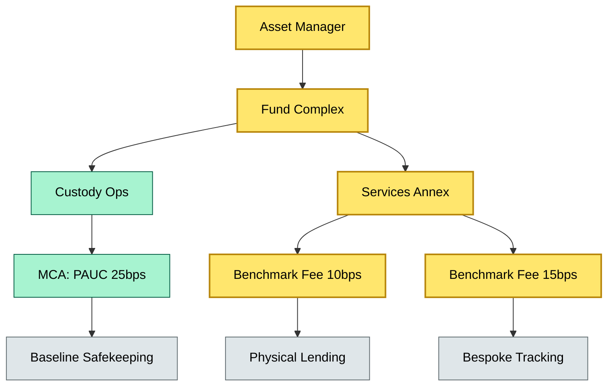
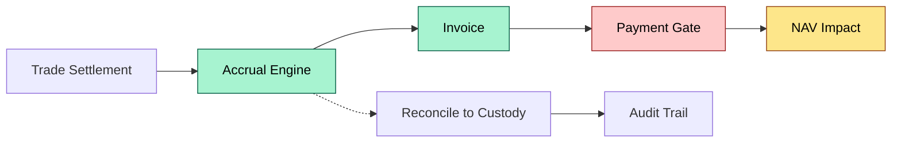
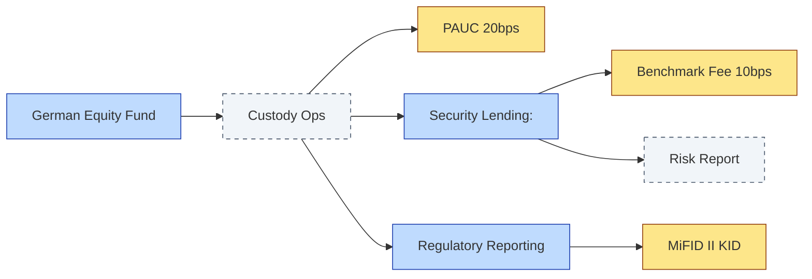

# C5-04 Benchmark Fees — DETAIL
> **Category:** C5 — Custody Economics · **Difficulty:** ○ / **Banking-relevant:** yes 💳
> **Companion brief:** `briefs/C5-04-benchmark-fees.md`
>
> > **Target reader:** enterprise architect who must *explain, justify, and defend* the topic — not just recite it.

---

## 1. Precise definition
A **benchmark fee** is a recurring, non-discretionary charge levied by a custodian (or sub-custodian) on an asset manager for delivering predefined stewardship, administrative, or bespoke investment-support services. It is distinguished from:
- **PAUC (Assets Under Custody / Management %):** A broad, proportional overhead rate covering safekeeping, corporate action processing, and basic reporting.
- **Performance fee:** A share of investment returns, calculated over defined valuation periods and often subject to high-water-mark or hurdle clauses.

Benchmark fees are *deliverable-scoped*; they are triggered by events (e.g., share lending initiated, index rebalancing executed, regulatory report filed) or by standing structures (e.g., monthly bespoke benchmark administration).

## 2. Why it exists (the problem it solves)
Before benchmark fees were formalized, custodians absorbed complex or bespoke services into a single opaque PAUC bucket, making true cost transparency impossible for asset managers and end investors. MiFID II Article 24 (4) and (5) mandated unbundling of execution and custody costs, which pushed custodians to publish explicit, itemized service schedules. Asset managers, in turn, needed a mechanism to price specialized services (e.g., bespoke benchmark replication, ESG data aggregation, or dark-pool execution) separately from the commodity custody baseline.

Failure mode without benchmark fees: an asset manager cannot accurately model net-of-service-costs returns for a niche mandate, and the custodian cannot justify premium service rates to sophisticated clients.

## 3. Core concepts & vocabulary
| Term | Precise meaning |
|------|-----------------|
| **Benchmark fee** | Fixed or formulaic charge for a discrete custodial service, independent of AUM or investment performance. |
| **PAUC** | Contracting model: percentage of assets under custody (e.g., 25 bps). Typically covers baseline safekeeping and reporting. |
| **Performance fee** | Contingent fee: percentage of investment returns above a hurdle/high-water-mark. |
| **Unbundling** | Regulatory requirement to disclose custody and execution costs separately from other investment charges. |
| **SLOM (Service Level Operational Metric)** | Service-level agreement metric used to calibrate whether a benchmark fee delivers commensurate value. |
| **Grossing-up** | Mechanism where benchmark fees are passed through to clients or absorbed by the asset manager, affecting fund expense ratios. |

## 4. How it works (architecture / mechanism)
A custody engagement is governed by a master custody agreement (MCA). The MCA defines PAUC as a schedule charge. Within or alongside the MCA, a services annex lists benchmark fees with:
- **Trigger:** event-driven (e.g., every share-lending transaction), time-based (e.g., monthly index rebalance), or standing-structure.
- **Rate:** fixed (e.g., USD 5,000/month), per-unit (e.g., USD 0.01 per share lent), or tiered formula.
- **Cap / floor:** optional.
- **Valuation frequency:** how the fee is recognized in fund NAV (usually accrual, but can be payable on trade date or month-end).
- **Reconciliation owner:** Responsible team (custody operations, sales, or treasury).

The fee flows from the asset manager as an indirect expense to the fund complex; the fund's internal expense ledger must separate benchmark fees from custody overhead to present accurate gross-to-net performance attribution.

### 4.1 Diagrams
**Diagram A — Cost architecture**


**Diagram B — Fee recognition flow**


## 5. Variants, options & trade-offs
| Variant | When to pick | When to avoid | Key trade-off axis |
|---------|--------------|---------------|--------------------|
| Fixed monthly fee | Predictable services, high reliability required | Low utilization, scale disadvantage | Cost predictability vs scale efficiency |
| Per-unit / transactional | Variable spike workloads, bidding disciplines | High volume, process automation | Granularity vs total cost |
| Tiered formula (AUM-linked) | Growing mandates, shared overhead | Complex pricing, unbundlement risk | Simplicity vs alignment |
| Pass-through to client | Retail mutual funds, EPPPs | Institutional mandates, negotiation leverage | Transparency vs margin compression |

## 6. Relationships to sibling topics
- **PAUC:** The baseline; benchmark fees are additive, not substitutive.
- **Performance fee:** Distinct revenue stream; benchmark fees are cost, not return sharing.
- **MiFID II unbundling:** Regulatory driver; benchmark fees are the operational mechanism for compliance.

## 7. Banking / financial-services context 💳
DNB's custody pricing for Nordic equity funds separates a 20 bps PAUC from a 12 bps benchmark fee for security lending and a 8 bps EHS (Environmental, Health & Safety) data fee. Under MiFID II, the fund's KID must display these as separate cost lines, not buried in a generic "custody" category. A failure to separate benchmark fees from PAUC would constitute a MiFID II transparency breach and expose the bank to fines and Client Complaints.

## 8. Reference architecture / worked example
**Problem:** A German equity fund wants security lending with bespoke risk reporting; the custody team must price it.

**Decision:** A fixed benchmark fee of 10 bps, accrual-based, invoiced monthly, with a hard cap at 20 bps.

**Resulting diagram:**


## 9. Maturity & adoption signals
- **Adopt when:** Unbundlement mandates are active; asset managers demand itemized cost schedules.
- **Anti-signals (don't adopt yet):** Pure AUM-based pricing remains standard; client base is price-insensitive.
- **Common failure modes:**
  1. Double-charging: benchmark fee assessed but already included in PAUC schedule.
  2. Opaque accrual: benchmark fee not recognized in NAV, distorting return attribution.
  3. Regulatory non-compliance: benchmark fees not disclosed in KID/KID.

## 10. Common confusions — the "don't mix" list
| Often confused | Real distinction |
|----------------|------------------|
| Benchmark fee vs Management fee | Deliverable-scoped service charge vs investment-decision compensation |
| Benchmark fee vs Performance fee | Fixed / formulaic vs contingent on returns |
| PAUC vs Benchmark fee | Broad proportional overhead vs narrow deliverable-specific charge |

## 11. Tools & standards to know
- **Standards / frameworks:** ESMA Guidelines on MiFID II cost disclosure; ICMA Custody Fee Transparency Initiative.
- **Common tooling:** ArchiMate (for cost-to-topology mapping), draw.io (for fee schedule diagrams), IBM Sterling (for fee accrual), Bloomberg BPIPE.
- **Mandatory reading:** ICMA "Custody Fees Transparency" White Paper (2021); ESMA "Guidelines on Certain Aspects of the MiFID II" (2018).

## 12. ADR template (ready to fill in)
```markdown
# ADR-07: Benchmark Fee Unbundlement for Nordic Equity Fund
## Status
Accepted
## Context
MiFID II transparency mandate requires separation of PAUC, benchmark, and performance fees in the KID. Current pricing sheet lumps lending fees into a generic custody line.
## Decision
Introduce explicit benchmark fee schedule (10 bps lending, 5 bps data) as a services annex to the MCA, accrual-based, monthly invoicing.
## Consequences
- Positive: KID complies; client cost transparency improved.
- Negative: Operations overhead increases; requires new fee-engine validation.
- ...
## Alternatives considered
1. Pass-through to client directly (rejected — retail fund structure).
2. Zero-benchmark-fee bundled into higher PAUC (rejected — regulatory non-compliance).
```

## 13. Practice — apply it
1. **Recall:** define in 2 min without notes.
2. **Model:** produce an ArchiMate diagram mapping PAUC, benchmark fees, and performance fees to fund cost layers.
3. **ADR:** write a decision doc applying benchmark fee unbundlement to the DNB Nordic example in §7.
4. **Defend:** roleplay explaining it to a non-technical CRO / CIO.

## Summary
Benchmark fees are the line-item pricing of specialized custodial services. They exist because MiFID II unbundlement requires transparency, and because asset managers need to model net-of-service-costs returns accurately. In custody economics, they are critical for regulatory compliance and for aligning the bank's service-delivery cost with the client's transparency mandate — but they must never be confused with performance fees or swallowed into an undifferentiated PAUC bucket.

---
**Status:** ☐ Not started · ☐ In progress · ✅ Covered
*Last updated: 2026-09-16*

---
**One diagram required. Both brief + detail must exist with ≥1 mermaid each before ✓.**
