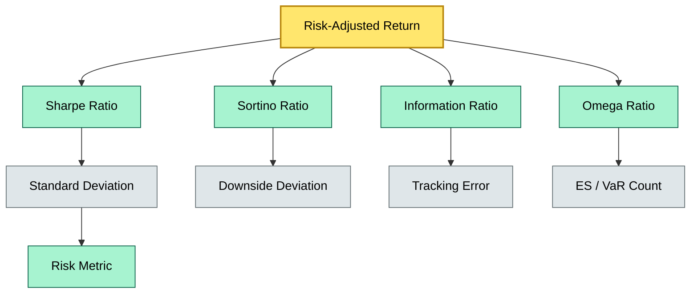
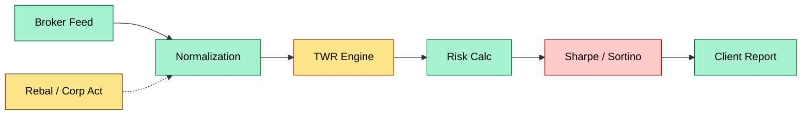
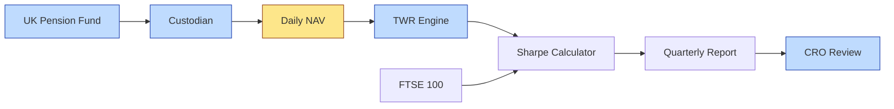

# C5-05 Risk-Adjusted Return — DETAIL
> **Category:** C5 — Custody Economics · **Difficulty:** ◑ / **Banking-relevant:** yes 💳
> **Companion brief:** `briefs/C5-05-risk-adjusted-return.md`
>
> > **Target reader:** enterprise architect who must *explain, justify, and defend* the topic — not just recite it.

---

## 1. Precise definition
A **risk-adjusted return** metric is a scalar performance measure that expresses a portfolio's return relative to a measure of risk. The most common families are:

- **Total-return normalized:** Sharpe ratio, Sortino ratio, Calmar ratio (return / max drawdown).
- **Benchmark-relative:** Information ratio (IR), tracking error, tracking risk.
- **Tail-risk focused:** Omega ratio, Sharpe with VaR/ES denominator.

These metrics are *observational* — they describe historical behavior — but they are also *normative* in that a higher value (above a disciplinary threshold) is considered "better."

Under custody reporting, the metric must be computed from **time-weighted** returns (TWR), not money-weighted, and the risk measure must use the same return frequency and window as the numerator.

## 2. Why it exists (the problem it solves)
Raw arithmetic returns are misleading for client comparison. Two funds can post 10% annual return, but one took half the risk of the other. Without normalization, an asset manager with a "hot" portfolio appears superior — until a crash. Regulators and consultants therefore demand risk-adjusted metrics to prevent Sharpe hunting, "hot hand" bias, and opacity in fee justification.

The architectural pain: custody systems store holdings, not returns. Constructing a reliable TWR from daily valuations, corporate actions, and rebalancing trades requires a dedicated time-series pipeline with auditability.

## 3. Core concepts & vocabulary
| Term | Precise meaning |
|------|-----------------|
| **Sharpe ratio** | (Portfolio return − Risk-free rate) / Portfolio standard deviation of returns. |
| **Sortino ratio** | (Portfolio return − Risk-free rate) / Downside deviation (below MAR). |
| **Information ratio (IR)** | Active return (portfolio − benchmark) / Tracking error (standard deviation of active return). |
| **Time-weighted return (TWR)** | Compound geometric return over a period, immune to cash-flow timing. |
| **Tracking error** | Standard deviation of the difference between portfolio and benchmark returns. |
| **Rolling window** | A trailing N-period look-back over which the metric is recalculated (e.g., 36 months). |
| **Minimum acceptable return (MAR)** | Hurdle rate (often risk-free or zero) below which returns are penalized in Sortino. |

## 4. How it works (architecture / mechanism)
A custody risk-adjusted return pipeline has four stages:

1. **Valuation ingestion:** Daily or intra-day NAVs per security and per portfolio.
2. **TWR construction:** A time-series of TWRs, with corporate action and rebalancing adjustments.
3. **Risk-factor extraction:** Compute rolling standard deviation, downside deviation, or tracking error over a user-defined window.
4. **Metric calculation:** Divide normalized return by the risk measure; store in the portfolio master table and expose via API / report.

The custody system must lock the valuation source (broker feed vs. custodian own NAV) at calculation time to prevent drift.

### 4.1 Diagrams
**Diagram A — Risk-adjusted return taxonomy**


**Diagram B — Custody calculation pipeline**


## 5. Variants, options & trade-offs
| Variant | When to pick | When to avoid | Key trade-off axis |
|---------|--------------|---------------|--------------------|
| Sharpe (full vol) | Liquid, short-horizon, low-gamma strategy | Asset with fat tails; upside volatility looks like risk | Simplicity vs accuracy |
| Sortino | Downside-oriented investors (pensions, endowments) | Smooth-trend strategies where up vol is real risk | Tail focus vs. total risk |
| Information ratio | Actively managed mandates vs benchmark | No defined benchmark | Benchmark quality vs. IR utility |
| Rolling 12-month | Short-term tactical reporting | Regimes with structural breaks | Noise vs. signal |
| Rolling 36-month | Long-term strategic reporting | Fast-changing strategy | Lag vs. relevance |

## 6. Relationships to sibling topics
- **TWR vs. IRR:** TWR is the default for custody; IRR is money-weighted and distorted by client cash flows.
- **Tracking error vs. standard deviation:** TE is benchmark-relative; σ is absolute. They share a denominator but differ in numerator alignment.
- **Risk-adjusted return vs. alpha:** Alpha is an *excess* return relative to a benchmark; risk-adjusted return is *normalized* by risk.

## 7. Banking / financial-services context 💳
Swiss private-bank custodian UBS calculates a "risk-adjusted custody score" for its sub-custodian network (e.g., BNP Paribas, State Street). The score is the IR of the custody service: the value-add of efficient corporate-action processing and trading provided by BNP, minus the tracking error it imposes on the Swiss Equity Fund. If IR < 0.2, the relationship is flagged for review. A failure mode: using total return alone masks a custodian that is slow on corporate actions, creating hidden "drawdown drag" that the Sharpe ratio smooths over because it is computed on a long window.

## 8. Reference architecture / worked example
**Problem:** A UK pension fund's custodian must produce a quarterly risk-adjusted return report for a £500 m UK equity mandate.

**Decision:** Compute Sharpe on 36-month rolling TWR, with daily corporate-action-adjusted NAVs, using the FTSE 100 as the risk-free proxy (borrow rate).

**Resulting diagram:**


## 9. Maturity & adoption signals
- **Adopt when:** Mandates require benchmark-relative reporting; regulatory frameworks (RDR, UCITS) demand transparency.
- **Anti-signals (don't adopt yet):** Pure total-return culture; custody systems lack reliable TWR.
- **Common failure modes:**
  1. Using money-weighted returns in a Sharpe ratio — denominator is correct, numerator is biased.
  2. Using monthly returns for a strategy known for daily volatility — coarse calendar smooths true risk.
  3. Ignoring rebalancing dates — TWR is broken across event-driven trades.

## 10. Common confusions — the "don't mix" list
| Often confused | Real distinction |
|----------------|------------------|
| Sharpe vs. Sortino | Sharpe penalizes all variance; Sortino penalizes only downside. |
| Sharpe vs. Information ratio | Sharpe compares to risk-free; IR compares to benchmark. |
| Risk-adjusted return vs. alpha | Risk-adjusted normalizes return by risk; alpha measures benchmark excess. |

## 11. Tools & standards to know
- **Standards / frameworks:** ICMA "Key Investor Information Document" guidance; ESMA MAR reporting.
- **Common tooling:** Bloomberg PORT, Refinitiv Eikon portfolio analytics, FactSet, Python (PyPortfolioOpt, arch), R (PerformanceAnalytics), Julia.
- **Mandatory reading:** "Investment Performance Measurement" by Bruce J. Feibel; "Risk-Adjusted Performance Measures" (Journal of Portfolio Management, 1998).

## 12. ADR template (ready to fill in)
```markdown
# ADR-08: Adopt 36-Month Sharpe for UK Equity Mandate Reporting
## Status
Accepted
## Context
DNB mandate requires quarterly risk-adjusted return disclosure; current method uses 12-month IR on money-weighted returns, causing regulatory pushback.
## Decision
Migrate to 36-month Sharpe, TWR, daily NAV, FTSE 100 risk-free proxy, stored in portfolio master with full lineage.
## Consequences
- Positive: RDR compliance; consultant satisfaction.
- Negative: TWR engine requires overnight batch; latency on intraday queries.
- ...
## Alternatives considered
1. Keep 12-month IR (rejected — falls under RDR transparency).
2. Use Sortino instead (rejected — client comfort with Sharpe is higher).
```

## 13. Practice — apply it
1. **Recall:** define in 2 min without notes.
2. **Model:** produce an ArchiMate diagram showing the risk-adjusted return pipeline as a service layer over the custody data lake.
3. **ADR:** write a decision doc applying the 36-month Sharpe migration to the UBS sub-custodian example in §7.
4. **Defend:** roleplay explaining it to a non-technical CRO / CIO.

## Summary
Risk-adjusted return metrics are the grammar of modern custody reporting. They transform raw returns into a normalized, comparable language that investors and regulators trust. Custody systems must support them with audit-grade TWR construction, rolling-window risk extraction, and explicit disclosure of benchmarks and windows — because a miscalculated Sharpe is not a modeling quirk; it is a credibility risk.

---
**Status:** ☐ Not started · ☐ In progress · ✅ Covered
*Last updated: 2026-09-16*

---
**One diagram required. Both brief + detail must exist with ≥1 mermaid each before ✓.**
