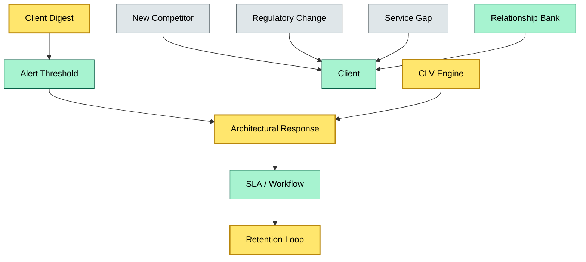
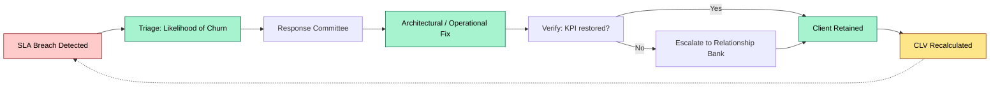

# C5-06 Brand Retention — DETAIL
> **Category:** C5 — Custody Economics · **Difficulty:** ● / **Banking-relevant:** yes 💳
> **Companion brief:** `briefs/C5-06-brand-retention.md`
>
> > **Target reader:** enterprise architect who must *explain, justify, and defend* the topic — not just recite it.

---

## 1. Precise definition
**Brand retention** is the organizational and architectural discipline of preserving client loyalty and trust through continuous value delivery, governance transparency, and embedded relationship depth—such that the marginal cost to the client of switching (operational, regulatory, and technical) exceeds the marginal expected benefit of doing so.

It is not a marketing campaign; it is a system property. In custody, where client switching can trigger regulatory events (e.g., MiFID II cost disclosure re-draft, AIFMD migration paperwork, UCITS depositary re-appointment), the architecture of retention matters as much as the architecture of service delivery.

## 2. Why it exists (the problem it solves)
Custody is a low-margin, high-relationship business. Asset managers and sovereign wealth funds have highly concentrated, low-frequency, high-value mandates. Losing a £500 m mandate does not show up in daily P&L; it shows up in 5-year market share. Historically, banks over-weighted client acquisition (sales commissions, fee cuts) and under-weighted retention (SLA governance, architectural continuity, relationship depth).

The architectural problem: without a retention-aware system, a client's operational knowledge lives in spreadsheets and personal laptops. The first call from a new DBA or CRO triggers a knowledge gap, which degrades service quality, which triggers churn.

## 3. Core concepts & vocabulary
| Term | Precise meaning |
|------|-----------------|
| **Switching cost** | The economic, operational, and regulatory effort required to move assets and workflows from one custodian to another. |
| **Relationship banking** | The practice of embedding human advisors (relationship managers, solutions architects) into a client's decision-making. |
| **Positive vendor lock-in** | Architectural dependence that is valuable and justifiable, not predatory. |
| **Client lifetime value (CLV)** | The net-present value of all future cash flows from a client relationship. |
| **SLA decay function** | The rate at which service-level agreement breaches increase the probability of churn. |
| **Key-person risk** | Concentration of client knowledge in an individual; a loss triggers retention intervention. |
| **Retention loop** | A closed control loop: monitor → alert → respond → verify → retain. |

## 4. How it works (architecture / mechanism)
A retention-aware custody platform has three layers:

1. **Observation layer:** A client-digest service consumes SLA metrics, compliance flags, query latency, and key-person changes. It computes an "attention score" per client.
2. **Governance layer:** An alert threshold triggers a response playbook (architectural, process, or relationship).
3. **Action layer:** A vendor-neutral response, executed by a cross-functional team, with a lifecycle that closes the loop.

The architecture must be vendor-neutral at the action layer to avoid "extracting" the client once they are hooked.

### 4.1 Diagrams
**Diagram A — Retention immune system**


**Diagram B — Lifecycle of a retention event**


## 5. Variants, options & trade-offs
| Variant | When to pick | When to avoid | Key trade-off axis |
|---------|--------------|---------------|--------------------|
| SLA-driven retention | High-touch, low-frequency mandates (Sovereign, AIFMD) | Mass-market retail platforms | Depth vs. scalability |
| Relationship-bank-led | Complex, multi-asset mandates | Lean, digitized platforms | Cost vs. stickiness |
| Architecture-lock-in | Institutional, long-horizon clients | Regulators / competition scrutiny | Justifiable depth vs. predatory trap |
| Service-exponential pricing | Price-sensitive, low-touch segments | Relationship-driven segments | Margin vs. churn |

## 6. Relationships to sibling topics
- **C2-06 (Sub-custody Monitoring):** Retention relies on delivery of sub-custody quality; poor monitoring erodes trust.
- **CI-01 (Service Contract Lifecycle):** Contract renewals are explicit retention moments; architectural continuity in contract language reinforces trust.
- **Client Onboarding (C2-01 / C2-05):** Onboarding sets the baseline for retention; poor onboarding produces a negative attention score from day one.
- **Data Lake / Data Sovereignty (C4-0x):** Client data portability is a switching cost; ambiguous sovereignty erodes retention.

## 7. Banking / financial-services context 💳
DNB retains a £1 bn Nordic sovereign-wealth bond portfolio by embedding a dedicated relationship bank (one RM, one solutions architect) and by architecting its sub-custody monitoring so that the client's IT team cannot replicate the bond-yield rounding logic without a six-month build. The switching cost is not predatory; it is genuine depth. A failure mode: a competitor launches a lower-fee platform and DNB matches the fee without architectural response. The client gains nothing in service quality and DNB's margin compresses.

## 8. Reference architecture / worked example
**Problem:** A €700 m German pension mandate shows early signs of attrition: query latency > 2 s and key-person turnover on the casualty-bond desk.

**Decision:** Commit a Solutions Architect to co-development for two quarters; embed their knowledge in the bond-yield rounding service; negotiate a joint escalation SLA.

**Resulting diagram:**

```mermaid
graph LR
    classDef service fill:#bfdbfe,stroke:#1e40af
    classDef data fill:#fde68a,stroke:#92400e
    classDef boundary fill:#f1f5f9,stroke:#475569,stroke-dasharray: 5
    Client[German Pension]:::service --> Custodian[Custodian]:::service
    Custodian --> Monitor[Sub-custody Monitor]:::service
    Monitor --> Alert[Alert Engine]:::critical
    Alert --> Response[Response Committee]:::service
    Response --> SA[Solutions Architect]:::service
    SA --> Knowledge[Embedded Knowledge]:::data
    Knowledge --> SLA[Joint SLA]:::core
    SLA --> Verify[Verified: Latency < 1s]:::ok
    Verify --> Retain[Client Retained]:::core
    Retain --> CLV[€700m CLV Preserved]:::money
```


## 9. Maturity & adoption signals
- **Adopt when:** Mandate concentration is high; switching costs are institutional-grade.
- **Anti-signals (don't adopt yet):** Platform fully commoditized; clients switch on price alone.
- **Common failure modes:**
  1. Treating retention as a sales SLA (discounting) instead of an architectural response.
  2. Letting key-person knowledge escape into personal drives / unbacked laptops.
  3. Running a one-off retention campaign rather than a closed loop.

## 10. Common confusions — the "don't mix" list
| Often confused | Real distinction |
|----------------|------------------|
| Brand retention vs. Customer acquisition | Retention moves existing clients; acquisition brings in new ones. |
| Brand retention vs. relationship banking | Retention is the outcome; relationship banking is the method (human + system). |
| Switching costs vs. vendor lock-in | Lock-in is exploitative; switching costs can be legitimate (complexity, integration). |

## 11. Tools & standards to know
- **Standards / frameworks:** TOGAF ADM (Architecture Development Method) for enterprise-wide continuity; ISO 20022 for data portability; MiFID II for regulatory trust.
- **Common tooling:** Archi for governance mapping, Grafana for SLA dashboards, Keycloak (for identity continuity), Confluence / MS Teams for knowledge embedding.
- **Mandatory reading:** "Customer Lifetime Value" by Gupta et al.; "Relationship Banking" by Berger and Udell; "The Repeatable Customer Experience" by Pine and Quillen.

## 12. ADR template (ready to fill in)
```markdown
# ADR-09: Embed Solutions Architect for Nordic Sovereign Mandate Retention
## Status
Accepted
## Context
€700 m German pension mandate threatens attrition due to query-latency spikes and key-person turnover on bond-desk.
## Decision
Co-locate one Solutions Architect with the client for two quarters; embed their domain knowledge into the rounding service; negotiate joint SLA + escalation.
## Consequences
- Positive: Retention secured; knowledge depth institutionalized.
- Negative: Resource cost; risk of architect dependency on the client.
- ...
## Alternatives considered
1. Discount to match competitor (rejected — margin fall, no value).
2. Engage external consultant (rejected — no knowledge embedment).
```

## 13. Practice — apply it
1. **Recall:** define in 2 min without notes.
2. **Model:** produce an ArchiMate diagram of the retention immune system as a governance layer over the custody service map.
3. **ADR:** write a decision doc applying the Solutions Architect embedment to the DNB Nordic example in §7.
4. **Defend:** roleplay explaining it to a non-technical CRO / CIO.

## Summary
Brand retention is custody's immune system. It is cheaper to retain than to acquire, and in custody — where regulatory depth and operational complexity create genuine switching costs — retention is an architectural, not a sales, discipline. The winning architecture treats retention as a closed-loop control system: observe, alert, respond, verify, and retain — with a vendor-neutral action layer that respects the client's sovereignty and proves value, not extracts it.

---
**Status:** ☐ Not started · ☐ In progress · ✅ Covered
*Last updated: 2026-09-16*

---
**One diagram required. Both brief + detail must exist with ≥1 mermaid each before ✓.**
