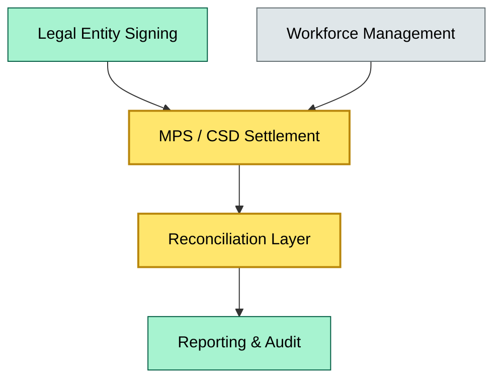
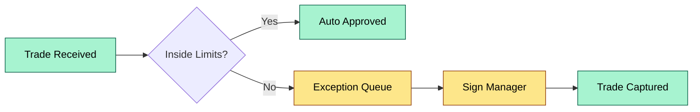

# C6 Org Chart — DETAIL
> **Category:** Cx — Custody & Asset Servicing · **Difficulty:** ◑ · **Banking-relevant:** yes / 💳
> **Companion brief:** `briefs/C6-01-org-chart.md`
>
> > **Target reader:** enterprise architect who must *explain, justify, and defend* the topic — not just recite it.

---

## 1. Precise definition
An organizational chart in custody is a governance artifact that maps reporting lines, approval gates, and system entitlements for the custody function. It covers three layers: (1) legal authority (who the entity is empowered to hold assets), (2) operational hierarchy (who executes on those powers), and (3) control architecture (who can override or audit). The org chart is the primary input to a RACI — it tells you *who* is in scope for *what* activity.

## 2. Why it exists (the problem it solves)
Without an explicit org chart, custody functions self-organize around proximity to the trading floor rather than around control requirements. This produces shadow authority: a VP who is not on the chart but holds de facto approval rights because the system shows them as residual signer on exception tickets. The org chart makes those shadow rights visible and forces them into either formalization or sunset.

## 3. Core concepts & vocabulary

| Term | Precise meaning |
|------|-----------------|
| **Line custody** | direct contractual custody for retail or institutional clients |
| **Agent custody** | sub-custody through intermediaries or PRIME brokers |
| **Nominee holding** | assets held in the advisor's name with registration in the provider's books |
| **Control gap** | when system entitlements or vicarious authority are not reflected in the org chart |
| **Separation of duties** | no single role can initiate, approve, and reconcile a transaction |

## 4. How it works (architecture / mechanism)

### 4.1 Diagrams

**Diagram A — Core structure** (highlight load-bearing parts = amber, supporting = grey):


**Diagram B — RACI / approval flow** (highlight decision points = green, money = gold):


## 5. Variants, options & trade-offs

| Variant | When to pick | When to avoid | Key trade-off axis |
|---------|--------------|---------------|--------------------|
| Centralized custody | large AUM aggregator | single concentration risk | concentration vs scale |
| Distributed / regional custody | regulatory arbitrage, local CSD requirement | reconciliation complexity | localization vs overhead |
| Third-party custodian-only | AUM < operational threshold | loss of control, counterparty risk | cost vs oversight |

## 6. Relationships to sibling topics
- **RACI:** the org chart provides the actor pool; RACI assigns responsibility per activity.
- **Client service model:** the org chart determines which service desks own which segments (institutional vs retail).
- **Reconciliation framework:** the org chart must include a reconciliation owner; otherwise, exceptions have no accountable party.

## 7. Banking / financial-services context 💳
Under EMIR and SFTR, a bank must demonstrate that custody and transparency data are held and reported by personnel with explicit authority. ESMA expects the pre-trade transparency obligation (reporting) to be separable from ongoing operational control. If the org chart shows the supervising dealer also holding the sign-off right on repo transparency reports, regulators view that as a conflict requiring remediation.

## 8. Reference architecture / worked example
**Problem:** A broker-dealer merged with an asset manager; custody staff reported to the M&A integration PMO instead of Compliance. During the first solo test, ESMA found that custody reconciliation reports were approved by the same individual who initiated exception tickets.  
**Decision:** restructure so that Custody Operations reports to the Chief Compliance Officer, with a dotted line to the CIO for system entitlements, and a structural firewall to Audit.  
**ADR:** ADR-42, "Custody Org Structure Post-Merger."

## 9. Maturity & adoption signals
- **Adopt when:** formal sign-off authority exists for every custody function and is documented in the org chart.
- **Anti-signals:** system shows 3+ "exception signers" who are not in the org chart or in a manual overrides list.
- **Common failure modes:** shadow authority, single point of override, audit independence erosion.

## 10. Common confusions — the "don't mix" list

| Often confused | Real distinction |
|----------------|----------------|
| Org chart vs org structure | Org chart is the diagram; org structure is the political/cultural reality behind it. |
| Line vs agent custody | Line is direct; agent is through intermediaries with delegated authority. |

## 11. Tools & standards to know
- **Standards:** ISO 20022 for messaging, ESMA Guidelines on custody, SOA (Standard Operational Allocation)
- **Common tooling:** OrgWeaver, Visio, draw.io, SAP Org Management
- **Mandatory reading:** ESMA Guidelines on the management of conflicts of interest in custody, Basel Passport

## 12. ADR template (ready to fill in)
```markdown
# ADR-42: Custody Org Structure Post-Merger
## Status
Accepted
## Context
Onboarding of Custody team into legacy integration PMO created control visibility gaps.
## Decision
Move Head of Custody Operations to report to Chief Compliance Officer with dotted line to CIO.
## Consequences
- Positive: audit independence preserved.
- Negative: IT access governance must be renegotiated with CIO.
## Alternatives considered
1. Staff it as a second-line-of-defense unit under Internal Audit (rejected: too distant from Operations).
2. Keep it under Operations with Compliance veto only (rejected: veto is not the same as authority).
```

## 13. Practice — apply it
1. **Recall:** define in 2 min without notes.
2. **Model:** produce an ArchiMate diagram from scratch showing legal-entity, operational, and system layers.
3. **ADR:** write a decision doc applying it to the banking example in §7.
4. **Defend:** roleplay explaining it to a non-technical CRO / CIO.

## Summary
The custody org chart is the control surface between legal authority, operational execution, and system entitlements. Its integrity determines whether a bank can pass solo-audit, satisfy ESMA transparency requirements, and avoid shadow authority. Every headcount change in custody is a risk-event that must be reflected in the chart before the migration.

---
**Status:** ✅ Covered  
*Last updated: 2026-09-16*
