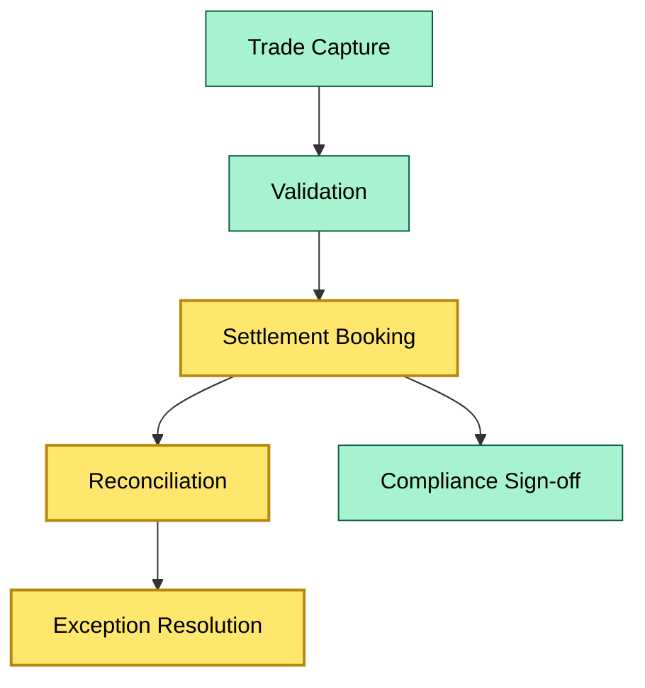
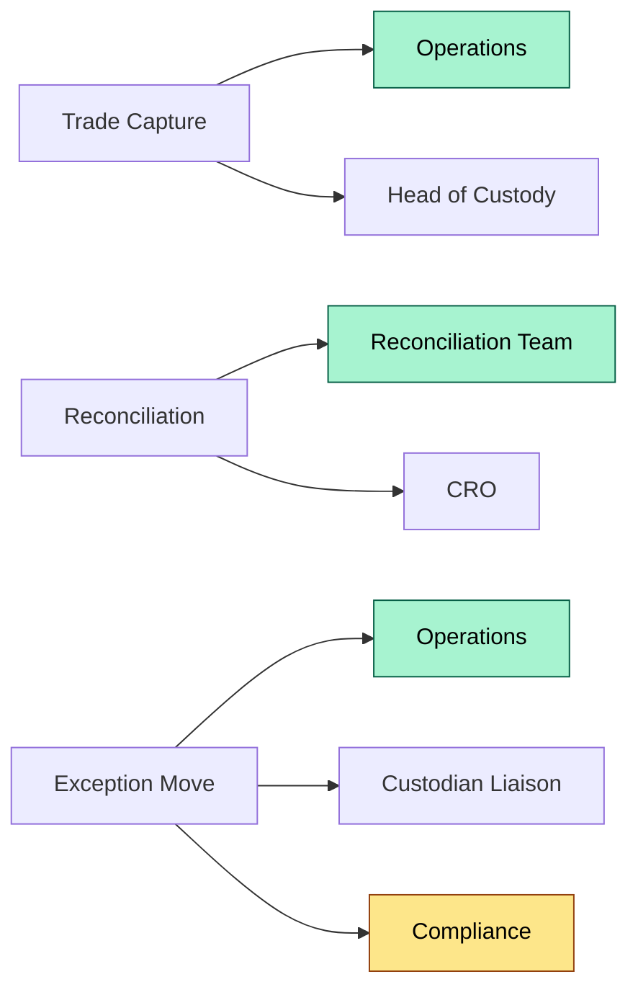

# C6 RACI Activity — DETAIL
> **Category:** Cx — Custody & Asset Servicing · **Difficulty:** ◑ · **Banking-relevant:** yes / 💳
> **Companion brief:** `briefs/C6-02-raci-activity.md`
>
> > **Target reader:** enterprise architect who must *explain, justify, and defend* the topic — not just recite it.

---

## 1. Precise definition
RACI is a responsibility-assignment schema in which each activity in a workflow is labeled with one Responsible (R), one Accountable (A), zero or more Consulted (C), and zero or more Informed (I). In custody, it is the mechanism that bridges org structure and operational control: the org chart supplies candidate names; RACI supplies the accountability contract.

## 2. Why it exists (the problem it solves)
A custody function can have the best segregation of duties in the world and still fail if no one is formally Accountable for trade capture. RACI forces the question: "If this breaks, who signs the remediation letter?" Without it, failure modes spread across unaccounted-for silos.

## 3. Core concepts & vocabulary

| Term | Precise meaning |
|------|-----------------|
| **Accountable** | single owner of the outcome; can be held accountable to regulator or board |
| **Responsible** | person or team that performs the task |
| **Consulted** | must be consulted before task completion; may veto or advise |
| **Informed** | notified after task completion or for audit trail |

## 4. How it works (architecture / mechanism)

### 4.1 Diagrams

**Diagram A — Core structure** (highlight load-bearing parts = amber, supporting = grey):


**Diagram B — RACI roles per activity** (highlight decision points = green, money = gold):


## 5. Variants, options & trade-offs

| Variant | When to pick | When to avoid | Key trade-off axis |
|---------|--------------|---------------|--------------------|
| Tightly coupled RACI | small custody desk with low volume | scalability bottleneck, key-person dependency | clarity vs throughput |
| Activity-based RACI | high volume, regulated | maintenance burden | detail vs maintenance |
| Lineage / pod-based RACI | regional or LOB-separated | cross-LOD coordination friction | autonomy vs integration |

## 6. Relationships to sibling topics
- **Org chart:** provides the pool of assignable names.
- **Exception-handling playbook:** RACI defines who owns each exception class.
- **Audit framework:** RACI is the input to control testing; auditor checks whether R/A assignments are documented.

## 7. Banking / financial-services context 💳
Under ESMA and the Basel Principles, the Single Point of Accountability is expected. In custody, that means one individual accountable for the completeness and accuracy of the custody suite. If the RACI shows two people Accountable for settlement booking, the authority line is split, and both can blame the other under solo-audit or regulatory enforcement.

## 8. Reference architecture / worked example
**Problem:** A fixed-income custodian used ageneric "Operations" role as Responsible for everything including exception overrides. During the first solo test, the auditor found that no individual was Accountable for the exception queue; the queue was cleared by whoever was on-shift.  
**Decision:** assign Accountable to CRO, Responsible to Operations, Consulted to Compliance and fix the exception-management systemto require named sign-off.  
**Outcome:** the RACI was published to the board and posted in the system as a control document.

## 9. Maturity & adoption signals
- **Adopt when:** every custody activity has an R/A pair documented in the RACI register.
- **Anti-signals:** more than one A on any activity, or A/R on the same person for the same task.
- **Common failure modes:** dual accountability, R/A collapse, "shadow A" through verbal authority.

## 10. Common confusions — the "don't mix" list
- **RACI vs decision rights:** RACI governs workflow; decision rights can be broader and delegated by policy.
- **Accountable vs Responsible:** R does the work; A owns the result.

## 11. Tools & standards to know
- **Standards:** ISO 20022, ESMA solo-test requirements, Basel Committee Principles
- **Common tooling:** Miro, Lucidchart, Office docs, ServiceNow workflow
- **Mandatory reading:** ISACA CAMS, OCC Bulletin 2013-29

## 12. ADR template (ready to fill in)
```markdown
# ADR-43: RACI Register for Custody Operations
## Status
Accepted
## Context
Generic roles caused ambiguity in solo benchmarks.
## Decision
Assign named Accountable roles per activity; publish to board quarterly.
## Consequences
- Positive: clear audit trail.
- Negative: maintenance cost; requires quarterly review.
## Alternatives considered
1. Attack by org chart only (rejected: chart does not show activity ownership).
2. Spreadsheet-only (rejected: no maintenance discipline).
```

## 13. Practice — apply it
1. **Recall:** define in 2 min without notes.
2. **Model:** produce an ArchiMate diagram showing the activity, the role, and the control gate.
3. **ADR:** write a decision doc applying it to the banking example in §7.
4. **Defend:** roleplay explaining it to a non-technical CRO / CIO.

## Summary
RACI is the contract that turns an org chart into accountability. In custody, it must show exactly one Accountable per activity, and it must be reviewed when any role changes. The failure mode to watch is the drift between the written RACI and who actually signs off — that drift is what solo audits and regulators find.

---
**Status:** ✅ Covered  
*Last updated: 2026-09-16*
