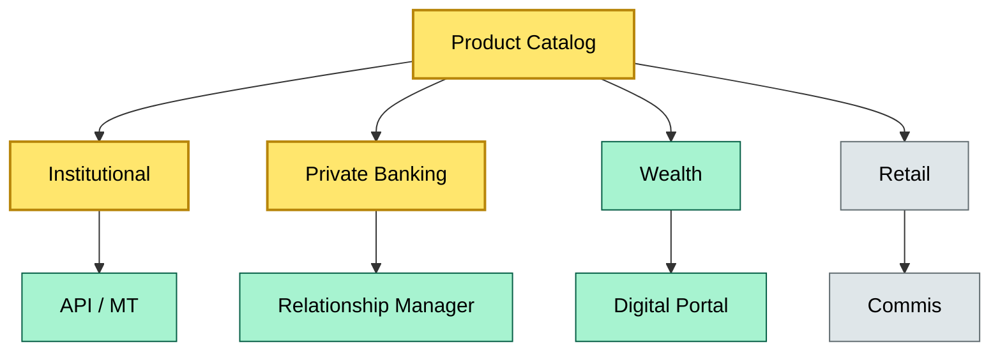
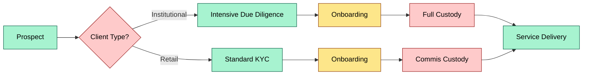

# C6 Client Service Model — DETAIL
> **Category:** Cx — Custody & Asset Servicing · **Difficulty:** ○ · **Banking-relevant:** yes / 💳
> **Companion brief:** `briefs/C6-03-client-service-model.md`
>
> > **Target reader:** enterprise architect who must *explain, justify, and defend* the topic — not just recite it.

---

## 1. Precise definition
A client service model is the institutional design of how a custody provider segments client populations, allocates service tiers, defines delivery channels, and prices service lines. It governs not only customer-facing SLA but also internal process routing, compliance posture, and technology service consumption (API vs batch, dedicated vs shared tenancy).

## 2. Why it exists (the problem it solves)
Without a formal service model, custody adoption follows ad-hoc relationships rather than repeatable economics. This produces cross-subsidization (retail subsidizing institutional tech shortfall), regulatory risk (retail AML mixed into institutional onboarding), and operational drag (service teams resetting delivery expectations per relationship).

## 3. Core concepts & vocabulary

| Term | Precise meaning |
|------|-----------------|
| **Line custody** | Branch-level or entity-level custody for direct clients |
| **Agent custody** | Sub-custody through prime brokers or fund administrators |
| **Discretionary mandate** | Authority for the custodian to execute without per-trade approval |
| **Non-discretionary mandate** | Trade-level approval required; custodian acts as execution agent only |
| **Tiered SLA** | Gold / Platinum / Standard / Basic service levels with divergent SLA and cost |
| **Service blueprint** | End-to-end map of all client touchpoints and exception recovery paths |

## 4. How it works (architecture / mechanism)

### 4.1 Diagrams

**Diagram A — Core structure** (highlight load-bearing parts = amber, supporting = grey):


**Diagram B — Lifecycle / flow** (highlight decision points = green, failures = red, money = gold):


## 5. Variants, options & trade-offs

| Variant | When to pick | When to avoid | Key trade-off axis |
|---------|--------------|---------------|--------------------|
| One-size-fits-all | new market entry with no product budget | concentration of wrong-segment clients | simplicity vs fit |
| Segment-only product | high AUM per segment, dedicated tech | internal overhead, shared services decay | focus vs cost |
| Tiered with shared back-office | scale ambition, cost discipline | lower SLA on premium tier, reputation risk | cost vs experience |
| API-first institutional / front-office for wealth | digital-native strategy | channel conflict, branch resistance | speed vs legacy friction |

## 6. Relationships to sibling topics
- **Org chart:** service model determines which custody desk owns which segment; vice-versa, desk strengths may reshape segment boundaries.
- **RACI:** each tier has a different RACI — Institutional requires dual sign-off on mandates; Retail does not.
- **Exception handling:** Service model exceptions differ per tier (institutional = legal-entity resolution; retail = re-KYC) and drive different triage SOPs.

## 7. Banking / financial-services context 💳
Under MiFID II, a custody bank serving UCITS must offer depositary services with clear fee structures and sub-custodian transparency. For private clients, DORA expectations on digital resilience apply, but the scope of digital service models varies by tier. A private bank offering institutional prime brokerage to retail clients via a retail product would violate suitability rules and attract ESMA attention.

## 8. Reference architecture / worked example
**Problem:** A custody house had no formal service model; institutional clients received gold-tier-like service on a standard product, while premium-wealth clients hit retail-priority queues. Net retention suffered; institutional pipeline stalled.  
**Decision:** define four segments (Institutional, Private, Wealth, Retail), three tiers (Alpha, Standard, Commis), with distinct pricing, SLAs, and channels, and route all onboarding through a segment-assessment scoring algorithm.  
**ADR:** ADR-44, "Segment-Based Custody Service Model."

## 9. Maturity & adoption signals
- **Adopt when:** every client is tagged at onboarding with a segment and tier that determines product, channel, and SLA.
- **Anti-signals:** two clients in the same tier with materially different service consumption; no pricing differential across segments.
- **Common failure modes:** wrong-segment onboarding, tier drift, channel conflict.

## 10. Common confusions — the "don't mix" list
- **Client service model vs delivery channel:** Model is *how* service is defined; channel is *where* the interaction happens.
- **Line vs agent custody by segment:** Some segments default to line; others to agent; the model must not conflate the two.

## 11. Tools & standards to know
- **Standards:** MiFID II, UCITS Directive, DORA Annex I, MiFIR transparency reporting
- **Common tooling:** Salesforce, Avaloq, Temenos, digital onboarding platforms
- **Mandatory reading:** ESMA Guidelines on UCITS depositaries, Basel Committee on Banking Supervision — custody responsibilities

## 12. ADR template (ready to fill in)
```markdown
# ADR-44: Segment-Based Custody Service Model
## Status
Accepted
## Context
Ad hoc service led to net retention loss and institutional pipeline stall.
## Decision
Four segments + three tiers with distinct pricing, SLA, and channels; segment-assessment scoring at onboarding.
## Consequences
- Positive: clear economics, compliant segmentation.
- Negative: migration cost, change management for existing clients.
## Alternatives considered
1. Keep one service tier (rejected: high-touch clients become noisy neighbors).
2. Adopt partner-only for premium (rejected: partner risk and SLA opacity).
```

## 13. Practice — apply it
1. **Recall:** define in 2 min without notes.
2. **Model:** produce an ArchiMate diagram showing segment → channel → product → policy.
3. **ADR:** write a decision doc applying it to the banking example in §7.
4. **Defend:** roleplay explaining it to a non-technical CRO / CIO.

## Summary
The client service model is the demand-side contract that shapes custody technology, compliance posture, and economics. It is not a marketing artifact; it is the operating model that binds segment, product, channel, and risk. When the model is wrong, the fix is expensive because it requires renegotiating onboarding, contracts, and technology tenancy.

---
**Status:** ✅ Covered  
*Last updated: 2026-09-16*
