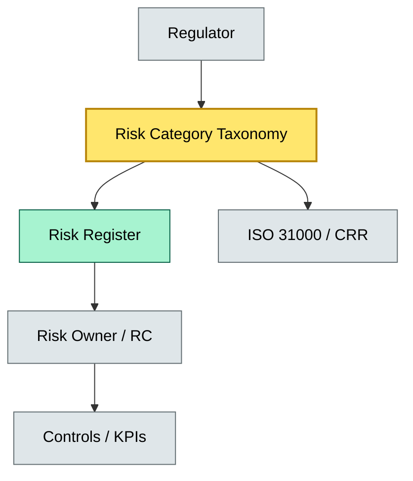
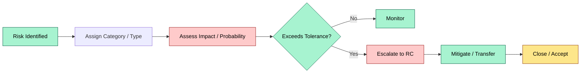
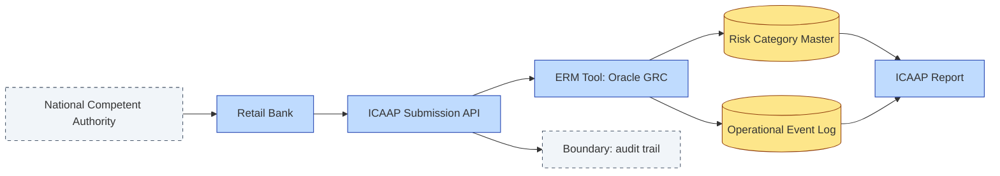

# C7-01 Risk Categories — DETAIL
> **Category:** C7 — Risks & Controls · **Difficulty:** ●/◑/○/◔ · **Banking-relevant:** yes / 💳
> **Companion brief:** `briefs/C7-01-risk-categories.md`
>
> > **Target reader:** enterprise architect who must *explain, justify, and defend* the topic — not just recite it.

---

## 1. Precise definition
Risk categories are a deliberate taxonomy for classifying risks into mutually exclusive, collectively exhaustive buckets based on their source, impact vector, or controllability. The International Organization for Standardization (ISO 31000:2018) defines risk management as "coordinated activities to direct and control an organization with regard to risk," and a category taxonomy is the first coordination activity: it creates a shared language between Risk, Audit, Compliance, and the business lines.

Distinction from risk type: a *type* answers "what does the risk do?" (e.g., interest-rate risk is a price movement risk); a *category* answers "who owns it and what governance framework applies?" (e.g., Market Risk is allocated to the Market Risk Committee under Supervised Entities Regulation Article 28 CRD IV).

## 2. Why it exists (the problem it solves)
Before standardized categories, an enterprise risk register was a flat list of 200 risks that every stakeholder updated differently. Market Risk measured VaR in euros; Operational Risk measured loss events in days; Compliance counted tickets. This produced three problems:
1. **Double-counting** — a "data-privacy breach" appeared in both Operational Risk and Compliance Risk.
2. **Mis-assigned capital** — the bank held no operational risk capital for a risk that was actually a vendor-security failure.
3. **Opaque escalation** — no clear "risk tolerance" threshold because the board was looking at 200 different scales.

A category taxonomy forces explicit ownership and explicit mapping to one regulatory framework (ICAAP, RRD, DORA IT risk, or SOX).

## 3. Core concepts & vocabulary
| Term | Precise meaning |
|------|-----------------|
| Risk category | A bucket grouping risks by shared source or impact dimension that determines the governance owner and the applicable risk framework. |
| Risk type | A sub-bucket within a category describing the specific threat (e.g., interest-rate type within Market Risk). |
| Risk appetite | The aggregate level of risk-taking an enterprise is willing to accept in pursuit of its objectives, expressed as a qualitative statement or quantitative threshold. |
| Risk tolerance band | The specific threshold for a given risk type within the appetite statement; exceeding it triggers mandatory mitigation. |
| Risk register | A living inventory (often in an ERM tool such as MetricStream or SAP GRC) mapping each risk to category, type, owner, probability, impact, mitigation plan, and residual rating. |
| Risk owner | The Executive or senior manager formally accountable for managing a risk to within its tolerance band. |

## 4. How it works (architecture / mechanism)
A bank’s Enterprise Risk Management (ERM) capability has four layers:
- **Identification** — Line-of-business controllers identify bottom-up risks; RACI workshops capture top-down risks.
- **Classification** — Every risk is tagged with a category code (e.g., M1 = Market Risk), a type code (e.g., TR = Interest-Rate), and a source code (e.g., EXT = External market; INT = Internal process).
- **Assessment** — Impact × probability = Independent Assessment (IA) score; peer-reviewed by the Subject Matter Expert (SME) panel.
- **Governance** — The risk category determines which RAC (Risk Appetite Committee) owns the review cycle: Market Risk → Market Risk Committee (MRC); Operational → Operational Risk Committee (ORC); Compliance → Compliance & Ethics Committee (CEC).

### 4.1 Diagrams

**Diagram A — Core structure** (highlight load-bearing parts = amber, supporting = grey):


**Diagram B — Lifecycle / flow** (highlight decision points = green, failures = red, money = gold):


## 5. Variants, options & trade-offs
| Variant | When to pick | When to avoid | Key trade-off axis |
|---------|--------------|---------------|--------------------|
| 4-category (Market, Credit, Operational, Compliance) | EU banks subject to CRR / CRD IV; simple reporting | Complex trading desks with many niche risks (fringe assets) | Simplicity vs granularity |
| 7-category (add Strategic and Reputational) | Large universal banks; stakeholder-centric governance | Asset managers focused on asset-class risk | Breadth vs accountability clarity |
| 1-category (enterprise-wide "all risks") | Commodity trader / MFI with small risk function | Any listed bank under EBA/CRD IV | Reporting speed vs regulatory detail |

## 6. Relationships to sibling topics
- **Risk type:** Type is the leaf under category; a category master data table governs type codes.
- **Risk treatment:** Once classified, the category decides whether the preferred treatment is capital allocation (Market), hedging (Market/Credit), insurance (Operational), or compliance program (Compliance).
- **Risk appetite framework:** The aggregate appetite statement is expressed in category weightings (e.g., Market Risk ≤ 15% of RWA) and in category-specific tolerance bands.

## 7. Banking / financial-services context 💳
Operational Risk is the most heavily regulated category for a bank. Under Basel II/III, Credit and Market Risk have standardized internal-ratings-based (IRB) or standardized (SA) capital formulae. Operational Risk, however, has three treatments: Basic Indicator Approach (BIA), Standardized Approach (TSA/OSA), or Advanced Measurement Approaches (AMA). Under Basel IV / CRD V, the BIA is less favored because it under-captures emerging operational risks (IT-outsourcings, crypto-asset firms). Thus the category taxonomy must be granular enough to separate "dependency on an external SaaS vendor" (Operational / External) from "fraud by an internal trader" (Operational / Internal / Fraud).

A real-world consequence of failure: the 2013 JPMorgan "London Whale" incident was originally classified as a Market Risk (large directional position) but should have been re-classified as Operational Risk (control failure in VaR/stress testing). The misclassification delayed the risk-adjusted compensation clawback and extended the recovery timeline.

## 8. Reference architecture / worked example
Problem: A European retail bank must submit its Internal Capital Adequacy Assessment Process (ICAAP) to the national competent authority. The IRB risk-weight function for the credit portfolio requires a per-category breakdown of Probability of Default (PD).

Decision: The bank adopts a 5-category taxonomy (Credit, Market, Operational, Compliance, Reputational) with 2-digit type codes. Operational Risk is split into "Fraud", "IT & Data", "Legal & Regulatory", and "Business Disruption."

ADR-005: Standardized Operational Risk Taxonomy for ICAAP
- **Status:** Accepted
- **Context:** EBA guidance EBA/GL/2019/11 requires granular operational risk categorization for ICAAP.
- **Decision:** Map all 340 operational risk events to the 12 operational types using the Basel OCC taxonomy.
- **Consequences:**
  - Positive: Alignment with EBA data requirements; faster supervisor review.
  - Negative: Mapping effort of ~14 FTE weeks; ongoing maintenance cost.
  - Mitigate: Quarterly review cycle; automated mapping via ERM tool ETL.
- **Alternatives considered:**
  1. Use Basel’s 7-event types only → too coarse for retail-specific risks.
  2. Build a private taxonomy → harder to justify to regulator.
  3. Adopt the specific-event-driven approach (EAD) early → premature; need 5 years of data.

### 8.1 Reference diagram


## 9. Maturity & adoption signals
- **Adopt when:** You have 3+ years of operational losses and can justify RWA impact per category.
- **Anti-signals (don't adopt yet):** Fewer than 50 distinct risks; no internal risk committee structure.
- **Common failure modes:**
  1. Category drift — users insert unnamed risks that bypass the taxonomy; solve with mandatory drop-down in the register.
  2. Over-classification — 50 categories become 50 fiefdoms; enforce a periodic consolidation review.
  3. Taxonomy-only approach — no appetite framework; the categories are just labels.

## 10. Common confusions — the "don't mix" list
| Often confused | Real distinction |
|----------------|------------------|
| Risk category vs risk type | Category = governance owner & framework; type = specific threat mechanism. |
| Risk appetite vs risk tolerance | Appetite = the *willingness* to take risk (a statement); tolerance = the *boundary* within which a specific risk type is acceptable. |
| Operational Risk vs Compliance Risk | Operational = internal process/people/systems failure (Basel definition); Compliance = violation of laws/regulations (overlap exists; resolve via governance RACI). |

## 11. Tools & standards to know
- **Frameworks / IR-2 / NINE:** ISO 31000:2018, COSO ERM 2017, SR 11-7 (OCC), EBA/GL/2019/11 (ICAAP operational risk).
- **Common tooling:** MetricStream, SAP GRC, Archer (Risk, Audit, Compliance), Jira for risk tickets.
- **Mandatory reading:** "Risk Management and Financial Institutions" (Larry Allen, 5th ed.); OCC SR 11-7; EBA Guidelines on ICAAP.

## 12. ADR template (ready to fill in)
```markdown
# ADR-005: Standardized Operational Risk Taxonomy for ICAAP
## Status
Accepted

## Context
EBA guidance EBA/GL/2019/11 requires granular operational risk categorization for ICAAP.

## Decision
Map all 340 operational risk events to the 12 operational types using the Basel OCC taxonomy.

## Consequences
- Positive: Alignment with EBA data requirements; faster supervisor review.
- Negative: Mapping effort of ~14 FTE weeks; ongoing maintenance cost.
- Mitigate: Quarterly review cycle; automated mapping via ERM tool ETL.

## Alternatives considered
1. Use Basel’s 7-event types only → too coarse for retail-specific risks.
2. Build a private taxonomy → harder to justify to regulator.
3. Adopt the specific-event-driven approach (EAD) early → premature; need 5 years of data.
```

## 13. Practice — apply it
1. **Recall:** define risk category in 2 min without notes.
2. **Model:** produce an ArchiMate diagram showing the ERM taxonomy layers.
3. **ADR:** write a decision doc applying a new "crypto-asset Operational Risk" category to the banking example in §7.
4. **Defend:** roleplay explaining the taxonomy to a non-technical CRO / CIO.

## Summary
Risk categories are the governance infrastructure of enterprise risk management. They are not a convenience layer; they are the contract between the board, the enterprise risk committee, and the regulator. A bank that treats them as optional folder names will fail its ICAAP review, misprice its capital, and confuse its risk owners. Adopt a stable taxonomy, enforce the categories in your ERM tool, and map them explicitly to the CRR / CRD IV / DORA frameworks that govern your license.

---
**Status:** ☐ Not started · ☐ In progress · ✅ Covered
*Last updated: 2025-09-16*

---
**One diagram required. Both brief + detail must exist with ≥1 mermaid each before ✓.**
