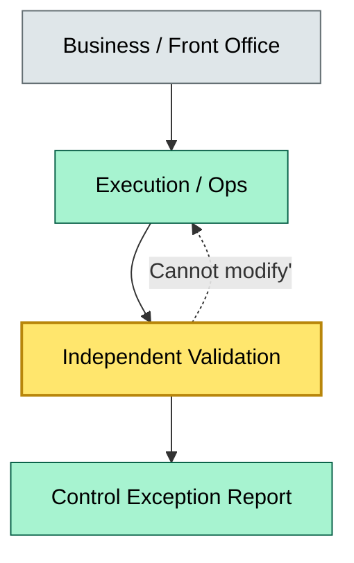
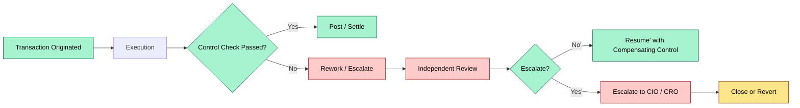
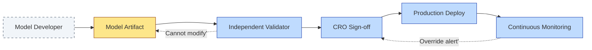

# C7-02 Strong Control — DETAIL
> **Category:** C7 — Risks & Controls · **Difficulty:** ●/◑/○/◔ · **Banking-relevant:** yes / 💳
> **Companion brief:** `briefs/C7-02-strong-control.md`
>
> > **Target reader:** enterprise architect who must *explain, justify, and defend* the topic — not just recite it.

---

## 1. Precise definition
A strong control is a control activity that ensures no single individual (or single automated process without compensating controls) can both authorize, execute, and verify a material transaction or system change without an independent cross-check. In banking, this principle is formalized by the Basel Committee’s "Principle 5" (effective risk-management assurance function) and by SOX 404 (management’s report on internal control over financial reporting).

The three independent dimensions are:
1. **Design independence:** The control owner (e.g., Head of Controls / CRO) defines the control rules; the business owner defines the transaction logic.
2. **Execution independence:** The control is executed by a function separate from the transaction originators (e.g., Operations, Front Office, or a dedicated Control Unit).
3. **Verification independence:** The control’s output is verified by an entity that does not hold the process keys (e.g., Internal Audit, External Auditor, Compliance, or Continuous Monitoring engine).

## 2. Why it exists (the problem it solves)
The 2008 Global Financial Crisis and subsequent crises (Lehman, Archegos, Wirecard, Celsius) exposed the same failure mode: a single department—often a front-office trading desk or a global custody operations unit—could both originate an instruction, approve it, and settle it without independent review. The result was:
- Material misstatements (Lehman’s Repo 105 transactions).
- Unrecorded fraud (Wirecard’s 1.5B EUR phantom sales).
- Operational losses from override bypasses (London Whale 8-billion-dollar loss).

Weak controls are not just a design flaw; they are a governance symptom. The Basel Committee’s 2013 "Principles for effective risk data aggregation" and the upcoming DORA (EU Regulation 2022/2554) explicitly require that critical ICT processes and outsourcing controls be executed and verified independently.

## 3. Core concepts & vocabulary
| Term | Precise meaning |
|------|-----------------|
| Segregation of duties (SoD) | A policy mechanism that prevents a single individual from having conflicting authorization, custody, and verification authority over a transaction. |
| Dual control | Two or more authorized individuals must simultaneously act for a critical operation to be completed. |
| Control self-assessment (CSA) | A technique where process owners evaluate the design and operating effectiveness of controls they own, with independent oversight. |
| Control deficiency | A statement of description, cause, or effect when a control is not operating as designed or cannot be supported by evidence. |
| Compensating control | An alternative control that reduces the risk to an acceptable level when a primary control is missing or ineffective. |
| Control environment | The tone at the top, ethics, and competence that dictates whether controls are taken seriously. |

## 4. How it works (architecture / mechanism)
A bank’s control architecture has four zones:
- **Zone 1 — Origin:** Business lines originate transactions / trades / model outputs.
- **Zone 2 — Execution:** Operations / Trading Support executes the transaction.
- **Zone 3 — Validation:** Independent validators (Control Unit, Compliance, or Internal Audit) verify adherence.
- **Zone 4 — Escalation:** Issues are escalated to the Chief Risk Officer, CRO Office, or Board Risk Committee.

The control is strong when there is no single-point-of-failure across these zones. In digital banking, "strong" means automated: API-level SoD rules (e.g., one user cannot approve their own A2A transfer), cryptographic dual-signature wallets, and continuous monitoring dashboards that flag "same-person-initiated-and-approved" events in real time.

### 4.1 Diagrams

**Diagram A — Core structure** (highlight load-bearing parts = amber, supporting = grey):


**Diagram B — Lifecycle / flow** (highlight decision points = green, failures = red, money = gold):


## 5. Variants, options & trade-offs
| Variant | When to pick | When to avoid | Key trade-off axis |
|---------|--------------|---------------|--------------------|
| Manual SoD + dual control | High-value, low-frequency transactions (e.g., wire >5M EUR) | High-volume daily operations | Assurance vs throughput |
| Automated SoD at API / IAM level | High-volume JSON / REST traffic (e.g., card fraud) | Complex front-office workflows with ad-hoc overrides | Speed vs flexibility |
| Continuous monitoring + exception reporting | Real-time settlement / payment rails (TCH, FedWire) | Batch-oriented trade reconciliation | Latency vs completeness |
| Outsourced + customer-side verification (SPOC) | Cloud / SaaS dependencies (DORA) | Core-critical processes (CPR, SWIFT) | Cost vs control existence |

## 6. Relationships to sibling topics
- **Risk appetite:** Strong controls are the *mechanism* by which the enterprise enforces its risk appetite; without them, the appetite is a statement of intent.
- **Control testing:** The control is strong by design; testing (walkthroughs, DoE) measures whether it is *effective*.
- **IT general controls (ITGC):** A subset of strong controls focused on the infrastructure layer (access management, change management, system operations).
- **Governance, risk, and compliance (GRC):** The platform that tracks SoD matrices, control deficiencies, and control owners.

## 7. Banking / financial-services context 💳
Under the Sarbanes-Oxley Act (SOX 404) and the OCC / Fed joint guidance on internal controls (SR 11-7, OCC 2011-12), a material weakness in internal controls over financial reporting (ICFR) can trigger SEC enforcement, delisting risk, and forced board restructuring. A "strong" control is not a luxury; it is a legal requirement for a U.S. bank that reports under Section 13(a) or 15(d).

Under DORA (effective 2025), a critical ICT risk scenario—such as a attack on the bank’s payment-card tokenization service—requires independent testing of the controls entity, independent monitoring, and independent incident reporting to the authority. The "strong control" triad is embedded in DORA Article 10 (critical ICT risk mitigation) and Article 22 (critical ICT third-party risk management).

A real-world consequence: In 2022, the SEC identified a material weakness at a large U.S. regional bank because the same individuals had both prepared and approved journal entries to the cash account. The SEC concluded the control was "not designed effectively" because the design owner and the execution owner were the same role. This led to a 20 million USD enforcement action and a board committee review.

## 8. Reference architecture / worked example
Problem: A European investment bank must upgrade its credit-risk model governance to satisfy the European Banking Authority’s stress-testing framework and to meet EBA Guidelines on credit-risk assessment systems.

Decision: The bank implements a "model risk management" control framework based on the OCC / BCBS 2011 (SS 2). The key strong control is that model developers (design) cannot sign off on model validation reports (verification), and both must be reviewed by an independent risk-quant team before market deployment.

ADR-008: Model Risk Management Strong Controls for Credit Risk
- **Status:** Accepted
- **Context:** EBA requires independent validation of IRB credit models under Article 134 of CRR.
- **Decision:** Institute a 3-tier control: a) Model design by quant team; b) Independent validation by a separate risk-quant unit; c) Independent sign-off by the CRO before production release.
- **Consequences:**
  - Positive: EBA-consistent validation; reduced model-risk capital.
  - Negative: Slower time-to-market for new models; need for two quant teams.
  - Mitigate: Shared-read model repository with mandatory peer review.
- **Alternatives considered:**
  1. Self-validation by the same quant team → rejected; EBA explicitly forbids.
  2. Buy a pre-certified vendor model → vendor model still needs independent validation per EBA.
  3. Roll a model into the group model pool → requires independent group validation.

### 8.1 Reference diagram


## 9. Maturity & adoption signals
- **Adopt when:** You have more than 100 unique risk events per month and at least one material weakness in the last two audits.
- **Anti-signals (don't adopt yet):** You have not mapped roles to SoD rules in any system; your compensating controls are hand-wavy narratives.
- **Common failure modes:**
  1. **SoD matrix drift:** Users create ad-hoc roles that bypass the matrix; enforce via IAM (Okta / Azure AD) conditional access.
  2. **Dual control fatigue:** Teams disable double-signatures for speed; enforce time-boxed emergency overrides with automatic escalation.
  3. **Automation-only false sense of security:** An automated SoD rule breaks; no human backup means uncontrolled risk.

## 10. Common confusions — the "don't mix" list
| Often confused | Real distinction |
|----------------|------------------|
| Strong control vs effective control | Strong = design/execution/ver-sification independence; effective = measured by DoE testing. |
| SoD vs dual control | SoD is a policy matrix (role-level); dual control is an operational event (two people at once). |
| Control deficiency - misstatement | Deficiency is the *absence or weakness* of a control; misstatement is the *result* of that absence. |

## 11. Tools & standards to know
- **Frameworks / IR-2 / NINE:** SOX 404, Basel Committee Principle 5, BCBS 2011 (Credit Risk), DORA (EU) Articles 10, 22, 28, 33, 41.
- **Common tooling:** SAP GRC (SoD), Oracle GRC, Control Shell, BlackLine (journal controls), Okta / Azure AD (IAM), Splunk / Elastic (continuous monitoring), Jira Service Management (defect tracking).
- **Mandatory reading:** "Internal Control: SOX is Just the Beginning" (Bowers & Miller, 4th ed.); OCC SR 11-7; DORA Final Article 93 Delegated Act.

## 12. ADR template (ready to fill in)
```markdown
# ADR-008: Model Risk Management Strong Controls for Credit Risk
## Status
Accepted

## Context
EBA requires independent validation of IRB credit models under Article 134 of CRR.

## Decision
Institute a 3-tier control: a) Model design by quant team; b) Independent validation by a separate risk-quant unit; c) Independent sign-off by the CRO before production release.

## Consequences
- Positive: EBA-consistent validation; reduced model-risk capital.
- Negative: Slower time-to-market for new models; need for two quant teams.
- Mitigate: Shared-read model repository with mandatory peer review.

## Alternatives considered
1. Self-validation by the same quant team -> rejected; EBA explicitly forbids.
2. Buy a pre-certified vendor model -> vendor model still needs independent validation per EBA.
3. Roll a model into the group model pool -> requires independent group validation.
```

## 13. Practice — apply it
1. **Recall:** define strong control in 2 min without notes.
2. **Model:** produce an ArchiMate diagram showing the 3 independent control zones.
3. **ADR:** write a decision doc applying the dual-control requirement to a new cloud-based trade-settlement workflow in §8.
4. **Defend:** roleplay explaining the SoD matrix to a non-technical CIO who wants a "bypass for Agile."

## Summary
Strong controls are the non-negotiable architecture of a trustworthy bank. They exist because history shows that the person who builds a system, approves it, and reports on it will eventually find a way to exploit that convergence. The triad of design, execution, and verification independence is the regulatory floor in the U.S. and the EU. A bank that treats strong controls as a checkbox exercise rather than a redesign of the role-and-authorization layer will face material weaknesses, enforcement actions, and loss of license.

---
**Status:** ☐ Not started · ☐ In progress · ✅ Covered
*Last updated: 2025-09-16*

---
**One diagram required. Both brief + detail must exist with ≥1 mermaid each before ✓.**
