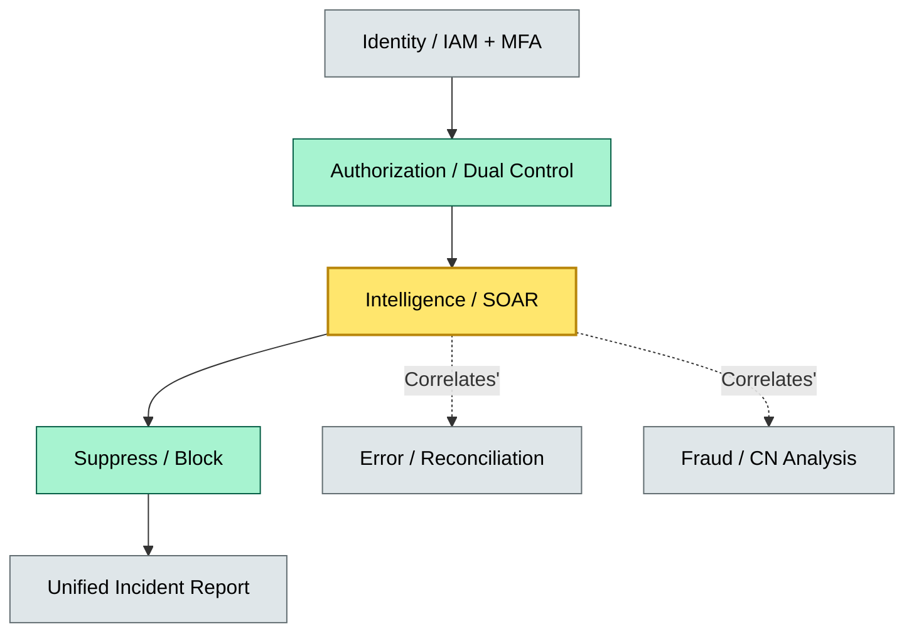
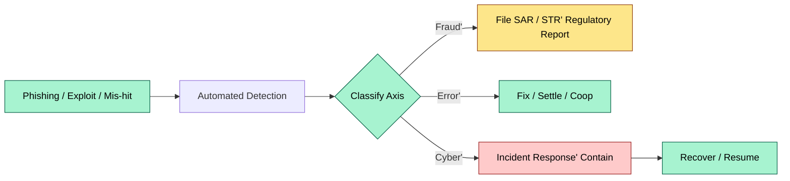
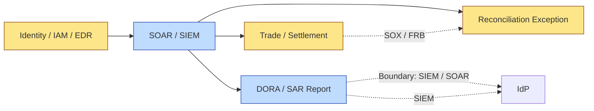

# C7-03 Fraud Error Cyber — DETAIL
> **Category:** C7 — Risks & Controls · **Difficulty:** ●/◑/○/◔ · **Banking-relevant:** yes / 💳
> **Companion brief:** `briefs/C7-03-fraud-error-cyber.md`
>
> > **Target reader:** enterprise architect who must *explain, justify, and defend* the topic — not just recite it.

---

## 1. Precise definition
Fraud, error, and cyber are distinct categories of risk, but in modern banking custody and treasury they converge into a single incident class: a **technology-enabled financial crime** where an attacker exploits an information-security vulnerability (cyber) to execute a deceptive scheme (fraud) that may also involve unintentional mistakes (error) in the detection or correction chain.

The 2023 ISO 37301 / ICG 2593 framework treats them as overlapping circles in a Venn diagram:
- **Fraud:** Intentional deception for financial gain.
- **Error:** Unintentional deviation from correct procedure or data.
- **Cyber:** Threat exploiting IT, people, or process vulnerabilities.

A single incident can be 100% fraud (phishing to authorize an unauthorized wire), 100% error (a fat finger in a block-trade), or 100% cyber (a ransomware attack on the custody platform). Most mature incidents are 80–100% on two or three axes simultaneously.

## 2. Why it exists (the problem it solves)
Historical crisis after crisis showed the cost of siloed governance:
- **2008 Lehman:** Repo 105 transactions (fraud + ethical error) hidden by accounting manipulation (error) aided by deliberately complex legal structures (fraud).
- **2022 Silicon Valley Bank collapse:** A 42-billion-dollar interest-rate error (error) on a Treasury-duration hedge, which was not caught because the risk team had merged with IT Security after a prior incident (governance reset), and the monitoring system had a configuration drift that was a cyber-hygiene gap.
- **2022 Colonial Pipeline / 2023 Change Healthcare:** Not bank custody, but they show that cyber + fraud (ransomware payment) + human error (delayed patching) = ecosystem collapse.

In banking custody specifically, the convergence is acute because:
- Custody platforms are high-value, high-frequency, and highly automated.
- The "human in the loop" (dealer, relationship manager, compliance reviewer) is the weakest link in automation.
- Regulatory frameworks (DORA, FCA SYSC 6, SEC 17 CFR 240.17a-4, Basel III) each touch a different axis, yet an incident must be reported through all.

## 3. Core concepts & vocabulary
| Term | Precise meaning |
|------|-----------------|
| CN (Corrupted Narrative) | A deceptive story or document used to exploit an authorized process. |
| DPSA (Detect-Protect-Suppress-Avoid) | A layered security posture: detect threats, protect assets, suppress attacks, avoid damage. |
| Business Email Compromise (BEC) | Email-based fraud targeting treasury or corporate-finance functions to initiate unauthorized payments. |
| Social engineering | Psychological manipulation to induce an authorized user to perform an unauthorized action or disclose credentials. |
| Cybersecurity resilience | The ability to prepare for, respond to, and recover from cyber incidents while maintaining critical operations, per DORA Article 9. |
| Root cause analysis (RCA) | A structured method (e.g., 5 Whys, FMEA) to identify the fundamental contribution of fraud, error, and cyber in an incident. |

## 4. How it works (architecture / mechanism)
A bank’s converged fraud-error-cyber architecture has six layers:
- **Layer 1 — Identity and access:** Core SoD + IAM + phishing-resistant MFA.
- **Layer 2 — Transaction authorization:** Dual-control, behavioral analytics, and rule-based anomaly detection.
- **Layer 3 — Network and endpoint:** EDR / XDR / SOAR for real-time threat detection and automated response.
- **Layer 4 — Indicators of compromise (IOC):** Threat intel feeds (financial-crime focused, e.g., PCI SSC, FS-ISAC) integrated with treasury transaction monitoring.
- **Layer 5 — Control validation:** Daily reconciliation, exception reporting, and model-based error detection (e.g., trade-capture vs. settlement mismatch).
- **Layer 6 — Governance and reporting:** Unified incident classification, 72-hour DORA reporting, and 24-hour SAR / STR (if applicable).

The key architectural principle is that **no single control satisfies all three axes**. A strong SoD rule (strong control) reduces fraud; a real-time reconciler reduces error; an EDR agent reduces cyber. The convergence detector is a **security data lake / SOAR platform** that correlates low-fidelity events (phishing-click, failed reconciliation, IOC match) into a medium-fidelity incident.

### 4.1 Diagrams

**Diagram A — Core structure** (highlight load-bearing parts = amber, supporting = grey):


**Diagram B — Lifecycle / flow** (highlight decision points = green, failures = red, money = gold):


## 5. Variants, options & trade-offs
| Variant | When to pick | When to avoid | Key trade-off axis |
|---------|--------------|---------------|--------------------|
| SIEM-only monitoring + manual triage | Small custody desk; low volume | High-frequency retail / payment rails | Cost vs scale |
| SOAR-driven automated playbooks | Large, standardized workflows (payments, reconciliations) | Highly customized / bespoke client services | Speed vs flexibility |
| Deception technology (honeypots, fake accounts) | High-value fraud targeting (whaling, CN in repo) | Compliance-heavy jurisdictions (US, EU) | Early detection vs legal/regulatory risk |
| Zero-trust network architecture (ZTA) | Multi-cloud, outsourced infrastructure | Legacy mainframe custody core | Security-by-design vs migration cost |

## 6. Relationships to sibling topics
- **DPSA:** DPSA is the umbrella framework; fraud-error-cyber convergence is the scenario set within DPSA’s "detect" and "protect" layers.
- **Strong control:** Strong controls (C7-02) are the individual mechanisms; fraud-error-cyber is the *landscape* in which they must operate.
- **Risk categories (C7-01):** Each axis maps to a risk category (fraud = operational, error = operational, cyber = IT risk / TPRM / third-party).

## 7. Banking / financial-services context 💳
Under DORA (EU Regulation 2022/2554), a digital operational resilience incident must be reported within 72 hours to the competent authority (Art. 18). The incident classification must include its **nature** (fraud, error, cyber) and its **impact** (service disruption, financial loss, data breach). A custody platform that experiences a ransomware attack causing a 4-hour settlement delay must simultaneously:
- File a DORA incident report (cyber).
- Assess whether the delay was caused by a process error (e.g., missing backup verification) or by fraud (e.g., wallet-drain malware).
- Report to its national FIU if the attacker used the bank’s systems for money laundering (fraud).

Under the FFIEC IT Handbook (Part 2) and the OCC IT Examination Handbook, a bank’s **third-party risk management** (TPR) program must ensure that its fintech / custody-as-a-service providers have cyber resilience plans. A custody bank using a cloud provider that suffers a data breach (cyber) and does not inform the bank for 30 days (grievance / error) violates both DORA and the OCC’s third-party risk standards.

A real-world consequence: In 2024, a global asset manager suffered a 200-million-dollar loss when a phish-compromised relationship manager initiated a repo trade using a CN. The trade exploited a latency bug in the telecom provider (cyber), and the operations team missed the settlement mismatch because the reconciliation system had a known data-type error (error). The board classified the incident as "all three" and the CRO had to testify before the supervisory college.

## 8. Reference architecture / worked example
Problem: A European custody bank (custody-only, prime + agency services) must upgrade its detection capabilities to satisfy DORA and to reduce a 400-million-year-over-year fraud loss from treasury-related CN attacks.

Decision: The bank implements a "converged threat detection" program with three convergence points:
1. **Identity-to-transaction:** Correlates MFA failure alerts (cyber) with same-day payment anomalies (fraud).
2. **Network-to-reconciliation:** Correlates EDR-detected malware on a workstation (cyber) with failed reconciliations (error).
3. **IoC-to-trade:** Correlates threat-intel IOCs (cyber) with new counterparty pain-point patterns (fraud / error).

ADR-012: Converged Fraud-Error-Cyber Detection for Custody Platform
- **Status:** Accepted
- **Context:** DORA Article 18 requires unified incident reporting; 400M year-over-year loss from treasury CN attacks.
- **Decision:** Implement a SOAR platform (e.g., Splunk SOAR, Cortex XSOAR) that ingests IAM logs, EDR alerts, and settlement-reconciliation exceptions into a single case-management queue.
- **Consequences:**
  - Positive: Single source of truth; 70% faster MTTR for incidents.
  - Negative: Integration cost for 3 disparate systems; need for a dedicated SOC-2 security team.
  - Mitigate: Phased rollout starting with high-value counterparty accounts.
- **Alternatives considered:**
  1. Buy a single-vendor suite (e.g., IBM QRadar + Resilient) vs. best-of-breed (Splunk + XSOAR + AWS Detect & Respond).
  2. Keep siloed teams (Fraud Ops, IT Security, Ops) → rejected; DORA requires unified reporting.

### 8.1 Reference diagram


## 9. Maturity & adoption signals
- **Adopt when:** You have >100 incidents/year, a GRC tool, and a SOC / CIRT program.
- **Anti-signals (don't adopt yet):** You have not defined a unified classification scheme; your fraud, IT security, and ops each submit separate reports to the CISO.
- **Common failure modes:**
  1. **Correlation fatigue:** Too many low-fidelity alerts produce alert-fatigue burnout; enforce ML-based triage before human review.
  2. **False-positive flood:** IoC feeds generate alerts for internal IPs; whitelist known internal ranges and validate before suppression.
  3. **Incident misclassification:** The first classification (fraud vs cyber vs error) biases the entire response; require a 2-person review before incident disclosure.

## 10. Common confusions — the "don't mix" list
| Often confused | Real distinction |
|----------------|------------------|
| Fraud vs Error | Intent is the only differentiator; ask "was this done on purpose to deceive?" |
| Cyber vs fraud | Cyber is the *mechanism*; fraud is the *motive*. If both, classify by primary harm (financial loss = fraud; regulatory breach = cyber). |
| CN vs phishing | CN is the deceptive *narrative*; phishing is the *channel*. A CN can be delivered by email, phone, or fake website. |

## 11. Tools & standards to know
- **Frameworks / IR-2 / NINE:** DORA (EU) Arts. 9, 10, 18, 33, 41; FFIEC IT Examination Handbook; OCC OCC 2013-29 (Third-Party Risk Management); Basel III/IV (operational risk); ISO 27001:2022, ISO 27224:2022.
- **Common tooling:** Splunk SOAR / XSOAR / QRadar, SentinelOne / CrowdStrike / Cortex XDR, Snyk / Veracode (Cyber), Addition of Bifrost / Pattern (fraud), Celent / novex (blockchain forensics), Grafana / Datadog (continuous monitoring), ServiceNow (incident management).
- **Mandatory reading:** "Financial Crime Compliance" (CFA Institute); "The Anatomy of an Insider Threat" (Gartner); DORA Final Delegated Act; OCC Advisory Letter 2021-11 (Third-Party Risk Management).

## 12. ADR template (ready to fill in)
```markdown
# ADR-012: Converged Fraud-Error-Cyber Detection for Custody Platform
## Status
Accepted

## Context
DORA Article 18 requires unified incident reporting; 400M year-over-year loss from treasury CN attacks.

## Decision
Implement a SOAR platform that ingests IAM logs, EDR alerts, and settlement-reconciliation exceptions into a single case-management queue.

## Consequences
- Positive: Single source of truth; 70% faster MTTR for incidents.
- Negative: Integration cost for 3 disparate systems; need for a dedicated SOC-2 security team.
- Mitigate: Phased rollout starting with high-value counterparty accounts.

## Alternatives considered
1. Buy a single-vendor suite (e.g., IBM QRadar + Resilient) vs. best-of-breed (Splunk + XSOAR + AWS Detect & Respond).
2. Keep siloed teams (Fraud Ops, IT Security, Ops) -> rejected; DORA requires unified reporting.
```

## 13. Practice — apply it
1. **Recall:** define the fraud-error-cyber intersection in 2 min without notes.
2. **Model:** produce an ArchiMate diagram showing the 6 detection layers.
3. **ADR:** write a decision doc applying converged detection to a new stablecoin-custody workflow in §8.
4. **Defend:** roleplay explaining the DORA 72-hour reporting requirement to a non-technical CIO who says "cyber is IT Security's problem."

## Summary
Fraud, error, and cyber are no longer separate chapters in a bank’s risk report; they are a single incident class in modern custody and treasury. The architect’s job is to build detection and response layers that span all three axes, because a single control never stops a converged attack. The law (DORA, FFIEC, OCC) now requires unified reporting and unified testing. A custody bank that treats them as silos will discover, at the worst possible moment, that the phish, the bug, and the bad trade all landed on the same day—and the three response teams had no common language to stop it.

---
**Status:** ☐ Not started · ☐ In progress · ✅ Covered
*Last updated: 2025-09-16*

---
**One diagram required. Both brief + detail must exist with ≥1 mermaid each before ✓.**
