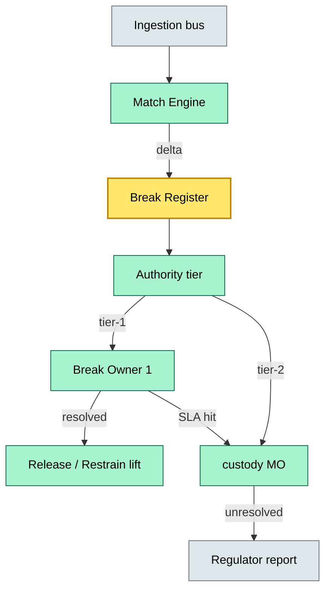
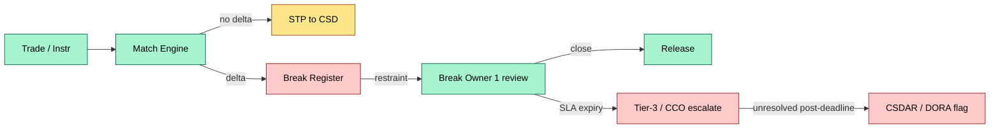
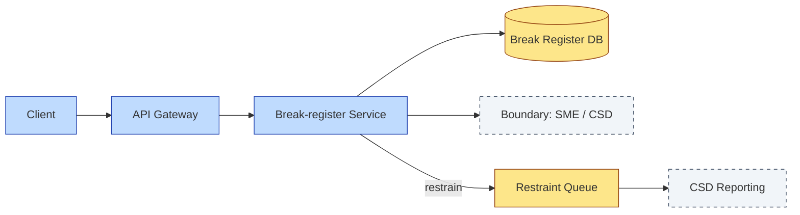

# C7-04 Break Management — DETAIL
> **Category:** C7 — Controls · **Difficulty:** ◑ vs ○ • **Banking-relevant:** yes / 💳
> **Companion brief:** `briefs/C7-04-break-management.md`
>
> > **Target reader:** enterprise architect who must *explain, justify, and defend* the topic — not just recite it.

---

## 1. Precise definition
Break management is the operational-risk control process that detects, classifies, assigns, authorities, and resolves mismatches between trade-instruction data and firm-confirmed trade data or between depository instructions and CSD-confirmed instructions. A break is any divergence that prevents the straight-through-processing (STP) settlement of a securities or cash leg. It encompasses:
- **Instruction breaks:** Origination-side errors (quantity, price, ISIN, coupon, currency).
- **Match breaks:** Confirmation engine output diverging from venue / CSD data.
- **Settlement breaks:** Confirmed trade or instruction that, upon CSD-level reconciliation, fails to match due to rounding, WI target, residual settlement, or fungibility splits.
- **When-issued (WI) breaks:** Specifically, the mismatch between the WI trade and the final coupon / maturity / adjustment instruction.

Regulators define its standards: **CSDR Art. 36–38** requires demonstrable controls over settlement fail events; **DORA Art. 17–19** requires clear ownership of operational-risk events including unresolved settlement breaks.

## 2. Why it exists (the problem it solves)
The pre-break-management world looked like this: the trading desk files a ticket, operations archives it, the back office reconciles manually non-ED, and by month-end there is a surprise of 40g€ of unmatched bonds. This creates three failure modes:
1. **Unconstrained risk exposure:** The mismatching security or cash continues trading / be earns interest, inflating market risk calculations.
2. **Regulatory default:** Unmatched instructions past the settlement-cut-off are classified as settlement fails under CSDR, triggering the fail charge and conformité breach reporting.
3. **Operational drag:** Break re-work costs escalate nonlinearly; one €10 m break-investigation day can cost €50 k in idle staff.

Modern custody platforms brought break management into the T+0–T+1 flow with automated break detection, workflow orchestration, and AI-assisted root-cause matching to prevent these failure modes.

## 3. Core concepts & vocabulary
| Term | Precise meaning |
|------|-----------------|
| **Break register** | The persistent log of all unmatched items, each with a break ID, timestamp, cause code, maturity tier, and owner. |
| **SLA tier** | The SLA bucket (e.g., 1 day, 3 days, 5 days, 10 days) that defines escalation rules and signatory authority. |
| **Restrain** | A system-level hold on the contested position or cash, preventing downstream events (call instructions, DVPS, coupon accrual) while the break is live. |
| **When-issued (WI)** | A pre-coupon / pre-maturity trade in a bond with a variable final maturity or coupon, settled against the definitive WI instructions. |
| **Forex / multi-currency break** | A mismatch in the FX leg of an FXD trade, resolved via a cross-currency settlement call. |
| **IR-2 / NINE** | Industry data standard frameworks that define breakout-event semantics for broken trades. |
| **CSDAR / DORA reporting** | Discrepancy reporting to central repositories and the operational-risk event log for unresolved breaks. |

## 4. How it works (architecture / mechanism)
The custody tech stack contains four layers:
1. **Ingestion layer:** Trading venue feeds and instruction receipts (SWIFT MT5xx, FIX, DLT) land in the event bus.
2. **Matching engine:** A rules-based match service computes the delta; mismatches are emitted as break events.
3. **Break-register microservice:** Persists the break, assigns a UUID, maps the authority tier, and publishes the event.
4. **Workflow / case-management engine:** Routes the break to the appropriate owner (break owner 1 = operations frontline, owner 2 = custody middle office, owner 3 = CRO / CCO) based on cause and value / quantity materiality.

### 4.1 Diagrams
**Diagram A — Core structure** (highlight load-bearing parts = amber, supporting = grey):


**Diagram B — Lifecycle / flow** (highlight decision points = green, failures = red, money = gold):


## 5. Variants, options & trade-offs
| Variant | When to pick | When to avoid | Key trade-off axis |
|---------|-------------|--------------|--------------------|
| **Manual review (paper-case)** | Low-volume prime broker; client mandates bespoke oversight | High-frequency; >10k breaks / month; DORA scrutiny | Latency vs. governance depth |
| **Automated restain + AI triage** | Large custodian; >50k breaks / month; need T+0 velocity | Conservative firm with strict sol-on-V model | False-positive rate vs. speed |
- **Pre-trade break prevention:** Validate inbound instructions against master data (ISO / ISIN / coupon) before routing; best for high-volume trading venues.
- **Post-trade break self-service portal:** Break owners resolve via a UI without engineer intervention; best for repetitive / low-value breaks.

## 6. Relationships to sibling topics
- **C7-03 Strong Control:** Break management is a control process; strong control defines the architecture that makes break detection fast and symmetric across the value chain.
- **C7-05 Repudiation Settlement:** Break management prevents settlement mismatches; repudiation settlement is the legal / commercial recovery when a counterparty denies a matched trade.
- **C7-06 Liquidity Funding:** Breaker bonds consume liquidity during the restraint period; liquidity funding is the capital / cash buffer that lets the custodian absorb tie-up without breaching LCR.

## 7. Banking / financial-services context 💳
In a G10 custodian, a break in the € sovereign WEI stack at T+0 is a daily reality because of coupon and maturity adjustments. The least expensive fix is to let the WI target float against the CSD final instruction, but that breaks the T+2 DvP assumption in the repo book. The bank therefore restrains the position (amber on the dashboard) for 48 h while the CSD forum-bond validator reconciles. If unresolved, the CCO signs an exception off the DORA KPI because the 48-hour SLA was missed. The business reason is simple: the firm cannot afford the settlement-fail fine (CSDR up to 0.5 % of the transaction value) and the reputational hit with the sell-side.

## 8. Reference architecture / worked example
**Problem:** A German Pfandbrief-Bund repo fails because the WI break shows 180 days instead of 177 days after a regulatory adjustment memo.

**Decision:** Restrain the cash leg for 24 h; assign break owner 2 (MO); publish a break report to the CSD reporting interface.

**Result:** The position is restrained, the repo funding line is frozen, no negative carry accrues, and the break is closed at T+1 after the memo is published.



## 9. Maturity & adoption signals
- **Adopt when:** Break volume >50k / month; DORA / CSDR audit imminent; STP <95 %.
- **Anti-signals (don't adopt yet):** Break volume <5k / month; manual settlement remains the dominant mode; no enterprise workflow engine.
- **Common failure modes:**
  1. **Break-owner 1 attributed = break auto-clears:** Without a timeout, the owner 1 queue backs up.
  2. **Restraint too narrow:** A single-position restraint lets the aggregate exposure leak.
  3. **TSO dominance:** The trade-support-office overrides the break register, causing reporting inconsistency.

## 10. Common confusions — the "don't mix" list
| Often confused | Real distinction |
|----------------|------------------|
| Break vs Dispute | Break = pre-settlement mismatch; Dispute = post-settlement legal claim. |
| Instruction break vs Match break | Instruction break = front-office input error; Match break = engine-vs-venue divergence. |
| Restrain vs Block | Restraint = operational hold; Block = legal / tax / AML freeze. |

## 11. Tools & standards to know
- **Standards:** CSDR Art. 36–38; DORA Art. 17–19; ISDA Trade Confirmation; IR-2 / NINE.
- **Common tooling:** Archi, Sparx EA, draw.io, Grafana (break-age KPI dashboards), ServiceNow (case management), Kafka / AWS SQS (event bus), Python / Airflow (DLT break crawlers).
- **Mandatory reading:** "Settlement Risk and Failures in Global Capital Markets" (BIS, 2022); "DORA and Operational Risk Management in Custody" (ECB, 2024).

## 12. ADR template (ready to fill in)
```markdown
# ADR-01: Automated break triage with AI
## Status
Proposed
## Context
150k breaks / month; owner-1 queue averaging 6.2 days; DORA audit Q4.
## Decision
Implement ML root-cause classifier on the break-register event bus to auto-route known-cause breaks to self-service, reserving owner-1 for novel / high-value breaks.
## Consequences
- Positive: 40 % reduction in owner-1 queue; faster CSD deadline compliance.
- Negative: Class-inference false positives requiring post-hoc audit log.
- Neutral: vendor lock-in with AI provider; mitigated by open-source fallback.
## Alternatives considered
1. Expand owner-2 roster — higher fixed cost, no speed gain.
2. Manual priority tagging — non-scalable, 15 % SLA breach rate.
```

## 13. Practice — apply it
1. **Recall:** define break management in 2 min without notes.
2. **Model:** produce an ArchiMate diagram showing the break-register microservice + workflow runner + CSD reporting boundary.
3. **ADR:** write a decision doc applying automated break triage to the German Pfandbrief repo example in §8.
4. **Defend:** roleplay explaining why break-owner 1 queue latency is a DORA KPI, not an ops KPI.

## Summary
Break management is the operational-risk heartbeat of a custody platform: without it, unmatched instructions cascade into CSD fails, regulatory fines, and capital erosion. The modern architecture couples an event-driven break-register microservice with an automated workflow engine and a tiered authority model, all instrumented to DORA and CSDR reporting thresholds. When an enterprise architect masters break management, they can justify the REST-and-Saga decomposition not as a luxury, but as the only means to keep settlement straight-through and the regulator satisfied.

---
*Last updated: 2026-09-16*
*Status: ✅ Covered*
*One diagram required. Both brief + detail must exist with ≥1 mermaid each before ✓.*
