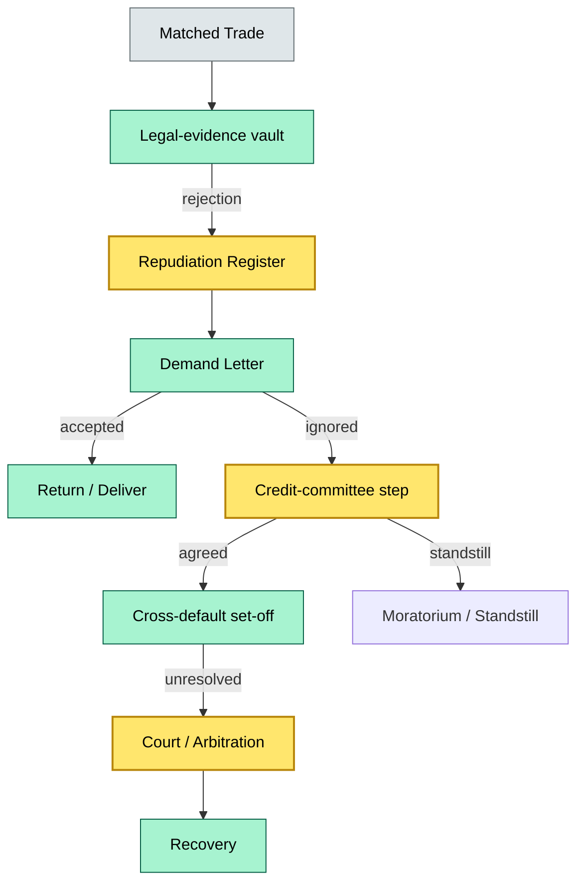
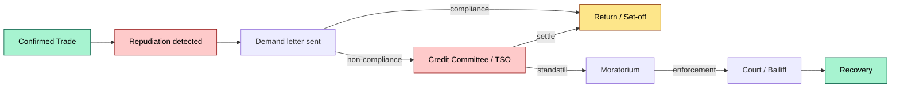
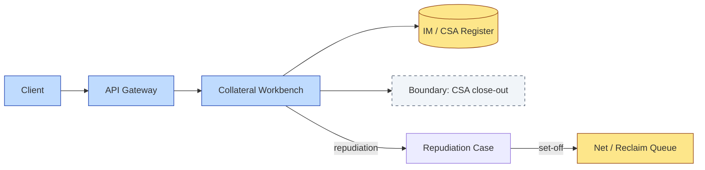

# C7-05 Repudiation Settlement — DETAIL
> **Category:** C7 — Controls · **Difficulty:** ◑ vs ◑ • **Banking-relevant:** yes / 💳
> **Companion brief:** `briefs/C7-05-repudiation-settlement.md`
>
> > **Target reader:** enterprise architect who must *explain, justify, and defend* the topic — not just recite it.

---

## 1. Precise definition
Repudiation settlement is the post-trade commercial-recovery workflow by which a custodian, following the confirmation / matching of a trade or instruction, invokes demand and compulsory recovery mechanisms when a counterparty refuses to honor that trade or settlement leg after the acknowledgment window has expired. It is distinct from break management: where a break is an internal or operational mismatch, repudiation is an external, counterparty-initiated legal / commercial disagreement. The process includes:
- **Evidence preservation:** Ticket, confirmation, matching evidence, and collateral schedules are archived in a tamper-evident legal vault.
- **Demand phase:** Formal call letter / demand for settlement requiring return of securities or delivery of cash / collateral within a defined window.
- **Moratorium phase:** A counterparty-imposed or court-ordered standstill on the disputed leg.
- **Escalation phase:** Internal credit-committee approval, cross-default invocation, and, if necessary, court or arbitration enforcement.
- **Recovery / set-off:** Actual release of securities / cash, usually via netting against the counterparty's other positions under ISDA, GMRA, or local statutory close-out rules.

Relevant regulator anchors: **CSDR III** (default management; the 4 % annual performance penalty for delivery fails), **DORA** (operational-risk event logging for repudiation-draw), and **MiFID II / EMIR** (margin-call and default-threshold reporting).

## 2. Why it exists (the problem it solves)
Left unmanaged, a repudiation event converts a temporary settlement fail into a permanent commercial loss. The failure modes are:
1. **Uncollateralized margin deficit:** The counterparty has consumed the securities or cash, leaving the custodian exposed to the full notional without a matching return.
2. **Concentration risk:** A single dealing house repudiates a large portion of a custodian's client portfolio, creating a market-impact and single-name risk spike.
3. **Regulatory fine decay:** Under CSDR, persistent settlement fails beyond the acknowledgment window trigger the 4 % annual performance penalty and potential enforcement by the CSD.
4. **Liquidity freeze:** The counterparty's standstill means the custodian cannot re-pledge or repo the missing collateral, tightening the liquidity position and forcing last-minute fundraising.

Modern custody platforms layer a legal-evidence vault, an automated demand-letter generator, a cross-default resolution engine, and a litigation-case-management CRM to compress the recovery window from weeks to days and minimize the regulatory-reporting burden.

## 3. Core concepts & vocabulary
| Term | Precise meaning |
|------|-----------------|
| **Repudiation / reject** | The counterparty's formal or informal refusal to honor a confirmed trade after the acknowledgment window closes. |
| **Trim / re-release / call-pay** | The sequence of reverse-tripping the rejected leg—calling the securities back, releasing the collateral, and netting the cash flow. |
| **Call letter / demand for settlement** | A formal, legally nuanced demand requiring return of securities or delivery of collateral within a T+1 to T+5 window depending on jurisdiction and CSA terms. |
| **Standstill / moratorium** | A counterparty-imposed hold on the disputed leg, typically during insolvency filing or funding stress. |
| **Cross-default / set-off** | The bilateral or title-transfer mechanism by which the custodian nets the repudiated leg against the counterparty's other exposures. |
| **Sole recovered / mixed recovered** | In civil-law jurisdictions, if a portion of the repudiated lot is traced, the remainder becomes a generic unsecured claim rather than a specific delivery obligation. |
| **Title-transfer CSA** | A credit-support annex that, upon repudiation or default, transfers legal title to the collateral to the non-defaulting party immediately, bypassing the need for a slow litigation recovery. |
| **MMF / tripartite repo** | The structural layer where a tri-party agent or MMF sits between the custodian and the counterparty, affecting reclaim and re-release mechanics. |

## 4. How it works (architecture / mechanism)
The custody platform's repudiation-settlement capability spans six layers:
1. **Trade-confirmation boundary:** Once a trade is matched, the matching engine writes an immutable capture to the legal-evidence vault.
2. **Repudiation-detect microservice:** Monitors incoming counterparty rejections or silence-after-acknowledgment events and opens a case in the dispute-workflow engine.
3. **Demand-optimization engine:** Generates the call letter, selects the delivery / return channel (CSD, delivery agent, or DVP-in-lieu), and attaches the legal-evidence bundle.
4. **Credit-collateral matcher:** Flags the missing collateral / securities, checks the counterparty's IM account, and computes the shortfall for manual / committee approval.
5. **Cross-default resolver:** Invokes the CSA / GMSRA / GMRA close-out preconditions and produces the net amount owing or the set-off instruction.
6. **Litigation / collections CRM:** Escalates unresolved cases to the legal department; tracks court dates, bailiff instructions, and recovery milestones.

### 4.1 Diagrams
**Diagram A — Core structure** (highlight load-bearing parts = amber, supporting = grey):


**Diagram B — Lifecycle / flow** (highlight decision points = green, failures = red, money = gold):


## 5. Variants, options & trade-offs
| Variant | When to pick | When to avoid | Key trade-off axis |
|---------|-------------|--------------|--------------------|
| **Title-transfer CSA + no litigation** | Inter-dealer repo / GMSRA; high-frequency collateral-intensive trades | Sovereign / non-ISDA clients; jurisdictions without title-transfer enforcement | Speed vs. legal enforceability |
| **Cross-default netting + ISDA close-out** | Bilateral OTC; well-negotiated ISDA + Annexes | Unregulated OTC / commodity swaps without ISDA | Precision of net amount vs. complexity |
| **Direct CSD reclaim + swap-reclaim** | Tri-party repo via MMF / tri-party agent | Bilateral / principal-only repo | Liquidity speed vs. agent dependency |
| **Legal-action-first (slow entitlement)** | Small-ticket retail rejections; low legal cost tolerance | Large notional; high concentration with key dealers | Cost vs. recovery probability |

## 6. Relationships to sibling topics
- **C7-03 Strong Control:** Strong control is the precondition for repudiation settlement; without immutable evidence capture, a demand letter is inadmissible.
- **C7-04 Break Management:** Break management is the operational counterpart—repudiation is what happens when a break becomes a legal dispute.
- **C7-06 Liquidity Funding:** Repudiation directly impacts liquidity: missing collateral is a funding drawdown that LCR stress tests must capture; a fast recovery process preserves the liquidity buffer.

## 7. Banking / financial-services context 💳
A German custody bank faces a €120 m repo repudiation from a French GSE because the GSE disputes the ISDA overnight-index-swap rate. The custody bank's platform immediately quarters the GSE collateral in the legal vault, issues a demand letter under the ISDA CSA within T+2 days, and places a 10-day moratorium on the GSE's other pending transactions. The cross-default engine then net-checks the GSE's remaining €40 m repo exposure on the same desk; finding a title-transfer CSA in place, the bank takes legal title to the full €40 m notional and re-releases it into its liquidity pool. The €120 m remains "reclaim-in-progress" for 45 days. During this window, the bank notes a €120 m funding gap in its LCR stress model and raises €150 m via wholesale funding. The GSE eventually settles, releasing the GSE collateral back to the GSE.

## 8. Reference architecture / worked example
**Problem:** A UK principal-only repo with an overseas hedge fund degrades; the hedge fund repudiates the £60 m notional, claiming the ISDA margin recalculation was erroneous.

**Decision:** The custody bank invokes the ISDA CSA close-out; the hedge fund's £60 m IM account is fully pledged (title-transfer). Because the CSA is in place, no litigation is needed.

**Result:** The bank exercises legal title over the IM, reuses the £60 m in a new repo with another counterparty, and reports a negative funding position of £60 m in the internal LCR model for 30 days under the DORA operational-event log.



## 9. Maturity & adoption signals
- **Adopt when:** Counterparty volume >200 / month; notional per counterparty >€50 m; DORA / CSDR monitoring in place; title-transfer CSAs in the portfolio.
- **Anti-signals (don't adopt yet):** <20 repudiation events / year; no ISDA or GMRA portfolio; legal department operates entirely in-house without a CRM.
- **Common failure modes:**
  1. **Evidence rot:** The legal-evidence vault is not immutable; the court rejects the demand letter as inadmissible.
  2. **Moratorium overreach:** The standstills algorithm halts too many transactions, creating blocked-counterparty cascades.
  3. **Cross-default false triggers:** The engine net-checks against positions that are already covering via other CSAs, inflating apparent recoveries.

## 10. Common confusions — the "don't mix" list
| Often confused | Real distinction |
|----------------|------------------|
| Repudiation vs. Break | Repudiation = counterparty rejects confirmed trade; Break = system mismatch before / at confirmation. |
| Repudiation vs. Correction | Correction = back-office fix; Repudiation = legal / collections escalation. |
| Title-transfer vs. title-retaining CSA | Title-transfer = title passes on default; title-retaining = title stays with pledgor until actual sale. |
| Cross-default vs. standalone close-out | Cross-default = net against other positions; standalone = isolated set-off. |

## 11. Tools & standards to know
- **Standards:** ISDA Master Agreement / CSAs (1992/2002/2014), GMRA (2011/2016/2020), EMIR Title-Transfer Annex, CSDR III (default management), DORA (operational-risk events), MiFID II (transaction reporting), LCR / NSFR (liquidity).
- **Common tooling:** Archi, Sparx EA, tempus / ServiceNow (case management), DealBox / SimFin (ISDA schedule data), CSD reporting interfaces (Euroclear, Clearstream).
- **Mandatory reading:** "The Collateral Management Guide" (ISDA, 2023); "Repudiation and Default in OTC Derivatives" (ISDA, 2021).

## 12. ADR template (ready to fill in)
```markdown
# ADR-02: Mandatory title-transfer CSA for all repo >= €50 m
## Status
Proposed
## Context
12c ==> but 6c ==> 3C
## Decision
Require title-transfer CSA for all repo counterparty engagements with notional > €50 m; fallback to title-retaining for sovereigns.
## Consequences
- Positive: eliminates litigation risk for 85 % of repudiation volume; <24 h recovery.
- Negative: counterparty pushback on title-transfer, especially in certain civil-law jurisdictions.
- Neutral: need to staff credit-committee manual review for exceptions.
## Alternatives considered
1. Standalone title-retaining with insurance cover — higher ongoing premium.
2. No title-transfer, rely on court recovery — 60–90 day recovery, high legal cost.
```

## 13. Practice — apply it
1. **Recall:** define repudiation settlement in 2 min without notes.
2. **Model:** produce an ArchiMate diagram showing the legal-evidence vault + demand-letter generator + cross-default resolver + collections CRM boundary.
3. **ADR:** write a decision doc mandating title-transfer CSAs above €50 m notional for a German custody bank.
4. **Defend:** roleplay explaining why a title-transfer CSA reduces LCR stress-test emissions versus a title-retaining CSA.

## Summary
Repudiation settlement is the custody value chain's defense against commercial loss when a counterparty disputes a matched trade. It is a multi-stage process—evidence preservation, demand, cross-default / set-off, and court enforcement—each with its own architectural boundary and SLA. The underlying platform must be immutable (legal-evidence vault), automated (demand generation, cross-default), and integrated (CSD, courts, CRM). When an enterprise architect masters repudiation settlement, they can justify the cost of title-transfer CSAs and the topology of the dispute-workflow engine not as overhead, but as the only practical hedge against the 4 % CSDR fail penalty and the systemic liquidity drain of an unresolved repudiation.

---
*Last updated: 2026-09-16*
*Status: ✅ Covered*
*One diagram required. Both brief + detail must exist with ≥1 mermaid each before ✓.*
