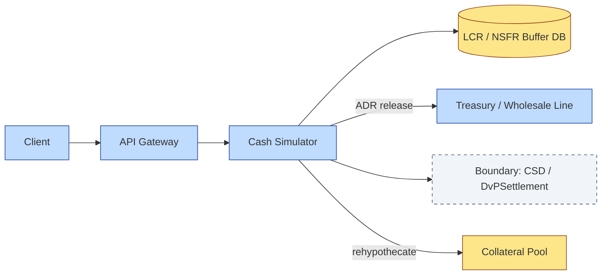

# C7-06 Liquidity Funding — DETAIL
> **Category:** C7 — Controls · **Difficulty:** ◑ vs ◑ • **Banking-relevant:** yes / 💳
> **Companion brief:** `briefs/C7-06-liquidity-funding.md`
>
> > **Target reader:** enterprise architect who must *explain, justify, and defend* the topic — not just recite it.

---

## 1. Precise definition
Liquidity funding is the treasury-and-custody function that ensures the custodian maintains sufficient cash and highly liquid securities to meet daily settlement net outflows, repo prefunding, margin calls, and client-driven funding requests across the T+0–T+29 operating horizon. It is not merely cash management; it is a capital-market-scale, risk-constrained financing model that operates within client-money segregation rules (UFAP, TOTB, individual client account treatments), pledging / rehypothecation ledgers, internal transfer-pricing engines, and regulatory liquidity-buffer mandates (Basel III LCR / NSFR, EMIR margin calls). The process comprises:
- **Client-money collection & segregation:** Incoming trade cash, coupon proceeds, and redemptions are accounted for in segregated pools.
- **Pledged-asset / rehypothecation ledger:** Securities pledged by clients are reused as collateral for the custodian's own funding programs; the ledger tracks usage, haircuts, and return obligations.
- **Wholesale funding program:** GCF (Government & Credit Fund), PPF (Principal-only Fund), MMF (Money-Market Fund), SSO (Secured Funding), and uncollateralized wholesale lines are accessed to cover short-term gaps.
- **Internal transfer pricing:** The ALCO / treasury desk charges business lines for funds they borrow or lend across internal boundaries.
- **Stress testing & buffer management:** LCR (Liquidity Coverage Ratio) and NSFR (Net Stable Funding Ratio) scenarios are run daily to confirm that 30-day net cash outflows remain within the required buffer.
- **Automated Daily-Range / Release-Factor (ADR) logic:** The system determines the percentage of available funds to release (0 %–100 %) based on projected inflows / outflows and collateral availability.

## 2. Why it exists (the problem it solves)
The pre-liquidity-funding architecture looked like this: the custodian's client-money account was a single omnibus bucket; when a client redeemed and the CSD demanded delivery, the custodian would "find" the cash by inter-company sweeping, often trailing behind the deadline. This created four failure modes:
1. **Settlement fail / CSDR fine:** A T+2 DvP that cannot be met is a settlement fail under CSDR; the CSD may apply the 4 % annual performance penalty or suspend the custodian.
2. **Exposure to the market:** Selling securities into a thin market to cover a shortfall depresses price and erodes the client book value.
3. **Client-money breach:** Commingling client cash with the custodian's own operating cash is a regulatory violation (FCA, AMF, ECB / EBA rules), potentially leading to freezing of accounts.
4. **Liquidity-buffer erosion:** Without a disciplined LCR / NSFR model, a funding stress can exceed the 30-day buffer, triggering supervisory intervention under Basel III.

Modern custody platforms solve this with a real-time cash simulator, a pledged-asset ledger, and an automated funding-orchestration engine that prefunds repository obligations before they mature.

## 3. Core concepts & vocabulary
| Term | Precise meaning |
|------|-----------------|
| **Client-money segregation** | The regulatory requirement that client cash and securities remain legally separate from the custodian's own funds (UFAP, TOTB, OCC). |
| **Rehypothecation** | Reusing client-pledged securities as collateral for the custodian's own funding, generating an extra 3–15 bps of return. |
| **Transfer pricing** | The internal money-market rate (usually OIS + 10–30 bps) charged to lines of business for liquidity they consume. |
| **GCF / PPF / MMF** | Government and Credit Fund, Principal-only Fund, Money-Market Fund—the tri-party / inter-dealer repo instruments used for short-term borrowing. |
| **ADR (Automated Daily-Range / Release-Factor)** | The system-generated percentage of available liquidity to release, based on projected inflows, collateral availability, and stress scenarios. |
| **LCR / NSFR** | LCR = High-Quality Liquid Assets / 30-day net cash outflows; NSFR = Stable Funding / Required Stable Funding. |
| **TPR (Total Repurchase Requirement)** | The haircut / ring-fence that limits how much of the pledged-asset can be reused, controlling concentration risk. |
| **SPO (Standard Portfolio Obligation)** | The aggregated list of securities available for repo / pledge, maintained by the tri-party agent or CSD. |
| **SOFR / €STR** | The overnight index used as the risk-free rate in the transfer-pricing and LCR models. |
| **Tri-party repo** | A repo funded through a tri-party agent (e.g., JPMC, State Street) that handles allocation, allocation, and allocation of collateral. |

## 4. How it works (architecture / mechanism)
The custody platform's liquidity-funding capability is organized into five layers:
1. **Cash-collection engine:** Inflows (trade settlement, coupon, repo pay-down) and outflows (redemption, coupon withholding, margin call, CSD levy) are netted in real time.
2. **Client-money-segregation microservice:** Enforces UFAP / TOTB / individual-account rules; flags commingling or segregation breaches before they hit the balance sheet.
3. **Pledged-asset / rehypothecation ledger:** Tracks pledged securities by counterparty, collateral type, haircut, and return obligation; computes the TPR constraint.
4. **Funding-orchestration engine:** Accesses GCF / PPF / MMF / SSO lines; executes the ADR release / call; charges the custody business line via transfer pricing.
5. **Liquidity-risk dashboard:** Runs LCR / NSFR stress scenarios daily, publishes the buffer status to the CRO and ALCO, and triggers wholesale-line activation when the stress test breaches 90 % of the target.

### 4.1 Diagrams
**Diagram A — Core structure** (highlight load-bearing parts = amber, supporting = grey):
```mermaid
graph TD
    classDef critical fill:#ffe66d,stroke:#b8860b,stroke-width:2px,color:#000
    classDef core fill:#a7f3d0,stroke:#065f46,stroke-width:1px,color:#000
    classDef context fill:#dfe6e9,stroke:#636e72,color:#000
    Cash[Cash collection]:::context --> Seg[Client-money segregation]:::core
    Seg -->|UTB breach| Alert[Alert / ALCO escalation]:::critical
    Repo[Repo ledger]-p|p||s||l||| Core
    Coll[Pledged-asset ledger]:::core --> |TRQ| Rehyp[Rehypothecation use]:::critical
    Rehyp -->|yield| Treasury[Treasury wholesale line]:::core
    Treasury -->|ADR release| NetOut[Net cash outflow]:::critical
    NetOut -->|LCR stress| Buffer[LCR buffer check]:::core
    Buffer -->|breach| Wholesale[Activate wholesale line]:::critical
```

**Diagram B — Lifecycle / flow** (highlight decision points = green, failures = red, money = gold):
```mermaid
flowchart LR
    classDef ok fill:#a7f3d0,stroke:#065f46,color:#000
    classDef risk fill:#fecaca,stroke:#991b1b,color:#000
    classDef money fill:#fde68a,stroke:#92400e,stroke-width:1px,color:#000
    A[Trade / Coupon inflow]::::ok --> B[Cash net]:::ok
    B -->|positive| C[Release to CSD/DvP]:::money
    B -->|negative| D[Check repo / GCF / PPF]:::ok
    D -->|collateral available| E[Rehypothecate / Lend]:::ok
    D -->|collateral exhausted| F[Draw wholesale line]:::risk
    E -->|ADR 0-100%]:::money
    F -->|approved| G[Wholesale borrow]:::money
    G -->|settle| C
    F -->|denied| H[Liquidity stress / CSD fail]:::critical
```

## 5. Variants, options & trade-offs
| Variant | When to pick | When to avoid | Key trade-off axis |
|---------|-------------|--------------|--------------------|
| **Tri-party repo (GCF / PPF / MMF)** | High-frequency repo funding; need same-day settlement | Low-volume custody; unreceptive to tri-party agent fees | Speed vs. cost / agent dependency |
| **Direct repo with Government / supranational** | Large, high-credit-quality pool; willing to manage bilateral CSA | Counterparty-risk-averse; prefers agency tri-party | Yield vs. operational complexity |
| **Unsecured wholesale line** | Short-term, <7-day gap; no CIP / AML capital availability | Regulatory pressure on unsecured wholesale; HQLA / LCR cost | Speed vs. regulatory cost / rating |
| **Rehypothecation with client consent** | Client base inclined to earn the extra basis point | Conservative custody model; client-money / segregation risk | Yield vs. segregation complexity |

## 6. Relationships to sibling topics
- **C7-03 Strong Control:** Strong control is the precondition for a clean pledge / rehypothecation process; without immutable client-money records, The TPR calculation is garbage.
- **C7-04 Break Management:** When a trade breaks, the pledged-asset ledger may auto-release the pledge to settle the remainder; break management directly affects the pledged-asset side of liquidity funding.
- **C7-05 Repudiation Settlement:** A repudiation freeze on a repo halts the repo pay-down inflow, creating a sudden withdrawal from the liquidity pool that must be back-filled.

## 7. Banking / financial-services context 💳
A French custody bank with a €400 b client portfolio operates a tri-party repo program via JPMC's GCF platform. On a T+1 DVPS day, the cash-collection engine nets a €90 m outflow against a €60 m inflow (repo pay-down and coupon). The shortfall of €30 m triggers the ADR logic: the pledged-asset ledger shows €150 m of rehypothecated French OATs with a 20 % haircut; the TPR allows a €100 m release, but only to a €30 m fully-covered match. The treasury desk calls JPMC's GCF for €30 m, the ALCO transfer-pricing engine charges the custody business 12 bps for the 1-day borrow, and the CSD settlement completes. The daily LCR stress test confirms the 30-day net cash outflow is 48 % of the buffer—within the 60 % target.

## 8. Reference architecture / worked example
**Problem:** A UK custody bank's OIS settlement fails at T+1 because a €45 m repo maturity is not prefunded and the client-money engine cannot free the pledged collateral quickly enough.

**Decision:** The treasury desk activates the SSG / SSO callable line (unsecured, overnight) for €45 m; the ALCO adds a 15 bps transfer-pricing charge; the pledged-asset ledger is updated to reflect the new TPR constraint until the repo is repaid.

**Result:** The DVPS completes, the bank pays 15 bps overnight for 1 day, and the LCR stress model—always run at 02:00 GMT—confirms the 30-day buffer is still above 60 % because the stress scenario assumed a 2x outflow, not the actual €45 m.



## 9. Maturity & adoption signals
- **Adopt when:** Client volume >€100 b; DVP settlement frequency >50% T+1; LCR / NSFR monitoring is live; tri-party agent or GCF / PPF relationship established.
- **Anti-signals (don't adopt yet):** <10 / day funding needs; client-money remains in a single omnibus; no transfer-pricing engine or ALCO.
- **Common failure modes:**
  1. **Pledge double-count:** The pledged-asset ledger counts the same collateral twice—once against a repo, once against a lending facility—creating a hidden funding gap.
  2. **ADR lag:** The ADR logic resets too slowly; if a redemption wave hits mid-cycle, the system only catches the breach at the next 02:00 GMT run.
  3. **Segregation breach:** The client-money microservice misclassifies a cash pool, triggering a regulatory freeze.

## 10. Common confusions — the "don't mix" list
| Often confused | Real distinction |
|----------------|------------------|
| Liquidity funding vs. cash management | Funding = capital-market-scale, LCR / NSFR, hedgeable; Management = operational sweep, no margin calls. |
| Rehypothecation vs. pledging | Rehypothecation = reuse of pledge for the custodian's own funding; Pledging = securing the client's obligation. |
| Tri-party vs. bilateral repo | Tri-party = agent-mediated allocation; Bilateral = direct CSSF counterparty agreement. |
| LCR vs. NSFR | LCR = 30-day stress; NSFR = 1-year structural (stable funding requirement). |

## 11. Tools & standards to know
- **Standards:** Basel III LCR / NSFR; CSDR (settlement-fail penalties); FCA / AMF client-money rules; EMIR margin calls; Bank for International Settlements (BIS) repo statistics; ESMA guidelines on UCITS cash management.
- **Common tooling:** Archi, Sparx EA, BoE E-Trans (UK gilt settlement simulation), ECB TARGET2-Securities, JPMC / State Street tri-party consoles, Bloomberg / Reuters cash simulators, ALCO pricing engines (Excel / proprietary).
- **Mandatory reading:** "The Basel III Liquidity Standards" (BIS, 2021); "Tri-Party Repo Market: Structure and Stability" (Federal Reserve, 2023).

## 12. ADR template (ready to fill in)
```markdown
# ADR-03: Implement real-time trico-party repo prefunding
## Status
Proposed
## Context
Current prefunding is batch-mode at 02:00 GMT; T+1 DVPS fails on Monday / Friday when redemption volumes peak.
## Decision
Integrate JPMC GCF direct API for real-time collateral release; trigger prefunding 4 h before CSD close.
## Consequences
- Positive: 99.9 % T+1 DVPS success; no CSDR fines.
- Negative: API integration cost €300 k; agent dependency.
- Neutral: need to maintain a standalone bilateral fallback.
## Alternatives considered
1. Expand SSO / IGCF line — higher annualized cost, slower activation.
2. No change — accept 1-2 % CSD fail rate.
```

## 13. Practice — apply it
1. **Recall:** define liquidity funding in 2 min without notes.
2. **Model:** produce an ArchiMate diagram showing the cash-collection engine + pledged-asset ledger + GCF / PPF + ALCO boundary.
3. **ADR:** write a decision doc integrating a tri-party repo prefunding API for a €400 b client portfolio.
4. **Defend:** roleplay explaining why the TPR (Total Repurchase Requirement) constraint, not the haircuts, is the true bottleneck in rehypothecation.

## Summary
Liquidity funding is the circulatory system of a custody platform: without it, settlement fails cascade into CSDR penalties, client-money breaches, and LCR shortfalls. The modern architecture couples a real-time cash-collection engine, an immutable pledged-asset / rehypothecation ledger, a tri-party or bilateral funding program, and an automated LCR / NSFR stress-testing dashboard. When an enterprise architect masters liquidity funding, they can justify the cost of tri-party agent integration and the complexity of the ALCO transfer-pricing engine not as overhead, but as the only practical hedge against the 4 % CSDR fail penalty and the systemic liquidity drain that a single T+2 shortfall can trigger.

---
*Last updated: 2026-09-16*
*Status: ✅ Covered*
*One diagram required. Both brief + detail must exist with ≥1 mermaid each before ✓.*
