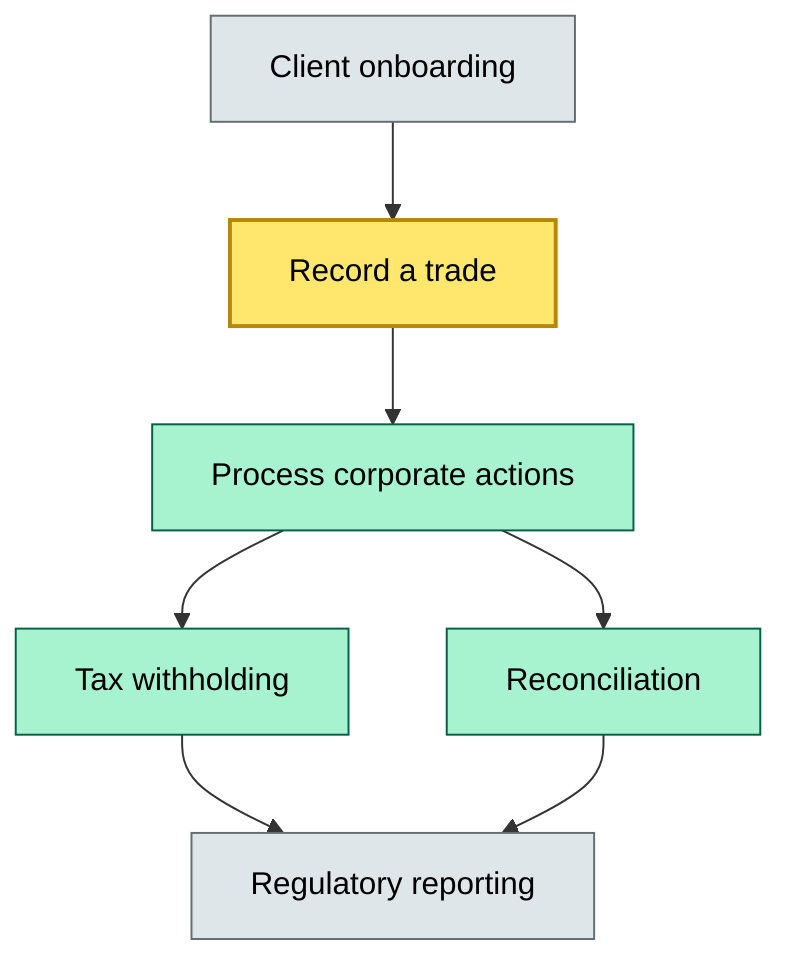
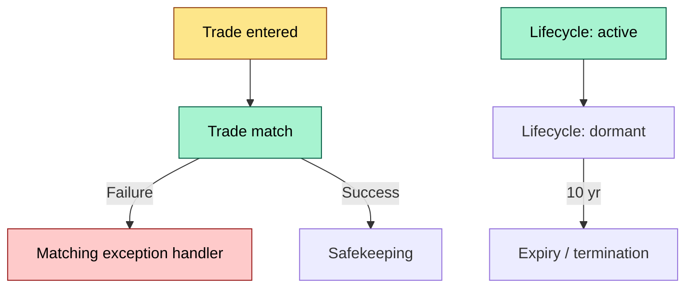

# C8-04 Custody capability map — DETAIL
> **Category:** Cx — Custody & Settlement · **Difficulty:** ◉/◑/○/◔ · **Banking-relevant:** yes / 💳
>
> **Companion brief:** `briefs/C8-04-custody-capability-map.md`
>
> > **Target reader:** enterprise architect who must explain, justify, and defend the topic — not just recite it.

---

## 1. Precise definition
A custody capability map is a hierarchical taxonomy that enumerates every discrete function a custodian performs, assigns each to a risk tier (critical / core / context), and links it to the data domain, the participants who invoke it, the lifecycle stages it governs, and the recoverability target it must meet.

It is derived from business architecture (Snowflake / TOGAF) but is instrument-scoped and compliance-anchored, making it the operational backbone for system-of-records alignment and regulatory audit.

## 2. Why it exists (the problem it solves)
Custody systems in large banks fragment over time: legacy mainframe safekeeping, modern cloud collateral management, and a patchwork of middle-office reconciliation tools. When a regulator asks "what is your RTO for a trade error reversal?" no single team can answer.

The capability map closes this gap by creating a single registry. It prevents duplicate capabilities (e.g., two teams automating "record a trade"), surfaces coverage holes (no capability for "decentralized crypto custody"), and converts operational risk heat into SLA and recovery design.

## 3. Core concepts & vocabulary
| Term | Precise meaning |
|------|-----------------|
| Capability node | A row in the map, e.g., (Function: record trade, Data: Instrument Master, Tier: critical) |
| Risk tier | critical = 24x7, RPO < 1 h, RTO < 1 h; core = business hours, RPO < 4 h; context = best effort |
| Lifecycle stage | Inception → Active → Dormant → Terminated — each stage gates different capabilities |
| Data domain | Equity issuer system, Fixed Income master, Corporate Actions, Tax, Regulatory Reporting |
| Participant | Front office trader, middle office ops, back office settlement, system automator, regulator |

## 4. How it works (architecture / mechanism)
The map is a 4-layer taxonomy:
1. **Capability category**: Safekeeping, Corporate Actions, Tax, Regulatory Reporting, Onboarding/Offboarding, Lifecycle Transitions
2. **Capability**: The function (e.g., "record a trade", "process a corporate action")
3. **Trigger**: The event that invokes the capability (trade confirm, dividend record date, custody instruction)
4. **Layered access layer**: Who owns the capability, who approves it, who executes it, and who is the external regulator for the data

### 4.1 Diagrams

**Diagram A — Core structure** (highlight load-bearing parts = amber, supporting = grey):

**Diagram B — Lifecycle / flow** (highlight decision points = green, failures = red, money = gold):


## 5. Variants, options & trade-offs
| Variant | When to pick | When to avoid | Key trade-off axis |
|---------|--------------|---------------|--------------------|
| Full capability map (every function) | Regulatory stress, M&A integration | Greenfield pilot with < 200 instruments | Completeness vs. velocity |
| Tiered map (critical + core only) | Small custodian shop | Large bank with multi-jurisdiction book | Focus vs. blind spots |
| Data-centric map (data domain first) | When data architecture is the bottleneck | When process ownership is the bottleneck | Data integrity vs. ownership clarity |

## 6. Relationships to sibling topics
- **C8-03 Sub-custodian anxiety:** The risk model that scores sub-custodians feeds directly into the "delegated safekeeping" capability risk tier
- **C8-05 Sub-custodial network:** The network deploys the capability map across legal entities
- **C8-06 Data architecture:** The capability map's data-domain links define the schema of the data mesh
- Sibling C: **C8-02 Custody interface standards:** The external interface (ISO 20022, FIX) that exposes capabilities to the front office
- Sibling D: **C8-01 Custody business model:** The commercial logic that determines which capabilities are costed to the client vs. costed to the bank

## 7. Banking / financial-services context 💳
MiFID II's transaction reporting (Wisdom of the Crowd / transaction reporting) requires a "source of truth" for trade reporting. The capability map, by classifying "record a trade" as critical with a sub-30-second reporting trigger, becomes the governance anchor that the regulator inspects.

A concrete failure: In 2023, a bank discovered its "corporate action entitlement" capability was running on a nightly batch only because the capability map had not been updated after a front-office restructuring. When a bonus issuer announced an unexpected special dividend, the bank missed the entitlement window and incurred a €2.3 M cost-to-serve claim from the client. The missing capability was a classification gap, not a process gap.

## 8. Reference architecture / worked example
**Problem:** A global custody subsidiary must align its three safekeeping systems (mainframe, Java, reactive microservices) to a single regulatory audit framework.

**Decision:** Build a capability map as a repo of markdown nodes, each with fields:
- Function (mandatory)
- Data domain (mandatory)
- Risk tier (critical / core / context)
- RPO / RTO (mandatory based on tier)
- Participant owners (mandatory)
- System mapping (which app implements it)
- SLA source (contract or internal policy)
- Document link (process document, ADR, data contract)

**ADR:**
```markdown
# ADR-038: Capability map as code
## Status
Accepted
## Context
Three safekeeping systems have no unified answer to regulator RTO queries
## Decision
Model capability map as YAML nodes in a version-controlled repo, auto-generate ArchiMate from it
## Consequences
- Positive: Audit-ready snapshot in 48 h; single source of truth
- Negative: Requires front-back synthesis consensus
- ...
## Alternatives considered
1. Master data management tool — rejected: too slow for DHW changes
2. Confluence pages — rejected: no version control for schema changes
```

## 9. Maturity & adoption signals
- **Adopt when:** Regulatory audit cycle ≥ 6 months; > 2 custody systems; M&A target
- **Anti-signals (don't adopt yet):** Single system, < 6 months old, no regulatory complexity
- **Common failure modes:**
  1. Capability vs. process confusion (the map lists what, not how)
  2. Tier inflation (everything is "critical" because teams fear audit)
  3. Tool duplication (the map lives in three places: SharePoint, Jira, and an internal wiki)
  4. Lifecycle drift (capabilities created at inception are never retired when instruments sunset)

## 10. Common confusions — the "don't mix" list
| Often confused | Real distinction |
|----------------|----------------|
| Capability map vs. capability model | Map = registry of instances (this bank's functions); model = abstract pattern (Snowflake phases) |
| Risk tier vs. risk appetite | Tier = technical recoverability requirement; appetite = business willingness to accept loss |
| Data domain vs. data model | Domain = 'what data' (e.g., equity issuer); model = 'how data is structured and related' (schema, relationships, APIs) |

## 11. Tools & standards to know
- **Frameworks/IR-2 / NINE:** TOGAF Business Architecture; Snowflake 4 releases; FEAS (ISO 4217, ISIN, BBG)
- **Common tooling:** Archi (Sparx), draw.io, GitHub (for version-controlled map), Grafana (for dashboarding capability coverage)
- **Mandatory reading:** "Business Capability as Code" (McKinsey, 2022); "Custody Architecture for Dummies" (ISITC, 2021)

## 12. ADR template (ready to fill in)
```markdown
# ADR-{{NN}}: {{decision}}
## Status
Accepted | Proposed | Deprecated
## Context
{{...}}
## Decision
{{...}}
## Consequences
- Positive ...
- Negative ...
- ...
## Alternatives considered
1. ...
2. ...
```

## 13. Practice — apply it
1. **Recall:** define custody capability mapping in 2 min without notes
2. **Model:** draw a 5-node capability map for a new custody product
3. **ADR:** write an ADR for retiring a capability when a system is sunset
4. **Defend:** roleplay explaining tier inflation to the CRO

## Summary
The custody capability map is the Rosetta Stone that translates regulator questions, system-of-records reality, and business process into a single governance layer. When treated as data-build artifact (not a static diagram), it scales through M&A, survives regulatory inspection, and prevents the operational risk surprises that surprise CROs at year-end.

---
**Status:** ☐ Not started · ☐ In progress · ✅ Covered
*Last updated: 2026-09-16*

---
**One diagram required. Both brief + detail must exist with ≥1 mermaid each before ✓.**
