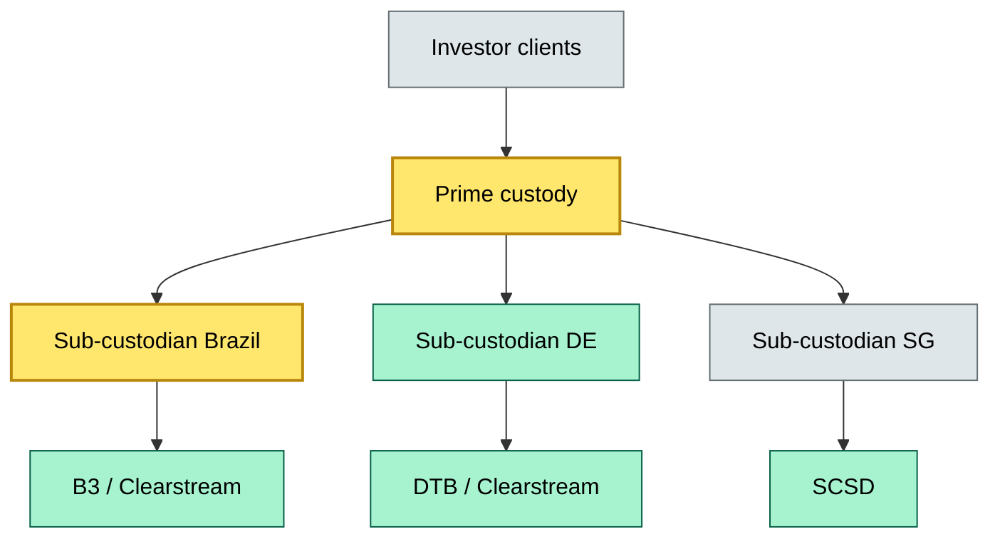
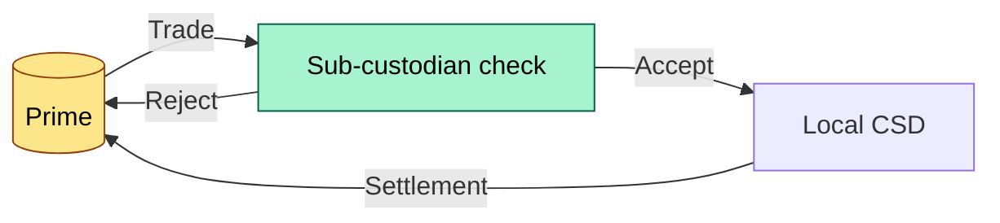

# C8-05 Sub-custodial network — DETAIL
> **Category:** Cx — Custody & Settlement · **Difficulty:** ◉/◑/○/◔ · **Banking-relevant:** yes / 💳
>
> **Companion brief:** `briefs/C8-05-sub-custodial-network.md`
>
> > **Target reader:** enterprise architect who must explain, justify, and defend the topic — not just recite it.

---

## 1. Precise definition
A sub-custodial network is the mesh of contractual, data, and process interconnections between a prime custodian and the sub-custodians (also called sub-custodians, correspondents, or omnibus account managers) to which it delegates safekeeping, settlement, or corporate-action functions for specific jurisdictions or asset classes.

The network is not merely an org chart; it is a capability-aware mesh where each sub-custodian connection is a distinct "thread" with its own SLA, data-sovereignty rules, currency boundaries, and reconciliation anchor points.

## 2. Why it exists (the problem it solves)
Depository systems are non-fungible across jurisdictions. A prime custodian cannot operate every local depository (CBE, Clearstream, Euroclear, SCSD, etc.). The sub-custodial network solves the regulatory fragmentation problem by delegating safekeeping to licensed local custodians while the prime retains prime responsibility for client attribution, end-to-end SLA management, and regulatory reporting.

Without it, the prime would face catastrophic concentration risk in a jurisdiction where local law requires local safekeeping (e.g., Brazilian custody law requires Brazilian custody of Brazilian securities).

## 3. Core concepts & vocabulary
| Term | Precise meaning |
|------|-----------------|
| Prime custodian | The ultimate legal accountable entity (usually the bank or a Crown-corporation entity) |
| Sub-custodian | A licensed entity to which the prime delegates safekeeping or related functions under an ISDA/ISM / CSD regulations |
| Omnibus account | An account structure where the prime holds securities on behalf of multiple clients in a single nominee name |
| Correspondent custodian | A sub-custodian that provides cross-border settlement bridging |
| SSA (Sub-custodian scorecard) | The maturity / risk ranking applied to each sub-custodian thread |

## 4. How it works (architecture / mechanism)

### 4.1 Diagrams

**Diagram A — Core structure** (highlight load-bearing parts = amber, supporting = grey):

**Diagram B — Lifecycle / flow** (highlight decision points = green, failures = red, money = gold):


## 5. Variants, options & trade-offs
| Variant | When to pick | When to avoid | Key trade-off axis |
|---------|--------------|---------------|--------------------|
| Single sub-custodian per jurisdiction | Small book, low volume | High concentration or regulatory pressure | Cost vs. concentration risk |
| Redundant sub-custodians with active-active failover | Critical markets (eur, usd, gbp) | Emerging markets with low liquidity | Resilience vs. cost |
| Omnibus + segregated sub-accounts | Retail / SME book | Institutional requiring real-time position transparency | Operational efficiency vs. principal protection |
| Direct CSD links (no sub-custodian) | Prime-only / proprietary | Client-facing multi-jurisdiction book | Control vs. scalability |

## 6. Relationships to sibling topics
- **C8-04 Custody capability map:** The capability map defines the competency; the sub-custodial network deploys it across jurisdictions.
- **C8-06 Data architecture:** Data flows between prime and sub-custodian over a dedicated reconciliation mesh (LoB DMZ).
- **010°F Core banking settlement:** Sub-custodians are the settlement correspondents when the prime cannot route directly to a CSD.
- Sibling C: **C8-03 Sub-custodian anxiety:** The risk model that scores each sub-custodian's financial health, operational maturity, and regulatory standing.

## 7. Banking / financial-services context 💳
Basel III / Basel IV require operational risk capital for third-party dependencies. A prime custodian that delegates safekeeping to a single sub-custodian in an emerging-market jurisdiction may hold 25-50 bps of additional RWA because the sub-custodian is a concentration risk.

A concrete failure: In 2018, a bulge-bracket custodian's sub-custodian in one jurisdiction lost connection to the local CSD for 48 hours because of a data-privacy regulation change. Because the capability map had classified "local safekeeping continuity" as critical, the bank invoked its SLA and the sub-custodian's reserve fund. Had it been core, the bank would have faced a regulatory breach of the CSD's continuity rules.

## 8. Reference architecture / worked example
**Problem:** A global prime wants to onboard institutional clients with gilt positions in UK, German, and US treasuries, but wants to limit sub-custodian partners to three to manage SSA.

**Decision:** Use a tiered network:
- **Critical:** DTB (DE), Clearstream (LU), BNY Mellon (US) — active-active reconciliation, 15-min SLAs
- **Core:** DTCC (secondary US), Euroclear (LU, fallback)
- **Context:** Nomura (SG, for volatility-driven hedging only)

**ADR:**
```markdown
# ADR-042: Tiered sub-custodial network
## Status
Accepted
## Context
Onboarding gilt book requires 3+ sub-custodians for treaty-based VAT withholding
## Decision
Adopt tiered network with active-active for critical, failover-only for core
## Consequences
- Positive: Faster VAT reclaim distribution; lower concentration risk
- Negative: Higher monitoring cost; 2 extra SSA analysts
- ...
## Alternatives considered
1. Direct DTCC UK / BNY Mellon — rejected: too costly for gilt volume
2. All sub-accounts segregated — rejected: too slow for institutional
```

## 9. Maturity & adoption signals
- **Adopt when:** Book exceeds 5,000 instruments in 3+ jurisdictions; sub-custodian volume > 10 threads
- **Anti-signals (don't adopt yet):** Book is single-jurisdiction with < 500 positions; sub-custodian partners < 3
- **Common failure modes:**
  1. Data-model drift between prime and sub-custodian (positions disagree at month-end)
  2. SLA misalignment (sub-custodian promises what the prime reports to the client)
  3. Regulatory arbitrage (data sovereignty rules change without network recalibration)

## 10. Common confusions — the "don't mix" list
| Often confused | Real distinction |
|----------------|----------------|
| Sub-custodian vs. correspondent bank | Sub-custodian holds the security; correspondent bank moves the currency |
| Sub-custodian network vs. data mesh | Network = organizational / contract threads; data mesh = technical data sharing topology |
| Omnibus vs. segregation | Omnibus = one nominee name for N clients; segregation = separate legal interests |

## 11. Tools & standards to know
- **Frameworks/IR-2 / NINE:** ISO 12048 (settlement) + ISO 20022; EMIR (EU) post-trade reporting
- **Common tooling:** Clearstream OTA-W / Euroclear RTF / DTCC-203; internal SSA model
- **Mandatory reading:** "Third-Party Risk in Custody" (ISITC White Paper), BIS CPMI reports on CSD connectivity

## 12. ADR template (ready to fill in)
```markdown
# ADR-{{NN}}: {{decision}}
## Status
Accepted | Proposed | Deprecated
## Context
{{...}}
## Decision
{{...}}
## Consequences
- Positive ...
- Negative ...
- ...
## Alternatives considered
1. ...
2. ...
```

## 13. Practice — apply it
1. **Recall:** define sub-custodial network in 2 min without notes
2. **Model:** draw the network for your bank's domiciled assets
3. **ADR:** write an ADR adding/removing a sub-custodian thread
4. **Defend:** roleplay explaining sub-custodian SLA risk to a non-technical CRO

## Summary
The sub-custodial network is the geographic and regulatory expansion layer of custody. It is not a cost center to be minimized; it is a risk-transfer architecture that, when modeled as a capability-aware mesh with clear critical/core/context threads, lets the prime defend its recoverability posture, meet CSD continuity rules, and avoid concentration-driven RWA inflation.

---
**Status:** ☐ Not started · ☐ In progress · ✅ Covered
*Last updated: 2026-09-16*

---
**One diagram required. Both brief + detail must exist with ≥1 mermaid each before ✓.**
