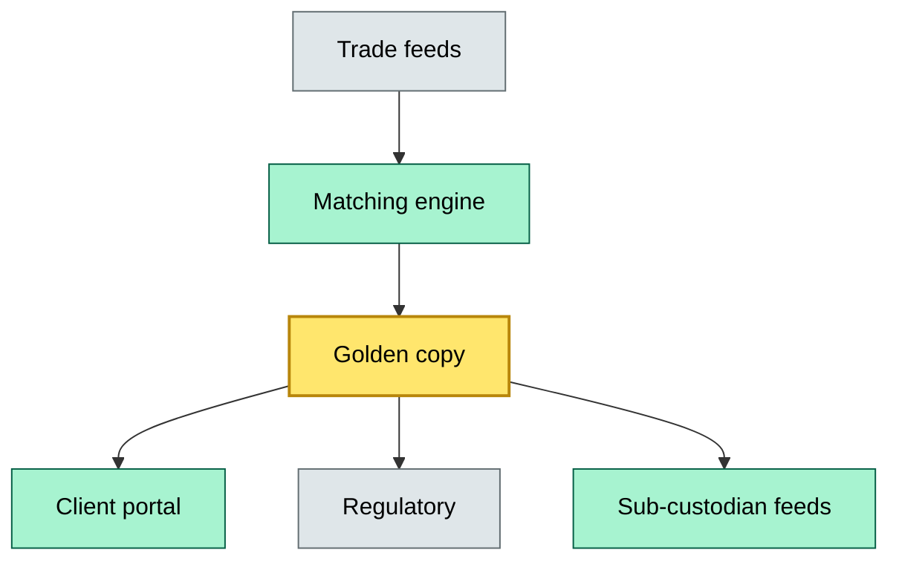
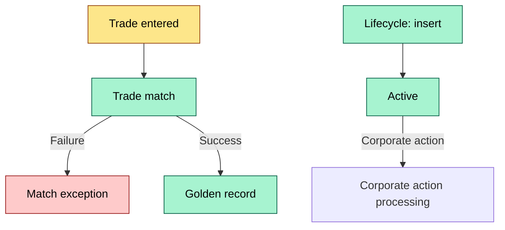

# C8-06 Data architecture — DETAIL
> **Category:** Cx — Custody & Settlement · **Difficulty:** ◉/◑/○/◔ · **Banking-relevant:** yes / 💳
>
> **Companion brief:** `briefs/C8-06-data-architecture.md`
>
> > **Target reader:** enterprise architect who must explain, justify, and defend the topic — not just recite it.

---

## 1. Precise definition
Custody data architecture is the end-to-end structural and governance design of how trade, matching, safekeeping, corporate-action, tax, and regulatory-reporting data flows, transforms, persists, and is distributed. It defines golden-copy ownership, cross-domain lineage, recovery boundaries, and the synchronization contracts between the front-of-book (trading, A-Book), the back-of-book (safekeeping, B-Book), and the sub-custodial mesh.

It is the harmonized extension of the master data management (MDM) layer scoped to financial instruments and positions, with an added compliance dimension: data must be recoverable to a regulatory snapshot, traceable to a legal instruction, and auditable across custody domains.

## 2. Why it exists (the problem it solves)
Custody data today lives in at least five disconnected systems: a mainframe safekeeping application, a collateral management system, a corporate-actions engine, a tax-withholding module, and a regulatory reporting system. Each has its own data model, its own sequences, and, critically, its own "version of truth."

This creates three failure modes:
1. **Source-of-truth drift:** The front office sees position T, the back office sees position T-Δ, and the regulator sees both.
2. **Regulatory reporting gaps:** Last-minute trade changes after the regulatory cut-off cannot be reflected because the transformation pipeline is batch-oriented (18 hours behind).
3. **Sub-custodian reconciliation failures:** The prime's golden copy disagrees with the sub-custodian's reported position because the two systems use different instrument identifiers (BBG ID vs ISIN vs FIGI).

The data architecture solves these by creating a canonical, versioned, domain-separated persistent layer with explicit lineage and a single addressable golden copy.

## 3. Core concepts & vocabulary
| Term | Precise meaning |
|------|-----------------|
| Golden copy | The canonical, authoritative source of truth for instruments, positions, transactions, and corporate actions, with a single addressing key (e.g., global instrument identifier + ISIN + CUSIP) |
| Data domain | Equity / Fixed Income / Derivatives / Corporate Actions / Tax / Regulatory Reporting / Safekeeping / Sub-custodian reconciliation |
| Event sourcing | Every change to a golden-copy item is stored as an immutable event, enabling replay, audit, and recovery to any historical state |
| Domain separation | Each data domain owns its schema, its retention policy, and its recovery target |
| CSD dataset / classification | The national or international data-product standard (e.g., ISO 20022 camt.052, DTCC-203, Euroclear RTF) that structures sub-custodian communication |
| Classification model | A regression-based model that assigns a data element to a compliance / regulatory classification level for retention and recovery gates |

## 4. How it works (architecture / mechanism)

The architecture is a three-layer data lakehouse / event-sourced stack:

**Layer 1 — Ingestion (raw zone):**
- Trade confirmations (ISO 20022 pain.001/caf.001, FIX 5.0 SP2)
- CSD notifications / settlement advice (camt.052, leginfo2)
- Sub-custodian position feeds (DTCC-203, Clearstream OTA-W, Euroclear RTF)
- Corporate-action notifications (EUCA, ISITC, DTCC-303 w/ ISO 20022 metadata)
- Tax and regulatory regulatory triggers (local tax authority lists, ESMA reporting or reporting-ready data sandbox)

**Layer 2 — Transformation & Golden Copy (enrichment zone):**
- Matching engine (trade → instruction → settlement)
- Attribution engine (omnibus → segregated, corporate-action entitlement)
- Corporate-action entitlement engine (entitlement calculation, election, distribution)
- Tax withholding engine (regulatory event → tax calculation → application)
- Regulatory snapshot service (on-demand, read-only, point-in-time view for audits)

**Layer 3 — Distribution (consumption zone):**
- Client portals (secure, role-based access to positions)
- Regulatory reporting pipelines (SFTR, EMIR, withholding tax returns)
- Sub-custodian reconciliation feeds (daily position, transaction, corporate-action)
- Internal analytics and ML (classification model, opportunity leakage detection, RWA estimation)

### 4.1 Diagrams

**Diagram A — Core structure** (highlight load-bearing parts = amber, supporting = grey):

**Diagram B — Lifecycle / flow** (highlight decision points = green, failures = red, money = gold):


## 5. Variants, options & trade-offs
| Variant | When to pick | When to avoid | Key trade-off axis |
|---------|--------------|---------------|--------------------|
| Lakehouse + event sourcing | High throughput, need replay and audit | Small custodian, limited scale | Cost vs. flexibility |
| Relational + ETL pipeline | Strong consistency, low regulatory complexity | Sub-custodian mesh with heterogeneous formats | Consistency vs. heterogeneity |
| Vaulted / WORM storage for regulatory data | + strict retention (EU Crypto-Asset / MiCAR) | Low-volume, single-jurisdiction | Compliance vs. storage cost |
| Blockchain DLT for finality | Cash equity settlement for native execution | Non-native or not-recognized blockchain | Immutability vs. interoperability |

## 6. Relationships to sibling topics
- **C8-04 Custody capability map:** The capability map drives which data domains exist and what their recoverability tier is; the data architecture implements it
- **C8-05 Sub-custodial network:** The sub-custodian network defines the source/sink boundaries in the data architecture (which feeds go where)
- **C8-03 Sub-custodian anxiety:** The risk model for sub-custodians feeds into data-architecture "low-confidence" zones and classification gates
- Sibling C: **C8-02 Custody interface standards:** ISO 20022, FIX, FHIR-like instruments standardize ingestion formats
- Sibling D: **C8-01 Custody business model:** The T+0 vs T+1 vs T+D settlement data requirements differ by business model

## 7. Banking / financial-services context 💳
Regulation: ESMA SFTR (Securities Financing Transparency Regime) requires reporting to trade repositories within one hour of a trade. If the data architecture's golden-copy layer is batch-only (nightly), the distributor (prime or sub-custodian) faces a decisiveness penalty or a reporting-quality warning.

Regulation: MiFID II transaction reporting + MiFIR mandates a best-execution / best-price record for every equity-like security. The data architecture must preserve an event-sourced audit log that can be replayed to the moment a trade was executed — otherwise the bank cannot defend the price and must refund the difference.

Concrete failure: A 2019 RBNZ / ASIC inquiry found that a custodian's golden copy was rebuilt on a fixed-asset refresh cycle. When a corporate action occurred mid-refresh, the system had two conflicting golden copies and missed a $12M entitlement. The root cause was a lack of event-sourced lineage.

## 8. Reference architecture / worked example
**Problem:** A global custodian wants to unify its equity and fixed-income safekeeping, collateral management, and corporate-action processing into a single, regulatory-ready data architecture.

**Decision:** Adopt a three-zone lakehouse architecture:
- **Raw zone:** Kafka for trade confirmations, CSD_s; SFTP feeds for sub-custodians
- **Enrichment zone:** Flink-based real-time matching + Golden-copy service storing positions in Databricks / Snowflake with event sourcing on delta lake
- **Distribution zone:** API layer for client portal; SFTP / ISO 20022 to SR (trade repository); JSON-to-PDF for client statements

**ADR:**
```markdown
# ADR-051: Golden copy as lakehouse
## Status
Accepted
## Context
Nightly ETL is too slow for SFTTR + MiFID II real-time obligations
## Decision
Shift to event-sourced Democratic Data Lakehouse (Kafka → Flink → DLakehouse)
## Consequences
- Positive: Sub-5-second reporting pipeline; audit-by-replay
- Negative: Requires Flink skill; vendor lock-in to Databricks
- ...
## Alternatives considered
1. Existing ETL rebuild — rejected: 18-month delivery
2. Off-the-shelf MDM — rejected: too slow; no event replay
```

## 9. Maturity & adoption signals
- **Adopt when:** Market participants > 5,000; regulatory reporting SLA < 1 hour; sub-custodian threads > 10
- **Anti-signals (don't adopt yet):** < 1,000 instruments; single-jurisdiction; no real-time regulatory deadline
- **Common failure modes:**
  1. Golden-copy key inconsistency across domains (ISIN vs BBG ID vs CUSIP mismatch)
  2. Event-sourcing log corruption or unbounded growth
  3. Sub-custodian feed schema drift without governance
  4. Data-sovereignty violation (cross-border data flows without adequate protection)
  5. Retention-policy conflict (tax data retentions differ between jurisdictions; primary category controls service until compliance date)

## 10. Common confusions — the "don't mix" list
| Often confused | Real distinction |
|----------------|----------------|
| Data architecture vs. data model | Architecture = structure, flow, governance; model = schema and relationships |
| Golden copy vs. snapshot | Golden copy is the persistent canonical source; snapshot is a read-only, point-in-time view |
| Regulatory data vs. master data | Regulatory data = compliance-scoped; master data = operational scope |
| Universal data vs. umbrella data | Universal data = truly unified across domains; umbrella data = per-domain "golden" with reconciliation gaps |

## 11. Tools & standards to know
- **Frameworks/IR-2 / NINE:** ISO 20022 (payment, securities), FIX 5.0 SP2, DTCC-203, ISO 12048
- **Common tooling:** Databricks / Snowflake, Kafka, Flink, AWS S3 + Athena, PostgreSQL, ArchiMate / TOGAF for modeling, Grafana / Superset for dashboards, Databricks ML for classification model
- **Mandatory reading:** "Master Data Management in Practice" (Fu et al.); "Data Sovereignty for Financial Services" (ISNSW, 2023)

## 12. ADR template (ready to fill in)
```markdown
# ADR-{{NN}}: {{decision}}
## Status
Accepted | Proposed | Deprecated
## Context
{{...}}
## Decision
{{...}}
## Consequences
- Positive ...
- Negative ...
- ...
## Alternatives considered
1. ...
2. ...
```

## 13. Practice — apply it
1. **Recall:** define custody data architecture in 2 min without notes
2. **Model:** draw a data-architecture blueprint for a new custody product with three data domains and one sub-custodian
3. **ADR:** write an ADR adding a new data domain to the lakehouse
4. **Defend:** roleplay explaining golden-copy key collisions to a non-technical data-science lead

## Summary
Custody data architecture is the truth-control layer. When golden copy, lineage, and recoverability are explicit in the design, the custodian can defend regulatory queries, reconcile with sub-custodians, and survive the single largest operational risk a bank faces: believing two different numbers at the same time.

---
**Status:** ☐ Not started · ☐ In progress · ✅ Covered
*Last updated: 2026-09-16*

---
**One diagram required. Both brief + detail must exist with ≥1 mermaid each before ✓.**
