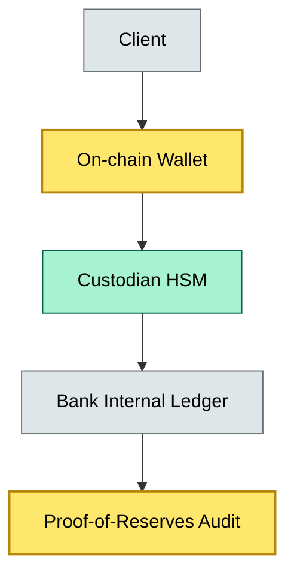
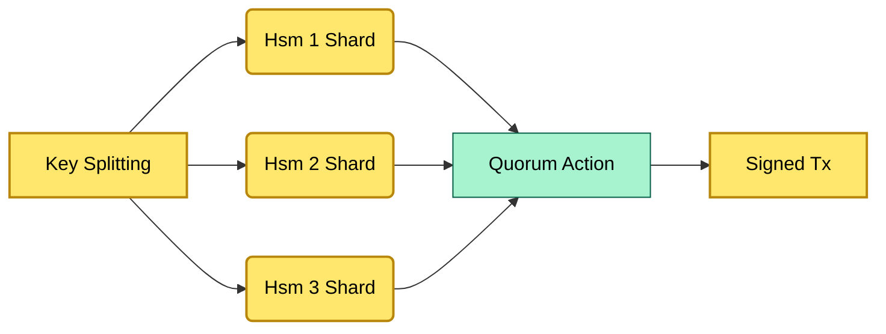

# C9-01 Digital Assets Custody — DETAIL

> **Category:** C9/C10 — Asset Custody · **Difficulty:** ◑ · **Banking-relevant:** yes / 💳
> **Companion brief:** `briefs/C9-01-digital-assets-custody.md`
>
> > **Target reader:** enterprise architect who must *explain, justify, and defend* the topic — not just recite it.

---

## 1. Precise definition
Digital asset custody is the secure holding, administration, and transfer of tokenized or native crypto assets on behalf of clients, combining cold-storage key management with real-time accounting and regulatory reporting. It differs from traditional asset custody in three dimensions:
- Counterparty risk is replaced by cryptographic risk (private-key loss or steal).
- Sovereignty is shared with the blockchain protocol; the custodian cannot unilaterally reverse a signed transaction.
- Regulatory treatment varies by jurisdiction; in the EU MiCA regulation, crypto-asset custody is classified under "crypto-asset service provider" (CASP) rules, while in the US, guidance is fragmented across SEC, FinCEN, and state money-transmitter laws.

## 2. Why it exists (the problem it solves)
The 2014 Mt Gox collapse demonstrated that hot-wallet-only custody led to irrecoverable loss. Banks entering digital assets needed a custody model that preserved client segregation, enabled real-time reconciliation, and satisfied regulators who treat client crypto assets as "assets of the client" rather than the bank’s own property. Without digital custody infrastructure, banks either outsource to unregulated exchanges (retaining legal risk) or ban crypto exposure entirely (losing a growing client segment and fee income).

## 3. Core concepts & vocabulary
| Term | Precise meaning |
|------|-----------------|
| Cold storage | Private keys stored offline, ideally in hardware security modules (HSMs) or encrypted hardware wallets; never exposed to network traffic. |
| Hot wallet | Private keys resident in an online service for trading or settlement; must be bounded by multi-sig and withdrawal limits. |
| MPC (Multi-Party Computation) | Cryptographic technique where a key is never fully assembled in one place; shares held by separate custodians can reconstruct a signature only when quorum is met. |
| Proof of reserves | A cryptographic audit (e.g., Merkle tree or snapshot) showing custodian on-chain holdings ≥ total client entitlements. |
| Gas | Network transaction cost, typically paid in the chain’s native token; custody fees may include a gas advance. |

## 4. How it works (architecture / mechanism)

### 4.1 Diagrams

**Diagram A — Core structure**

**Diagram B — MPC key custody workflow**


## 5. Variants, options & trade-offs

| Variant | When to pick | When to avoid | Key trade-off axis |
|---------|--------------|---------------|--------------------|
| Single-signature cold custody | Cost-sensitive, low-value assets, single jurisdiction | Regulators require segregation; client loss risk | Cost vs risk |
| MPC custody | Multi-jurisdiction, high-net-worth clients, exchange settlement | Higher integration cost; vendor lock-in | Security vs cost |
| Dispersed custody (threshold-N-of-M) | Institutional clients, tokenized securities | Latency: recovery depends on quorum assembly | Latency vs security |
| Institutional broker-dealer custody | Broker-dealer bank own client assets pre-trade | Less direct on-chain control; regulatory reporting burden | Control vs convenience |

## 6. Relationships to sibling topics
- **C9-02 T0 Same-Day Settlement:** Digital custody is a prerequisite for any same-day settlement product; without custody, there is no asset to settle.
- **C9-03 AI/ML Custody:** AI models may be tokenized (compute-NFTs, model-weights) and thus fall under digital asset custody when the output is economically valuable.
- **C5-04 Asset Tokenization:** Custody of the off-chain asset (e.g., a Treasury note) must map to the on-chain token; custody bridges both worlds.

## 7. Banking / financial-services context 💳
Banks like UBS and BNY Mellon have issued "digital-asset custody" services for private clients. In Europe, MiCA CASP requirements mandate that client assets are segregated from the custodian’s own assets and subject to a proof-of-reserves published quarterly. In the US, the OCC has issued interpretive letters allowing national banks to custody crypto, but state money-transmitter licenses are still required for disbursement.

Real-world consequence of a failure: In 2022, the Indian exchange WazirX reported an un-audited wallet; users could not prove their balances were held, leading to a regulatory freeze and a 150-million-dollar write-down in client entitlement assets.

## 8. Reference architecture / worked example
A mid-size European universal bank wants to offer tokenized US Treasury deposits. The architecture:
- A dedicated LLC sub-custodian holds the private keys in three physically separated MPC nodes (Germany, Ireland, Singapore).
- The bank’s internal ledger maps each wallet address to a client account.
- At month-end, a third-party auditor takes a Merkle root snapshot of the custodian wallets and reconciles it to the bank ledger.
- API calls from the bank’s trading system are signed by the MPC quorum after AML screening.

## 9. Maturity & adoption signals
- **Adopt when:** Client demand exceeds 5% of retail deposits in a target segment, and a qualified crypto custody partner (e.g., Anchorage, Fireblocks, Copper) is integrated.
- **Anti-signals:** No legal opinion covering key ownership; no capacity to reconcile on-chain state to off-chain ledgers in T+0.
- **Common failure modes:** 1) Private-key escrow in a cloud IAM service (no HSM); 2) Social engineering of a single signatory; 3) Incompatible gas policy—network pauses when the custodian wallet lacks ETH for gas.

## 10. Common confusions — the "don't mix" list
| Often confused | Real distinction |
|----------------|------------------|
| Key custody vs asset custody | Key custody is technical control of a private key; asset custody is the legal entitlement to a on-chain balance. A bank can hold the key without legally owning the asset if a partnership agreement says so. |
| Custody vs exchange wallet | Exchange wallets are often pooled and mixed; custody requires segregated entitlement and provable reserves. |
| ETL vs E2E reconciliation | ETL (Extract-Transform-Load) means off-chain ledger reconciliation; E2E (End-to-End) must prove that the custodian's on-chain output equals the bank's input. |

## 11. Tools & standards to know
- **Frameworks/IR-2 / NINE:** FIDO2 for key signing, ISO 22301 for business continuity of custody operations.
- **Common tooling:** Fireblocks, Copper, Anchorage for key management; Blackmagic for on-chain analysis; Grafana for proof-of-reserves dashboards; AWS Nitro Enclaves for key isolation.
- **Mandatory reading:** "Digital Asset Custody: A Regulator's View" (BIS, 2023); EU MiCA text (Regulation (EU) 2023/1114).

## 12. ADR template (ready to fill in)
```markdown
# ADR-01: Adopt MPC custody for tokenized deposits
## Status
Accepted

## Context
Client demand for tokenized deposits is growing; hot-wallet-only custody lacks segregation and auditability.

## Decision
Adopt three-party MPC custody with threshold-of-three, deployed across three EU data centers.

## Consequences
- Positive: No single point of key compromise; regulator-friendly segregation.
- Negative: Integration cost ~$2M; latency 2-4 seconds for quorum signing.
- Negative: Vendor lock-in to Fireblocks for key operations.

## Alternatives considered
1. Single-signature cold wallet — rejected due to key-loss risk.
2. Indirect custody via exchange — rejected due to BATs regulatory risk.
```

## 13. Practice — apply it
1. **Recall:** define in 2 min without notes.
2. **Model:** produce an ArchiMate diagram showing the custodian, bank, regulator, and client.
3. **ADR:** write a decision doc applying MPC custody to the EU tokenized-deposit example in §7.
4. **Defend:** roleplay explaining it to a CRO / CIO — focus on "what can go wrong" and "how we measure it."

## Summary
Digital asset custody is the keystone of any bank's tokenized-asset strategy. It trades the familiar counterparty-risk model for cryptographic and governance risk, but when implemented with MPC, cold storage, and third-party proof-of-reserves, it satisfies both client expectations and emerging regulatory demands.

---
**Status:** ☐ Not started · ☐ In progress · ✅ Covered
*Last updated: 2026-09-16*

---
**One diagram required. Both brief + detail must exist before ✓.**
