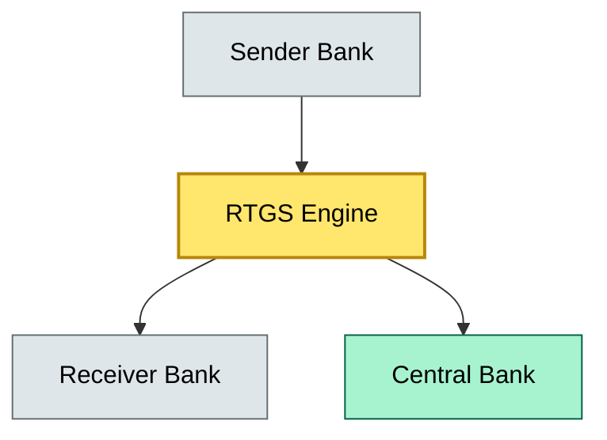
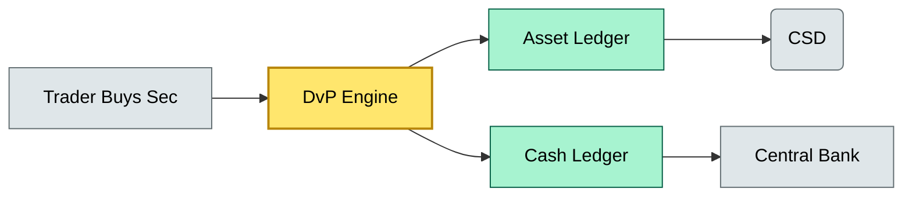

# C9-02 T0 Same-Day Settlement — DETAIL

> **Category:** C9/C3 — Settlement & Clearing · **Difficulty:** ◑ · **Banking-relevant:** yes / 💳
> **Companion brief:** `briefs/C9-02-t0-same-day-settlement.md`
>
> > **Target reader:** enterprise architect who must *explain, justify, and defend* the topic — not just recite it.

---

## 1. Precise definition
T0 same-day settlement is the final transfer of payment and funds within the same business day, using an RTGS system or a blockchain-based finality layer. It replaces deferred net settlement (T+2, T+1) with immediate, irrevocable finality, and is increasingly mandated by central banks for specific high-value corridors (e.g., securities settlement, CBDC).

The International Organization for Standardization (ISO 20022) and CPMI have defined T0 as "same-day final settlement," distinguished by four properties:
1. Intraday finality (no reversal after commitment).
2. Two-way finality (both parties receive enforceable claims).
3. Automated or policy-driven cut-off elimination.
4. Interoperability across central bank RTGS and private systems.

## 2. Why it exists (the problem it solves)
Historical settlement conventions (T+3 for equities, T+1 for FX) created operational risk: the "Herstatt risk" where one party delivers securities but the other fails to deliver cash before a European banking day closes, leaving the first party exposed. T0 settlement compresses the window to zero or near-zero.

The business driver is liquidity efficiency: under T+2, banks must pre-fund end-of-day positions to guarantee delivery, tying up capital. T0 drops that requirement because each transaction is final immediately. The friction is operational: real-time infrastructure, heartbeat monitoring, and strict SLAs.

## 3. Core concepts & vocabulary
| Term | Precise meaning |
|------|-----------------|
| RTGS (Real-Time Gross Settlement) | Each payment is settled individually, grossed-up, at the central bank in real time; no netting across the day. |
| Atomic settlement | Both legs of a trade (cash and security) settle simultaneously; a failure in one leg aborts the other. |
| DvP (Delivery versus Payment) | A settlement mechanism that ensures the delivery of securities occurs only if payment is received. |
| CLS (CLS Bank) | Continuous Link Settlement; a netting and settlement mechanism that provides T+0 value-date FX settlement. |
| TIPS (TARGET Instant Payment Settlement) | ECB’s instant, low-value payment system using ISO 20022 and a dedicated RTGS link. |
| Finality | The point after which a transaction cannot be reversed or altered. |

## 4. How it works (architecture / mechanism)

### 4.1 Diagrams

**Diagram A — Core structure**

**Diagram B — Atomic DvP lifecycle**

**Diagram C — CLS pooling and netting**
```mermaid
graph LR
    classDef critical fill:#ffe66d,stroke:#b8860b,stroke-width:2px,color:#000
    classDef core fill:#a7f3d0,stroke:#065f46,stroke-width:1px,color:#000
    classDef context fill:#dfe6e9,stroke:#636e72,color:#000
    Participant1[Bank A]:::context --> CLS[CLS Netting}]:::critical
    Participant2[Bank B]:::context --> CLS
    Participant1 --> Eur[EUR Settlement]:::core
    Participant2 --> USD[USD Settlement]:::core
    class CLS critical
```

## 5. Variants, options & trade-offs

| Variant | When to pick | When to avoid | Key trade-off axis |
|---------|--------------|---------------|--------------------|
| Legacy RTGS (central bank only) | Large corporate payments, regulated corridors | Segmentation by value; cannot support low-value retail | Coverage vs cost |
| TIPS / instant-payment RTGS | Retail, salary, bill payments | Not for securities or high-value forex | Scale vs settlement speed |
| Blockchain finality (smart contract) | Private-chain, tokenized assets | Interoperability with legacy RTGS; finality oracle dependency | Decentralization vs integration risk |
| Hybrid T+0 (CLS + RTGS) | FX cross-currency | Requires CSD links and pre-positioned liquidity | Coverage vs complexity |

## 6. Relationships to sibling topics
- **C9-01 Digital Assets Custody:** T0 settlement is a prerequisite for any digitized asset to be useful; custody without same-day settlement is a liquidity trap.
- **C9-03 AI/ML Custody:** AI-generated tokenized outputs (e.g., synthetic data tokens) settle under T0 if the underlying value is monetary.
- **C5-04 Asset Tokenization:** Tokenized securities require T0 DvP to behave like cash; otherwise, token holders face T+1/T+2 friction.

## 7. Banking / financial-services context 💳
The ECB’s TIPS has processed over 40 billion payments since 2023, demonstrating T0 scalability. In the US, the FedNow Service provides instant payments for small businesses. For securities settlement, the EU’s T2 (TARGET2-Securities) is moving toward T+0 under DVP rules.

Real-world consequence: In 2015, the Swiss franc de-pegging caused SNB large limits, but T0 mechanisms would have reduced the "gap risk" of delayed settlement. The CHF/EUR T1 settlement window amplified losses before central-bank intervention.

## 8. Reference architecture / worked example
A German universal bank (120B EUR deposits) wants to support T0 settlement for tokenized European government bonds. The architecture:
- A DvP engine calls T2 (TARGET2-Securities) for bond delivery and Euroclear for cash leg.
- A blockchain finality layer (private Corda or Hyperledger Besu) provides same-day finality for intra-bank transfers.
- Liquidity is pre-positioned against T2 real-time reporting SLAs.

## 9. Maturity & adoption signals
- **Adopt when:** The central bank has a T0 product or rule change; the core banking system supports ISO 20022; liquidity is available in real time.
- **Anti-signals:** The RTGS provider has a Target Downtime SLA >5 minutes; the bank’s fall-over site cannot support the load.
- **Common failure modes:** 1) Heartbeat loss between RTGS and internal system (divergence, then manual reconciliation); 2) Liquidity exhaustion during peak hours; 3) Clock skew in blockchain finality leading to double-spend if strict sequencing is not enforced.

## 10. Common confusions — the "don't mix" list
| Often confused | Real distinction |
|----------------|------------------|
| Settlement vs finality | Settlement is the process of transferring claims; finality is the irreversibility property. A transaction can settle (change hands) but still be reversed (finality failure). |
| T0 instant payments vs T0 securities settlement | Instant payments use RTGS + low value; securities T0 requires DVP, CSD, and central-bank integration. |
| Atomic vs non-atomic DvP | Atomic means both legs succeed or both fail; non-atomic risks one-sided exposure. |

## 11. Tools & standards to know
- **Frameworks/IR-2 / NINE:** ISO 20022 for message standards; CPMI Rules for RTGS interoperability.
- **Common tooling:** FedNow API, TARGET2, TIPS panel; SWIFT gpi for tracking; Apache Kafka / Pulsar for intraday event streams.
- **Mandatory reading:** CPMI "General principles for financial market infrastructures" (2020); ECB "Instant payments in the euro area" (2024).

## 12. ADR template (ready to fill in)
```markdown
# ADR-02: Subscribe to FedNow for corporate payments
## Status
Proposed

## Context
Treasury wants 24/7 corporate payments; CHIPS and Fedwire are insufficient for weekend liquidity.

## Decision
Subscribe to FedNow for sub-100k USD payments; retain Fedwire for >100k and securities DVP.

## Consequences
- Positive: Instant settlement, reduced ACH T+1/T+2 risk.
- Negative: 30-minute max reversal window required for fraud; FedNow support not yet available as a return point.
- Negative: Operational overhead of separate pane-of-glass monitoring.

## Alternatives considered
1. CHIPS upgrade — rejected due to 2-hour settlement SLA.
2. Private blockchain finality — rejected due to interoperability risk with FedNow via ISO 20022 bridges.
```

## 13. Practice — apply it
1. **Recall:** define in 2 min without notes.
2. **Model:** produce an ArchiMate diagram showing the RTGS, bank, client, and central bank.
3. **ADR:** write a decision doc applying T0 settlement to the FX T1 risk scenario in §7.
4. **Defend:** roleplay explaining it to a CRO / CIO — focus on "what can go wrong" and "how we measure it."

## Summary
T0 same-day settlement compresses settlement risk to near-zero, but it demands real-time infrastructure, pre-positioned liquidity, and interoperability across central bank and private systems. For tokenized assets and CBDC, it is not optional—it is the condition for economic viability.

---
**Status:** ☐ Not started · ☐ In progress · ✅ Covered
*Last updated: 2026-09-16*

---
**One diagram required. Both brief + detail must exist before ✓.**
