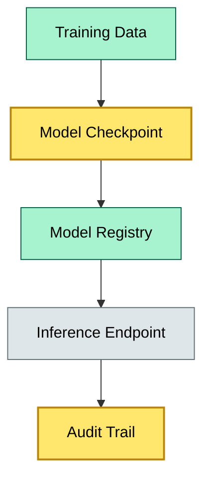
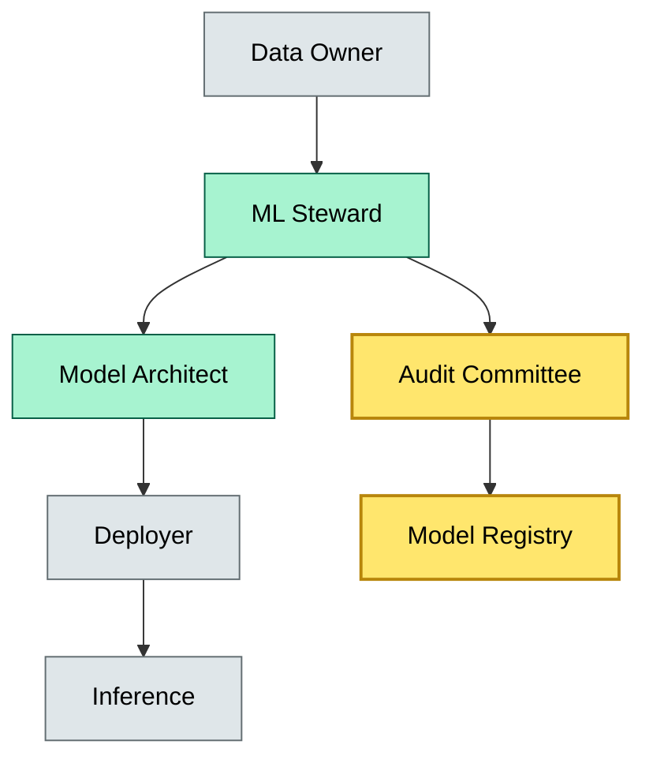

# C9-03 AI/ML Custody — DETAIL

> **Category:** C9/C10/C12 — Model & Data Governance · **Difficulty:** ○ · **Banking-relevant:** yes / 💳
> **Companion brief:** `briefs/C9-03-ai-ml-custody.md`
>
> > **Target reader:** enterprise architect who must *explain, justify, and defend* the topic — not just recite it.

---

## 1. Precise definition
AI/ML custody is the secure storage, versioning, and access-control of machine-learning models, weights, training data, and inference artifacts, with cryptographic integrity and immutable audit trails, so that regulatory audits, lineage, and reproducibility can be proven in a banking context.

The OCC's SR 11-7 (Model Risk Management) in the US and the EU AIA (Artificial Intelligence Act) both require "model lifecycle management" and "record-keeping." In banking, the definition extends to:
- Storage of model weights and parameters under integrity checks (hashes, signatures).
- Training data lineage (source, transformations, feature definitions, time windows).
- Inference request logs and model-ID at time of inference.
- Access controls (who can retrain, deploy, or export the model).

## 2. Why it exists (the problem it solves)
Regulators and central-bank supervisors now treat AI models in credit, fraud, and market risk as material to capital and reputation. The SBA and EU AI Act require explainability and fairness audits.

Without custody, a bank cannot:
- Prove that a model used in a decision was the exact version validated by risk.
- Re-create the training environment to test for fairness or bias.
- Respond to a "model inventory" on short notice.

The 2023 OCC's examination handbook for model risk (SR 11-7) explicitly cites "inadequate model documentation and lineage" as a deficiency.

## 3. Core concepts & vocabulary
| Term | Precise meaning |
|------|-----------------|
| Model registry | A centralized, versioned store of signed models with metadata: owner, training-data SHA, performance metrics, and deployment status. |
| Data lineage | The complete end-to-end provenance trail from raw source to final features and model weights. |
| Model weights | The numerical parameters learned during training; these are the primary artifact to be versioned and signed. |
| Feature store | An online, time-aware repository of computed features, version-controlled and shared across training and inference. |
| Inference log | An immutable log of which model version, input data snapshot, and parameters were used for a scoring decision. |
| MLOps | The practice of applying DevOps principles to model training, deployment, and monitoring. |

## 4. How it works (architecture / mechanism)

### 4.1 Diagrams

**Diagram A — Core structure**

**Diagram B — End-to-end data and model lineage**

```mermaid
graph LR
    classDef critical fill:#ffe66d,stroke:#b8860b,stroke-width:2px,color:#000
    classDef core fill:#a7f3d0,stroke:#065f46,stroke-width:1px,color:#000
    classDef context fill:#dfe6e9,stroke:#636e72,color:#000
    Source[Data Source]:::context --> ET[Extract / Transform]:::core
    ET --> FS[(Feature Store)]:::core
    FS --> Train[Training Run]:::critical
    Train --> Registry[Model Registry]:::critical
    Registry --> Deploy[Deploy]:::context
    Deploy --> Inference[Inference]:::context
    Inference --> Log[Inference Log]:::critical
    class Train critical
```

**Diagram C — Governance and access control**


## 5. Variants, options & trade-offs

| Variant | When to pick | When to avoid | Key trade-off axis |
|---------|--------------|---------------|--------------------|
| Centralized model registry (MLflow, Weights & Biases) | Single-bank or region; strict audit requirement | Multi-cloud or acquisition-driven landscapes | Governance vs flexibility |
| Decentralized / blockchain-anchored registry | Tokenized AI IP, interoperable audit across banks | Performance overhead; limited tooling | Immutability vs cost |
| Air-gapped offline storage (tape + HSM) | Critical models (core credit) | Zero HA; slow recovery | Security vs availability |
| Cloud-native (S3, GCS, Databricks) | Data science velocity; MLOps maturity | Regulatory pushback on data residency | Speed vs compliance |

## 6. Relationships to sibling topics
- **C9-01 Digital Assets Custody:** If AI weights are tokenized (compute-NFTs) or licensed as IP, they fall under digital-asset custody rules for key management and proof of ownership.
- **C9-02 T0 Same-Day Settlement:** AI services (e.g., real-time fraud scoring) are only useful if the downstream decision (charge/decline) settles T0; otherwise, latency renders the model worthless.
- **C5-04 Asset Tokenization:** Model-as-a-service platforms may tokenize weights; custody must then cover both the model and the compute environment.

## 7. Banking / financial-services context 💳
Under the EU AI Act (effective 2024), high-risk AI systems (including credit scoring) require:
- Risk management throughout the lifecycle.
- Data governance (training data appropriateness, bias testing).
- Transparency and provision of information to deployers.
- Human oversight.

In the US, SR 11-7 requires:
- Model inventory.
- Independent model validation.
- Anomaly detection in model performance.
- Governance and controls.

Real-world consequence: In 2021, Apple Card's credit-scoring algorithm faced gender-bias allegations. Had the bank maintained immutable model-lineage custody (model version, training window, feature list), it could have demonstrated that the model was fair and unremedied.

## 8. Reference architecture / worked example
A UK building society wants Model Risk Management for its mortgage-risk classifier. The architecture:
- A feature store (Feast) hosts time-aware features with lineage.
- Training data is versioned in DVC (Data Version Control) with SHA-256.
- Model weights are computed, hashed, signed with the bank’s HSM, and stored in an MLflow model registry.
- Every inference request logs: model version, input feature snapshot, and decision.
- Quarterly, the audit committee runs anomaly detection against inference logs and model performance.

## 9. Maturity & adoption signals
- **Adopt when:** Model inventory >20, or a regulator demands explainability for a deployed model.
- **Anti-signals:** Model weights stored in a Jupyter notebook on a shared drive; no immutable log of inference.
- **Common failure modes:** 1) "Model replays" (copying weights to a new environment without registry); 2) Training data leakage from one model version into another; 3) Inference-model skew when a hot-swap changes weights without updating the audit log.

## 10. Common confusions — the "don't mix" list
| Often confused | Real distinction |
|----------------|------------------|
| Model custody vs model governance | Custody is storage and integrity; governance is policy, review, and sign-off. |
| Feature store vs data lake | Feature store is online, time-aware, and model-specific; data lake is raw or lightly transformed for exploration. |
| Training-data custody vs production-data custody | Training data must be versioned and archived for reproducibility; production data must be partitioned and access-controlled for live scoring. |

## 11. Tools & standards to know
- **Frameworks/IR-2 / NINE:** MLflow for model registry; DVC for data versioning; IEEE 7003 for algorithmic bias; ISO/IEC 23894 for AI risk.
- **Common tooling:** MLflow, DVC, Feast (feature store), Weights & Biases, S3/GCS, Databricks, Flyte for workflow orchestration.
- **Mandatory reading:** OCC SR 11-7 (Model Risk Management); EU Commission "Artificial Intelligence — Questions and Answers" (2024); NIST AI RMF (2023).

## 12. ADR template (ready to fill in)
```markdown
# ADR-03: Adopt MLflow + DVC for model custody
## Status
Accepted

## Context
SR 11-7 and EU AIA require immutable model lineage and training-data provenance for credit-scoring models.

## Decision
Adopt MLflow for model registry and DVC for data versioning, with HSM-signed hashes and quarterly audit-committee review.

## Consequences
- Positive: One-click re-training, reproducible experiments, regulatory-ready lineage.
- Negative: Training pipeline cost increase (~40% engineering time upfront).
- Negative: DVC S3 backend requires lifecycle rules to manage storage cost.

## Alternatives considered
1. Custom PostgreSQL + checksums — rejected due to lack of MLOps workflow integration.
2. Blockchain-anchored provenance — rejected due to latency and tooling immaturity.
```

## 13. Practice — apply it
1. **Recall:** define in 2 min without notes.
2. **Model:** produce an ArchiMate diagram showing the data lake, feature store, training pipeline, model registry, and inference endpoint.
3. **ADR:** write a decision doc applying model custody to the Apple Card bias scenario in §7.
4. **Defend:** roleplay explaining the lineage trail to a non-technical CRO / CIO — focus on "how we prove the model was exactly what we said it was."

## Summary
AI/ML custody is the evidence trail that regulatory examiners and internal risk committees require. Without it, a bank cannot prove model fairness, reproducibility, or immutability. As AI moves deeper into credit and operational risk, custody transitions from a nice-to-have to a licensing condition.

---
**Status:** ☐ Not started · ☐ In progress · ✅ Covered
*Last updated: 2026-09-16*

---
**One diagram required. Both brief + detail must exist before ✓.**
