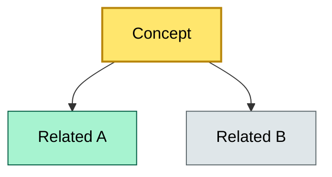

# [C?] [Topic Name] — BRIEF
> **Category:** Cx — {Category name} · **Difficulty:** ●/◑/○/◔ · **Banking-relevant:** yes/no / 💳

> **One-liner:** _{define the topic in one complete sentence}_

> **Why an enterprise architect / trainee cares:** _{why this matters in an enterprise/banking context, what you stop sounding naive about}_

## Quick definition
_{2–4 sentences, precise, jargon-free where possible. Protothug_

## Key ideas / terms
- **{Term}:** {one-line definition}
- **{Term}:** {one-line definition}
- **{Term}:** {one-line definition}

## The mental model
_{1 short paragraph: how it fits into the larger architecture picture, and how it relates to 2–3 sibling concepts. Emphasize the governance / alignment angle that a bank cares about._

## One diagram (mandatory)
_{A single, simple Mermaid diagram capturing the core idea. Use `classDef` color coding to highlight the most important parts. Use different colors for different dimensions Example: critical = revenue, core = function, context = support._

```

## When to use / when NOT to use
- ✅ **Use when:** {scenario}
- ⚠️ **Avoid when:** {scenario}

## Banking example
_{One concrete banking / financial-services example. Name the vault, the mechanism, the regulations, and the logic. Avoid vague platitudes._

## Common confusions (don't mix these up)
- **{Topic}** vs **{Similar topic}:** {one-sentence distinction}

## Interview / recall prompt
_{“Explain {topic} in 2 minutes without notes.”_ → _{3–5 bullet key points you should hit._

## Status
☐ Not started · See detail doc: `details/{{filename}}.md`

---
**One diagram required. Both brief + detail must exist before ✓.**
