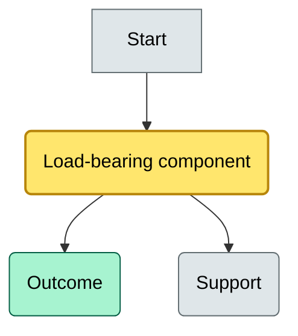
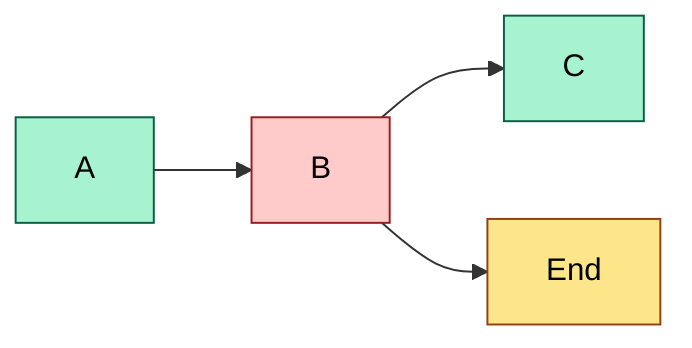
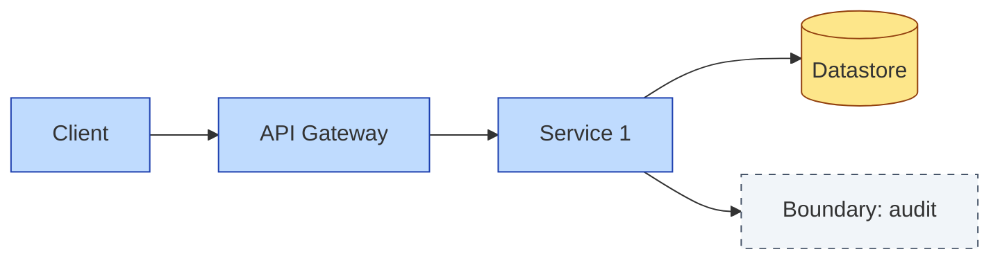

# [C?] [Topic Name] — DETAIL
> **Category:** Cx — {Category name} · **Difficulty:** ●/◑/○/◔ · **Banking-relevant:** yes/no / 💳
> **Companion brief:** `briefs/{{same-filename}}.md`
>
> > **Target reader:** enterprise architect who must *explain, justify, and defend* the topic — not just recite it.

---

## 1. Precise definition
_{Rigorous, unambiguous definition. Distinguish from near-identical terms explicitly. If there is a standards-body or a regulator definition, cite it and anchor the discussion._

## 2. Why it exists (the problem it solves)
_{What architectural pain drove this? What would happen without it? Why did it emerge historically? Name the failure mode._

## 3. Core concepts & vocabulary
| Term | Precise meaning |
|------|-----------------|
| {term} | {definition} |
| {term} | {definition} |

## 4. How it works (architecture / mechanism)
_{Step-by-step or structural explanation. Include how the parts connect and who owns what._

### 4.1 Diagrams
_{2–4 Mermaid diagrams. MANDATORY: use `classDef` color coding to separate critical (amber), core (green), and supporting/context (grey) elements. Different diagrams can use different color schemes to encode different "what matters" dimensions._

**Diagram A — Core structure** (highlight load-bearing parts = amber, supporting = grey):


**Diagram B — Lifecycle / flow** (highlight decision points = green, failures = red, money = gold):


## 5. Variants, options & trade-offs
_{For each alternative: pros, cons, when-to-use. Be explicit about which axis differs (cost vs latency vs coupling vs governance vs risk)._

| Variant | When to pick | When to avoid | Key trade-off axis |
|---------|--------------|---------------|--------------------|
| A | {case} | {case} | {axis} |
| B | {case} | {case} | {axis} |

## 6. Relationships to sibling topics
- **{sibling A}:** {how it's a prerequisite / consumer / alternative}
- **{sibling B}:** {same}
- Sibling C: {same}

## 7. Banking / financial-services context 💳
_{Concrete application in banking. Tie to relevant regulations where applicable (Basel, MiFID II, SOX, DORA, CSDR). State the *business* reason, not only the technical one. Give one real-world consequence of a failure._

## 8. Reference architecture / worked example
_{A small but realistic worked example: the problem, the decision, the resulting diagram, and the ADR you'd write._}



## 9. Maturity & adoption signals
- **Adopt when:** {org readiness}
- **Anti-signals (don't adopt yet):** {signals}
- **Common failure modes:** {top 3}

## 10. Common confusions — the "don't mix" list
| Often confused | Real distinction |
|----------------|------------------|
| {X} vs {Y} | {precise} |
| {Z} vs {W} | {precise} |

## 11. Tools & standards to know
- **Frameworks/IR-2 / NINE:** {cite RFC / standard / regulator / TOGAF-phase}
- **Common tooling:** {e.g. Archi, Sparx EA, Protégé, draw.io, GitHub, Grafana, Databricks}
- **Mandatory reading:** {books, white papers, articles}

## 12. ADR template (ready to fill in)
```markdown
# ADR-{{NN}}: {{decision}}
## Status
Accepted | Proposed | Deprecated
## Context
{{...}}
## Decision
{{...}}
## Consequences
- Positive ...
- Negative ...
- ...
## Alternatives considered
1. ...
2. ...
```

## 13. Practice — apply it
1. **Recall:** define in 2 min without notes.
2. **Model:** produce an ArchiMate/UML diagram from scratch.
3. **ADR:** write a decision doc applying it to the banking example in §7.
4. **Defend:** roleplay explaining it to a non-technical CRO / CIO.

## Summary
_{A closing paragraph you could literally read aloud at a board meeting._

---
**Status:** ☐ Not started · ☐ In progress · ✅ Covered
*Last updated: _{date}_*

---
**One diagram required. Both brief + detail must exist with ≥1 mermaid each before ✓.**
